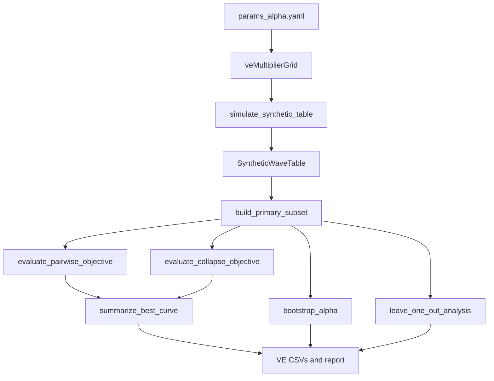

# Alpha Vaccine-Effect Stress-Test Plan

## Target Files

- [test/alpha/params_alpha.yaml](test/alpha/params_alpha.yaml)
- [test/alpha/code/estimate_alpha.py](test/alpha/code/estimate_alpha.py)
- [test/alpha/README.md](test/alpha/README.md) if the new sandbox-only outputs should be documented

## Current Constraint To Preserve

The existing synthetic branch is narrow: `simulate_synthetic_table()` creates rows with `excess` directly, and `synthetic_recovery()` only records `pairwise_alpha_hat` and `collapse_alpha_hat`. The real identifiability helpers (`add_reference_excess()`, `build_primary_subset()`, `leave_one_out_analysis()`, `bootstrap_alpha()`, `summarize_best_curve()`) expect a more wave-table-like schema with `dose`, `hazard_obs`, `enrollment_date`, and `week_monday`.

That means the cleanest isolated extension is not to change the estimator, but to make the synthetic generator look more like the real sandbox input so the current alpha-only fitting and diagnostics can be reused unchanged.

## Planned Changes

### 1. Extend Synthetic Config In [test/alpha/params_alpha.yaml](test/alpha/params_alpha.yaml)

- Add a sandbox-only vaccine-effect axis under `synthetic:`.
- Support both named presets and explicit numeric values, but normalize them to one internal concept: `ve_multiplier`.
- Keep defaults backward-compatible by including a no-effect path (`1.0`).
- Leave the alpha grid, theta grid, cohort count, week count, and existing noise models untouched.

Proposed shape:

```yaml
synthetic:
  synthetic_vaccine_effect:
    enabled: true
    modes:
      - none
      - vaccinated_half_hazard
    values:
      - 1.0
      - 0.75
      - 0.5
```

### 2. Refactor Synthetic Generation In [test/alpha/code/estimate_alpha.py](test/alpha/code/estimate_alpha.py)

- Update `simulate_synthetic_table()` so each synthetic cohort carries a dose label.
- Emit a synthetic wave table with the columns needed by the existing alpha-only path, especially `dose`, `hazard_obs`, `enrollment_date`, `week_monday`, `excess`, `theta_t_gamma`, and `eligible`.
- Build synthetic strata so dose `0` is the reference cohort and dose `>0` receives `ve_multiplier`.
- Use a single cohort-level vaccine-effect multiplier shared by all vaccinated cohorts in this pass:
  - dose `0`: multiplier `1.0`
  - dose `>0`: multiplier `ve_multiplier`
- Do not introduce dose-specific VE heterogeneity in this pass.
- Apply `ve_multiplier` only to the observed wave excess component after frailty amplification.
- Do not modify the baseline hazard or theta trajectory directly.
- Preserve existing synthetic dimensions: same `alpha_true`, `theta_w_values`, noise model handling, and wave shape.

Implementation note:

- Prefer representing the contaminated observed hazard directly, then deriving anchored excess through the existing `add_reference_excess()` route instead of hard-coding a special synthetic-only estimator path.
- This keeps Step 3 intact: the estimator still fits the same alpha-only working model and remains unaware of vaccine effect.

### 3. Rework Synthetic Evaluation To Reuse Existing Diagnostics

- Expand `synthetic_recovery()` from a minimal recovery loop into a VE-grid evaluation loop over:
  - `noise_model`
  - `alpha_true`
  - `ve_multiplier`
  - `rep`
  - `estimator` (`pairwise`, `collapse`)
- For each synthetic replicate:
  - build the contaminated synthetic wave table
  - derive the primary subset with the same alpha-only assumptions
  - evaluate both objective curves
  - run `summarize_best_curve()` for raw/reported alpha and curvature-based identification
  - run bootstrap and leave-one-out diagnostics on the synthetic primary subset so VE stress inherits the same identifiability language as the real sandbox
- Record the requested per-row fields in a new recovery table:
  - `alpha_hat_raw`
  - `alpha_hat_reported`
  - `bias`
  - `absolute_error`
  - `identified` / `identification_status`
  - `curvature_metric`
  - estimator gap
  - bootstrap IQR
  - bootstrap boundary fraction
  - leave-one-out max shift

### 3a. Bias Accounting Rule

- For each replicate, keep both `alpha_hat_raw` and `alpha_hat_reported`.
- Compute raw bias from `alpha_hat_raw`.
- Compute identification rate from `alpha_hat_reported` and `identification_status`.
- Do not treat non-identified replicates as numeric reported estimates in summaries.

## Output Additions

All new artifacts stay under [test/alpha/out/](test/alpha/out/):

- `alpha_synthetic_vaccine_effect_recovery.csv`
- `alpha_synthetic_vaccine_effect_summary.csv`
- `alpha_synthetic_vaccine_effect_report.md`
- `fig_alpha_synthetic_vaccine_effect.png`

Planned behavior:

- Keep legacy `alpha_synthetic_recovery.csv` only if preserving backward compatibility is cheap; otherwise make the new VE outputs the primary synthetic branch and keep naming/reporting clearly sandbox-only.
- Add a VE-specific writer/report path in `write_outputs()` rather than mixing these rows into real-data artifacts.

### 4. Add VE Summary + Interpretation Report

Create a dedicated Markdown renderer in [test/alpha/code/estimate_alpha.py](test/alpha/code/estimate_alpha.py) that:

- aggregates by `ve_multiplier`
- reports mean bias, mean absolute error, identification rate, mean curvature, and mean bootstrap boundary fraction
- explicitly answers whether stronger vaccine effects:
  - bias alpha recovery
  - flatten the objective
  - increase non-identification
  - increase boundary-seeking
- explicitly classifies degradation relative to `VE=1.0` as `mild`, `moderate`, or `severe` based on changes in identification rate, curvature, and boundary-seeking
- ends with the requested conservative interpretation block and avoids causal claims about real data

### 5. Add VE Figure

Replace the current simple synthetic mean-recovery plot with a VE stress-test figure, likely 3 panels:

- Panel A: recovered alpha vs true alpha, colored by `ve_multiplier`, with separate pairwise/collapse traces
- Panel B: identification rate and/or mean curvature vs `ve_multiplier`
- Panel C: bootstrap boundary fraction vs `ve_multiplier` if readable

This likely belongs beside `plot_synthetic_recovery()` as a new plotting helper so the existing real-data figures remain unchanged.

### 6. Add Console Summary

After output writing in `main()`, print a short synthetic VE block such as:

```text
SYNTHETIC VE STRESS TEST
VE=1.00 identified_rate=... mean_abs_error=... boundary_fraction=...
VE=0.75 identified_rate=... mean_abs_error=... boundary_fraction=...
VE=0.50 identified_rate=... mean_abs_error=... boundary_fraction=...
```

## Minimal Internal Design




## Risks To Watch

- Synthetic rows currently do not include anchorable hazard fields, so a partial retrofit could accidentally fork the estimator logic. The plan avoids that by making synthetics mimic the real sandbox input shape.
- Bootstrap and LOO summaries are currently real-data-oriented; they may need lightweight helper wrappers so per-replicate synthetic metrics can be aggregated cleanly without overwriting existing output contracts.
- Plot layout will likely need a new function rather than stretching `plot_synthetic_recovery()` beyond its current one-metric role.

## Verification

- Run the sandbox only through `test/alpha/`.
- Confirm new VE outputs are created in [test/alpha/out/](test/alpha/out/).
- Treat `VE=1.0` as a regression gate, not just a check.
- Require the `VE=1.0` branch to reproduce the current no-contamination synthetic behavior within expected Monte Carlo tolerance.
- Fail the run if the no-effect branch diverges materially from the current baseline synthetic outputs.
- Check that stronger contamination does not change the estimator definition, only the synthetic DGP and downstream diagnostics.

