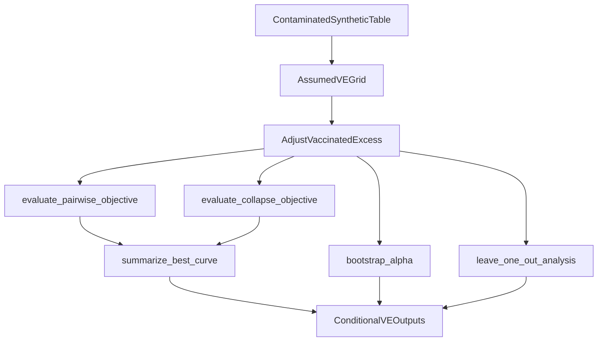

# Conditional VE Alpha Identification Plan

## Goal

Build a separate `test/alpha/` experiment that answers:

> If the synthetic data are generated with a real vaccine effect, can the sandbox recover a known `alpha_true` once VE is fixed in the fitting model, especially at `VE=0.5`?

This treats VE as an assumed nuisance parameter in the fitter, not a new parameter to estimate jointly.

## Default Scope

Use the existing contaminated synthetic branch as the data source, then add a second-stage conditional fit over assumed VE values. That matches the latest request about known `alpha_true` on simulated data while keeping the prior VE contamination experiment intact.

Target files:

- [test/alpha/params_alpha.yaml](test/alpha/params_alpha.yaml)
- [test/alpha/code/estimate_alpha.py](test/alpha/code/estimate_alpha.py)
- [test/alpha/README.md](test/alpha/README.md) if the new artifact names should be documented

Do not modify:

- `code/KCOR.py`
- manuscript files

## Current Code To Reuse

The current sandbox already has the pieces needed for this experiment:

- Contaminated synthetic generation and VE summaries already exist in [test/alpha/code/estimate_alpha.py](test/alpha/code/estimate_alpha.py).
- The core alpha fitter still runs through the same objective functions:
  - `evaluate_pairwise_objective()`
  - `evaluate_collapse_objective()`
  - `summarize_best_curve()`
  - `bootstrap_alpha()`
  - `leave_one_out_analysis()`
- Output plumbing is centralized in `write_outputs()` and `main()`.

That means the least risky design is to add a new conditional-VE evaluation layer that sits between the contaminated synthetic table and the existing alpha objective sweep.

## Planned Changes

### 1. Add Conditional VE Config

Extend [test/alpha/params_alpha.yaml](test/alpha/params_alpha.yaml) with a dedicated fitting-stage VE axis, separate from the existing synthetic contamination axis.

Proposed shape:

```yaml
synthetic:
  conditional_VE_values:
    - 1.0
    - 0.75
    - 0.5
  conditional_VE_target_multiplier: 0.5
```

Intent:

- `synthetic_vaccine_effect_values` stays the DGP axis.
- `conditional_VE_values` becomes the fitter-assumption axis.
- `conditional_VE_target_multiplier: 0.5` provides the exact test case the user asked for.

### 2. Add A Fitting-Stage Decontamination Hook

In [test/alpha/code/estimate_alpha.py](test/alpha/code/estimate_alpha.py), add a small helper that adjusts excess before the objective is evaluated:

- dose `0` stays unchanged
- dose `>0` gets `excess_adjusted = excess_observed / VE_assumed`

Constraints:

- Do not modify the synthetic generator for this experiment.
- Do not modify `theta_t_gamma`, baseline hazard, or the alpha grid.
- Keep the alpha estimator unchanged after the adjustment step.

Recommended insertion point:

- Apply this to the contaminated synthetic primary subset right before `evaluate_pairwise_objective()` / `evaluate_collapse_objective()` are called.
- Keep the existing VE-contamination experiment separate by using a dedicated helper, not by changing the default objective path globally.

## Conditional Fit Flow




### 3. Evaluate Conditional VE On Contaminated Synthetic Data

Add a separate loop that runs on synthetic contaminated data with known `alpha_true`, using the already supported VE-contaminated generator with `ve_multiplier=0.5` as the primary scenario.

Loop dimensions:

- `alpha_true`
- `noise_model`
- DGP `ve_multiplier` with primary focus on `0.5`
- `VE_assumed` from `conditional_VE_values`
- `estimator` in `{pairwise, collapse}`

### 3a. Primary DGP Setting

- Treat DGP `ve_multiplier = 0.5` as the primary conditional-VE experiment.
- Additional DGP VE values may be included as sensitivity analyses, but the main report should center on whether `VE_assumed = 0.5` recovers `alpha_true` when the DGP truly used `ve_multiplier = 0.5`.

For each replicate:

- generate or reuse contaminated synthetic data with known `alpha_true`
- apply the conditional VE adjustment in the fitting path only
- run the existing alpha-only objective sweep
- record:
  - `alpha_hat_raw`
  - `alpha_hat_reported`
  - `identified`
  - `curvature`
  - `bootstrap_boundary_fraction`
  - `leave_one_out_max_shift`

Important interpretation rule:

- Keep raw bias based on `alpha_hat_raw`
- Keep identification status based on `alpha_hat_reported`
- Do not turn non-identified replicates into numeric reported alpha values

### 4. Add Dedicated Conditional VE Outputs

Create separate artifacts under [test/alpha/out/](test/alpha/out/) so this does not get mixed with the earlier contamination experiment:

- `alpha_conditional_VE_estimates.csv`
- `alpha_conditional_VE_summary.csv`
- `alpha_conditional_VE_report.md`
- `fig_alpha_vs_assumed_VE.png`

Suggested contents:

- `alpha_conditional_VE_estimates.csv`
  - one row per `alpha_true`, `noise_model`, DGP VE, `VE_assumed`, estimator, replicate
  - include raw/reportable alpha and identifiability diagnostics
- `alpha_conditional_VE_summary.csv`
  - aggregate by `VE_assumed` and estimator
  - include identification rate, mean curvature, bootstrap boundary fraction, and optionally mean raw bias
- `alpha_conditional_VE_report.md`
  - explicitly answer:
    - does fixing VE enable identification?
    - does `VE_assumed=0.5` recover the known `alpha_true` better than `VE_assumed=1.0`?
    - is there a stable VE region or just a VE-alpha tradeoff?
- `fig_alpha_vs_assumed_VE.png`
  - Panel A: `alpha_hat_raw` vs `VE_assumed` for pairwise and collapse
  - Panel B: identifiability or curvature vs `VE_assumed`
  - mark identified vs not identified clearly

### 5. Add Identity And Sanity Gates

Add explicit checks for:

- `VE_assumed=1.0` reproduces the unadjusted contaminated-fit result for the same synthetic input
- only vaccinated cohorts are adjusted
- non-vaccinated cohorts are unchanged
- `VE_assumed=0.5` is highlighted in the report as the exact-match decontamination case when the DGP uses `ve_multiplier=0.5`

### 5a. Conditional Recovery Criterion

For the primary DGP setting (`ve_multiplier = 0.5`), report whether the `VE_assumed = 0.5` branch improves all of:

- mean absolute error
- curvature
- identification rate
- bootstrap boundary fraction

relative to `VE_assumed = 1.0`.

### 6. Add Console Summary

At the end of the conditional run, print a short block such as:

```text
CONDITIONAL ALPHA FIT
VE=1.00 alpha=... identified=... curvature=...
VE=0.75 alpha=... identified=... curvature=...
VE=0.50 alpha=... identified=... curvature=...
```

## Design Guardrails

- Do not change the synthetic generator for this experiment.
- Do not overwrite the existing `alpha_synthetic_vaccine_effect_*` outputs.
- Do not change production code or manuscript files.
- Keep this as a separate methodological experiment alongside the existing synthetic VE contamination test.

## Expected Outcome

This should distinguish three cases cleanly:

- `VE_assumed=0.5` restores identification and improves recovery of known `alpha_true`
- alpha remains non-identified even when VE is fixed correctly
- alpha moves along a VE-alpha tradeoff curve, implying structural non-separability without external VE information

## Verification

- Run only through `test/alpha/`
- Confirm all four `alpha_conditional_VE_*` artifacts plus `fig_alpha_vs_assumed_VE.png` are created
- Check that `VE_assumed=1.0` matches the same contaminated synthetic fit without decontamination
- Treat DGP `ve_multiplier=0.5` as the primary comparison branch in the summary and report.
- Check whether `VE_assumed=0.5` improves curvature, lowers boundary-seeking, or raises identification rate relative to `VE_assumed=1.0`
- Explicitly report whether `VE_assumed=0.5` improves mean absolute error, curvature, identification rate, and bootstrap boundary fraction relative to `VE_assumed=1.0`
- Compare recovered alpha to known `alpha_true` under the `VE_assumed=0.5` branch specifically

