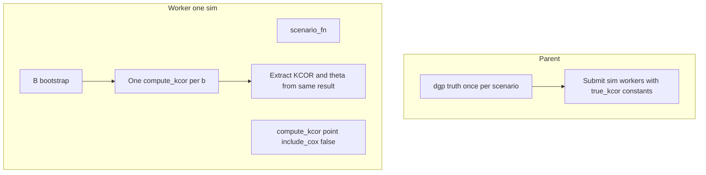

# Faster bootstrap coverage (runtime rewrite)

## Current cost structure (confirmed)

- Each **simulation** does: `scenario_fn` → `compute_kcor_for_scenario` (point) → **`n_bootstrap` × (`deepcopy(scenario_data)` + resample + `compute_kcor_for_scenario`)** for KCOR, then the same pattern again for theta ([`_bootstrap_kcor_for_dataset`](test/sim_grid/code/compute_bootstrap_coverage.py), [`compute_coverage_theta_per_arm`](test/sim_grid/code/compute_bootstrap_coverage.py) / `_bootstrap_theta_hats_for_dataset`).
- [`compute_kcor_for_scenario`](test/sim_grid/code/generate_sim_grid.py) always builds full `H_obs`, fits θ on the quiet window, inverts frailty **elementwise** (`invert_gamma_frailty`), forms KCOR, then runs **`fit_time_varying_cox`** — **unused** for KCOR/θ coverage and **skipped in stage (a)** for all bootstrap coverage calls (see below).

## Statistical constraints (must not change)

- One **percentile CI per simulated dataset** (same 2.5/97.5); coverage = mean of inclusion indicators across datasets.
- **`true_kcor`** = DGP KCOR at `target_week` via existing `dgp_kcor_at_target_week` / `truth_seed` (**parent only**; see workers).
- **Do not change** the Poisson bootstrap implementation in [`bootstrap_resample_cohort_data`](test/sim_grid/code/compute_bootstrap_coverage.py) (same draws, same formula).
- **Bootstrap resampling seeds:** use the **single** formula `boot_seed = base_seed + sim_index * 100_000 + b * 1_000 + idx` for cohort `idx`. After the merge there is **one** bootstrap loop and **one** `compute_kcor_for_scenario` per draw—**do not** add a separate `+17` branch for a second estimator call (legacy θ-only loop goes away). KCOR bootstrap draws stay seed-aligned with the **old KCOR** path.

## Statistical invariance (optimizations vs reference)

- **Requirement:** For identical integer seeds and flags, **runtime optimizations** (shallow copy vs `deepcopy`, `include_cox=False`, and—once gated—**truncation**) must preserve:
  - **`KCOR(target_week)`** (point and each bootstrap draw),
  - **`theta_hat` by dose** from the **same** `compute_kcor` result objects,
  - and thus the **empirical bootstrap distributions** used for percentile CIs.
- **Reference for regression tests:** “Full” path = current numerical pipeline without the optimization under test (e.g. full horizon + Cox on for truncation tests only). **`include_cox=False`** is **not** a distribution change for `kcor_trajectory` / `cohort_results` θ (Cox is side output only)—still verify once with a small equality check in tests.
- **Merged loop vs legacy two-pass:** Legacy ran **two** independent bootstrap worlds (different boot counts of `compute_kcor` and θ used `+17`). The new design **intentionally** defines θ bootstrap from the **same** draws as KCOR; do not claim bitwise identity to old **θ** bootstrap marginals—do claim invariance for **KCOR** vs old KCOR path seeds and **internal** consistency of the new combined design under optimization toggles.

## Deterministic seeding (workers and serial path)

- **`cfg.seed = base_seed + sim_index`** for each simulation replicate.
- **Bootstrap:** only `np.random.default_rng(boot_seed)` inside resampling—**no global numpy RNG** in workers.
- **Workers must NOT recompute truth:** do **not** call `dgp_kcor_at_target_week` or `dgp_theta_true_by_dose` inside workers. Parent computes truth **once per scenario** (and passes `true_kcor`, `theta_true_by_dose` or equivalent constants into the worker payload). Workers use these as read-only inputs for coverage flags / replicate rows.

## 1) Single combined pipeline — **one `compute_kcor_for_scenario` per bootstrap draw**

For each `sim_index`:

1. `config.seed = base_seed + sim_index`; `scenario_data = scenario_fn(config)` (once).
2. **Point fit:** `result = compute_kcor_for_scenario(..., include_cox=False)`; extract `KCOR(target_week)`; if θ enabled, extract `theta_hat` by dose from **`result["cohort_results"]`**.
3. **Bootstrap loop** `b = 0..n_bootstrap-1`:
   - Build resampled scenario (shallow top-level + per-cohort copy only—**no `copy.deepcopy` in this loop**).
   - **`result_b = compute_kcor_for_scenario(..., include_cox=False)` exactly once.**
   - From **`result_b` only:** extract `KCOR(target_week)` and (if θ enabled) `theta_hat` by dose.
   - **Forbidden:** a second `compute_kcor_for_scenario` (or any duplicate estimator call) for the same bootstrap draw.

4. Build CIs and replicate rows from those lists.

### Guardrail: exactly one `compute_kcor` per bootstrap iteration

- Maintain a **per–bootstrap-iteration counter** (incremented only around the single allowed call). In **debug** builds or when e.g. **`--debug-kcor-call-count`** (or env `KCOR_BOOTSTRAP_DEBUG=1`) is set, **`assert counter == 1`** at end of each iteration; in production default, optional **non-fatal** check that logs if violated. Goal: catch regressions that accidentally double-call the estimator.

### Scope: **do not change mathematical internals** of `compute_kcor_for_scenario` in this pass

- **Allowed:** control-flow wrappers only—e.g. **`include_cox`** to skip `fit_time_varying_cox`, **`max_week_index`** / cohort **slicing before** the existing per-cohort loop (data fed into unchanged `fit_k_theta_cumhaz`, `invert_gamma_frailty`, KCOR ratio logic).
- **Forbidden:** edits to least-squares fitting, inversion formulas, KCOR normalization math, quiet-window selection rules, or Poisson resampling—except where already specified (`include_cox`, truncation input shape).

### `include_cox=False` in **stage (a)** (not deferred)

- Add **`include_cox: bool = True`** (default) to [`compute_kcor_for_scenario`](test/sim_grid/code/generate_sim_grid.py); bootstrap coverage passes **`include_cox=False`** from the first merged implementation.
- **Rationale:** Cox is unused for KCOR/θ coverage; skipping it is a **performance** requirement immediately, not part of truncation stage (d).

### `--skip-theta` **strict**

When enabled:

- No θ extraction from results, no θ bootstrap lists, no θ CIs, no θ replicate rows, **no θ summary CSV** (do not write `bootstrap_coverage_theta.csv` or leave empty placeholder columns), **no θ rows in manifest** beyond omitting theta maps if desired, **no θ collapsed-CI or other θ QA**.
- KCOR path unchanged.

### Theta collapsed-CI QA

- When θ is **on**, keep **per-scenario, per-dose** collapsed-CI warnings in the combined pipeline (same thresholds as today).

## 2) Timing instrumentation (`time.perf_counter()`)

**Fine-grained buckets** (for JSON / detailed breakdown):

1. **Scenario generation** — `scenario_fn(config)` only.
2. **Resample + scenario construction** — Poisson resampling + building the per-bootstrap scenario dict (excludes `compute_kcor_for_scenario`).
3. **`compute_kcor_for_scenario`** — point fit + each bootstrap fit (sub-aggregate point vs per-bootstrap mean as needed).

**Workers must return detailed timing** (serializable floats), per simulation replicate:

- `seconds_scenario_generation`
- `seconds_point_compute_kcor`
- `seconds_bootstrap_total` (sum over `b` of inner-loop wall time, or define consistently as point excluded)
- `seconds_bootstrap_resample_and_build` (aggregate over boots: resample + shallow scenario build)
- `seconds_bootstrap_compute_kcor` (aggregate over boots: time inside `compute_kcor_for_scenario` only)

**Parent** aggregates across workers (mean/median as documented) for manifest and global prints.

**Simple per-scenario prints (required):** at end of each scenario (and optionally during long runs), print at least:

- **Average seconds per simulation** (wall time for full sim replicate, averaged over completed sims).
- **Average seconds per bootstrap** (mean over `(sim, b)` or per-sim mean of boot—document definition).
- **Total scenario wall time.**
- **`compute_kcor` dominance:** **% of total scenario wall time** spent inside `compute_kcor_for_scenario` (point + all bootstrap fits), e.g. `100 * (t_point + t_boot_kcor) / t_scenario_total`.

Also time **truth** in parent (`dgp_kcor_*`) when applicable.

**Slow-run warning:** after burn-in (e.g. first **3** completed simulations), if **average time per simulation > 60 s**, emit a **WARNING** suggesting lowering `n_bootstrap` and/or **`--max-workers > 1`**.

**Optional hard abort:** CLI **`--abort-if-slow-seconds-per-sim T`** (optional float). After the **same burn-in**, if **average seconds per simulation > T**, **exit non-zero** with a clear message (document whether the last checkpoint is retained).

**ETA / manifest:** keep rolling ETA logic; persist structured timing under e.g. `timing_seconds` in `bootstrap_coverage_run.json` (benchmark mode: no manifest unless `--benchmark-write`).

## 3) Multiprocessing over the **outer** simulation index

- **`--max-workers`** default **1**; **`effective_workers = min(max_workers, n_simulations)`**.
- **ProcessPoolExecutor** + top-level picklable worker; **no file I/O** in workers.
- **Truth:** passed from parent only (see above).
- **`max_workers == 1`:** use the **same** per-sim timing payload shape as the multiprocessing path (single code path or thin wrapper) so aggregation/printing stays one implementation.
- **Parent** collects, sorts by `sim_index`, enforces row order: KCOR replicates by **`simulation_id`**; θ by **`(simulation_id, dose)`**; fixed scenario order unchanged.

## 4) Parent-side intra-scenario checkpointing

- **`--checkpoint-every N`:** parent writes checkpoints every **N** completed sims; workers never write.

## 5) Benchmark mode (`--benchmark`)

- Default: **timing + projections only**; **no** CSV/manifest unless **`--benchmark-write`**.
- **Default θ behavior in benchmark:** imply **`--skip-theta`** unless the user passes an explicit override flag, e.g. **`--benchmark-with-theta`** (benchmark then runs θ extraction/bootstrap for timing). Rationale: benchmark is for KCOR pipeline speed unless θ cost is explicitly requested.
- **Scope:** default **scenario index 0** (Gamma-frailty null); **`--benchmark-all-scenarios`** for all five.

## 6) Staged implementation order (required)

| Stage | Content |
|-------|--------|
| **(a)** | Merge KCOR/θ into **one** loop; **`include_cox=False`**; **exactly one** `compute_kcor` per bootstrap + **debug call counter/assert**; **no `deepcopy` in bootstrap loops**; shallow copy only; strict **`--skip-theta`**; worker/parent timing + **`compute_kcor` %** of scenario time; **`--abort-if-slow-seconds-per-sim`**; **no edits to estimator math** inside `compute_kcor_for_scenario`; collapsed θ QA when θ on |
| **(b)** | Multiprocessing; **workers never compute truth**; deterministic seeds; `min(max_workers, n_simulations)` |
| **(c)** | Reserved for any **residual** micro-optimizations not already required in (a), or mark N/A if (a) already covers all copy/Cox work |
| **(d)** | **Truncation** (`max_week_index` or equivalent) **only after** regression tests pass (Cox already off in (a)) |

## 7) Regression tests for **truncation** (required before stage (d))

1. **Original** `scenario_fn` draw at fixed seed: truncated vs full horizon — **`KCOR(target_week)`** and **`theta_hat` by dose** must match (tight tolerance).
2. **At least one bootstrap-resampled** scenario (fixed `boot_seed`): same comparison.

`include_cox=False` vs Cox on: quick sanity check that `kcor_trajectory` / `theta_hat` at `target_week` are unchanged for a couple of cases (document in test).

## 8) Copy policy — **no `deepcopy` in bootstrap loops**

- **Hard rule:** **`copy.deepcopy` must not appear inside the per-bootstrap inner loop** (or any per-bootstrap path). Violations are a regression.
- **Allowed:** shallow copy of top-level `scenario_data`; **`copy.copy` / dict-unpack** per cohort; replace `weeks`/`alive`/`dead` with new arrays from `bootstrap_resample_cohort_data`; never mutate the original `scenario_data`.

## 9) Truncated-horizon (stage (d) only)

- Optional `max_week_index` **W** (or equivalent slice index cap) on [`compute_kcor_for_scenario`](test/sim_grid/code/generate_sim_grid.py), **after** §7 passes. Cox remains off.

**Cache `W` per scenario:** compute **once** when entering a scenario (from `target_week`, `quiet_window_end`, `skip_weeks`, and cohort `weeks` layout—same formula as plan: cap index so all needed indices ≤ W). **Reuse** that **same W** for **every** simulation replicate and **every** bootstrap draw in that scenario—no per-call recomputation drift.

**When truncation is enabled:** after slicing, **`assert`** (or hard fail in debug) that **no** cohort has `len(weeks) > W + 1` (or the agreed convention: last index ≤ W)—i.e. **no cohort arrays extend past the truncation cap**. Catch builder bugs that would silently reintroduce long horizons.

## 10) Preserve outputs, QA, plots (normal runs)

- When θ **on**: summary + replicate CSVs, manifest, KCOR + θ QA, checkpoints, plot column compatibility.
- When **`--skip-theta`**: **KCOR-only** artifacts only; do not emit theta CSVs or θ-specific manifest sections that imply θ was run.

## 11) Smoke (`--smoke`)

- Unchanged intent (small n, warning).

## 12) Post-implementation performance report (BUILD)

- Note Cox skipped from (a); one call per bootstrap (counter verified); no deepcopy in loops; worker truth policy; typical **`compute_kcor` %** of wall time; invariance summary; truncation + **cached W** status; benchmark defaults to **skip-θ** unless `--benchmark-with-theta`.

