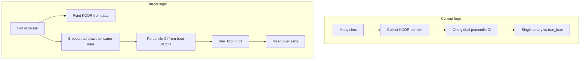

# Fix bootstrap coverage computation

## Problem (confirmed in repo)

In [`compute_coverage_for_scenario_simple()`](test/sim_grid/code/compute_bootstrap_coverage.py), the code:

1. Runs `n_simulations` independent datasets and collects one KCOR value per replicate into `kcor_values`.
2. Builds **one** global 2.5–97.5% interval from that **cross-replicate** empirical distribution.
3. Sets `coverage` to **0 or 1** depending on whether `true_kcor` lies in that single interval.

That answers a different question than bootstrap / repeated-sampling coverage. The manuscript already describes the right object: e.g. in [`documentation/preprint/paper.md`](documentation/preprint/paper.md) (Table `tbl:bootstrap_coverage` caption) it says coverage is the **proportion of simulations** where the true value lies in the interval—which implies **one interval per simulation** (from bootstrap noise on *that* dataset), not one interval across simulations.

[`bootstrap_resample_cohort_data()`](test/sim_grid/code/compute_bootstrap_coverage.py) is implemented but **never called**. CLI usage in the module docstring mentions `--n-bootstrap`, but [`main()`](test/sim_grid/code/compute_bootstrap_coverage.py) only exposes `--n-simulations`.

[`compute_kcor_for_scenario()`](test/sim_grid/code/generate_sim_grid.py) already returns everything needed for extended metrics: `kcor_trajectory` and per-cohort `theta_hat`, with `theta_true` on each cohort when the DGP is gamma-frailty ([`run_scenario_*`](test/sim_grid/code/generate_sim_grid.py) populate `theta_true`; scenario 4 uses `np.nan`).



## Target algorithm (KCOR at `target_week`)

For each simulation index `sim`:

1. Set `config.seed = base_seed + sim` (keep current convention).
2. `scenario_data = scenario_fn(config)`.
3. **Point estimate:** `result = compute_kcor_for_scenario(scenario_data, config)`; read `kcor_trajectory[eval_week]` (same `eval_week = min(target_week, len-1)` logic as now). Skip replicate if non-finite (same as today).
4. **Bootstrap inner loop** (`b = 0 .. B-1`):
   - For **each** cohort in `scenario_data["cohorts"]`, call `bootstrap_resample_cohort_data(weeks, alive, dead, seed=...)` (or refactored RNG API—see below) to get resampled `(alive, dead)`.
   - Build bootstrapped cohort rows with **`copy.deepcopy(cohort)`** per cohort (`import copy`), then **only overwrite** `weeks` / `alive` / `dead` with the resampled arrays. **Use `copy.deepcopy` for cohort dicts to avoid mutation across bootstrap draws:** shallow copies (`dict(cohort)`, `{**cohort}`) still share nested **`numpy` arrays**, so in-place or reassigned slice updates can corrupt the original `scenario_data` between inner iterations. **`compute_kcor_for_scenario()` may rely on keys beyond those four**; do not hand-build minimal dicts that drop metadata.
   - Assemble `scenario_boot` with a new `cohorts` list; do not mutate the original `scenario_data` across `b`.
   - `compute_kcor_for_scenario(boot_data, config)` and append bootstrap KCOR at `eval_week` when finite.

5. If too few finite bootstrap values (`< max(20, int(0.5 * n_bootstrap))`), mark replicate as failed (reference rule).
6. `ci_lower, ci_upper = np.percentile(kcor_boot, [2.5, 97.5])`.
7. `covered_sim = (true_kcor >= ci_lower) & (true_kcor <= ci_upper)`.

Aggregate: `coverage = np.mean(covered)` over successful simulation replicates; report `n_valid_sims`, `n_failed`, and **`coverage_se = sqrt(p * (1-p) / n_valid)`** where `p` is the empirical coverage proportion (useful for Table 11 / MC noise on the coverage estimate).

**Bootstrap success threshold (reference):** treat a simulation replicate as failed if `len(kcor_boot) < max(20, int(0.5 * n_bootstrap))` (insufficient successful bootstrap draws to trust the percentile CI).

## Reference implementation

The **full drop-in function** is in the section [Full reference listing](#full-reference-listing-compute_coverage_for_scenario_simple) below. The listing still contains `cohort_a` / `cohort_b` as a **pedagogical placeholder**; the repo implementation must not mirror that structure—see the bold line immediately above the code block there.

When porting it into the repo:

- **Adapt only** `_bootstrap_one_dataset`: real [`run_scenario_*`](test/sim_grid/code/generate_sim_grid.py) data uses `scenario_data["cohorts"]` (list of cohort dicts), not `cohort_a` / `cohort_b`.
- **Cohort dict copy rule:** `import copy` and use **`cohort_copy = copy.deepcopy(cohort)`** for each bootstrap row, then set only `weeks`, `alive`, and `dead` from the resampler output. **Do not use shallow copy** for cohort dicts. Do not strip fields—`compute_kcor_for_scenario` must see the same schema the scenario generator produced.
- **Do not regress:** keep **one percentile CI per simulated dataset** from **that dataset’s** bootstrap draws, then average inclusion indicators. Never revert to pooling KCOR across outer replicates into a single global interval (that was the original bug).

## Poisson resampling (labeling)

[`bootstrap_resample_cohort_data()`](test/sim_grid/code/compute_bootstrap_coverage.py) uses Poisson noise on weekly deaths: acceptable for the minimal patch, but **document in-code** (docstring or short comment) that this is a **variance / approximation device**, not exact nonparametric resampling of discrete survival paths. Do not block the fix on swapping to Binomial(`alive[t]`, p) (follow-up if desired).

## Implementation details (minimal, file-local)

| Item | Action |
|------|--------|
| CLI | Add `--n-bootstrap` / `-b`, default **200** (per reference); pass through to `compute_coverage_for_scenario_simple(..., n_bootstrap=args.n_bootstrap)`. Optionally default `n_simulations` to **500** to match reference or keep 1000 for stability—document tradeoff (runtime vs MC error). Fix top-of-file Usage to match argparse. |
| RNG | Prefer refactoring `bootstrap_resample_cohort_data` to use `np.random.default_rng` instead of `np.random.seed` global mutation; if keeping `seed=` ints, use distinct seeds per `(sim, b, cohort)` as in reference. |
| Copy-on-bootstrap | **`copy.deepcopy` each cohort dict** before overwriting `weeks` / `alive` / `dead`; original `scenario_data` unchanged across `b` (avoids shared numpy buffers under shallow copy). |
| Two arms | Resample **each cohort independently** (matches independent arms in the sim grid); both arms feed KCOR through existing `compute_kcor_for_scenario`. |
| Output CSV | Include `n_bootstrap`, `coverage_proportion` / `coverage_percent`, `n_valid`, `n_failed`, `median_point_estimate`, `mean_ci_width`, and **`coverage_se = sqrt(p*(1-p)/n_valid)`** (with `p = coverage_proportion`); keep `true_kcor` and scenario name. |

### KCOR “truth” vs `target_week` (consistency with the paper)

**Ensure `true_kcor` corresponds to the estimand at `target_week`; do not compare a time-varying truth to a scalar unless that scalar is defined at that horizon.**

The scenarios in [`main()`](test/sim_grid/code/compute_bootstrap_coverage.py) pass fixed **`true_kcor`** values (e.g. 1.0 / 1.2 / 0.8) while coverage is evaluated at **`target_week`** (default 80). For the minimal patch, **keep that convention aligned with the manuscript**: if the paper treats those constants as the estimand at the reported horizon (week 80), the script should use the same pairing. If any scenario’s **interpretable KCOR truth varies with time**, pass a **horizon-specific** truth (per scenario or per `target_week`) or document an intentional approximation—**do not** silently compare a time-varying DGP to a scalar that only matches one week.

Exact CLI addition (reference):

```python
parser.add_argument(
    "--n-bootstrap", "-b",
    type=int,
    default=200,
    help="Number of bootstrap replicates per simulation replicate",
)
```

Call site:

```python
result = compute_coverage_for_scenario_simple(
    scenario_fn,
    scenario_name,
    true_kcor,
    config,
    n_simulations=args.n_simulations,
    n_bootstrap=args.n_bootstrap,
    target_week=args.target_week,
)
```

## θ₀ coverage (separate function; reviewer alignment)

Per reference notes: **do not** overload `compute_coverage_for_scenario_simple` with θ logic. Add a **parallel** function (e.g. `compute_coverage_theta_per_arm(...)`) that repeats the same outer simulation loop and inner bootstrap, but the bootstrapped quantity is `theta_hat` from `result["cohort_results"]`, compared to **`theta_true` on the same cohort**.

**Truth vs estimate matching:** pair **`theta_hat` ↔ `theta_true` by cohort `dose`** (or another **stable cohort identifier** used consistently by the scenario generators), **not by list index alone**. `scenario_data["cohorts"]` and `result["cohort_results"]` are ordered consistently today, but matching by `dose` avoids a subtle bug if ordering ever changes.

- **Control (dose 0) / treatment (dose 1):** report coverage separately when `theta_true` is finite.
- **Scenario 4 (non-gamma):** `theta_true` is `nan`—omit or label N/A.
- **Publication strategy:** Table 11 / `tbl:bootstrap_coverage` justifies **KCOR interval calibration** for the stacked pipeline; strongly consider an **appendix table or extra rows** for **θ₀ coverage** because that is closer to identification / frailty-variance concerns in reviews.

## Strategic note (manuscript)

If Table 11 is meant to justify **interval calibration of the current method**, rerun the fixed script with the **current** `compute_kcor_for_scenario` / estimator, replace stale table entries and any inline percentages in [`documentation/preprint/paper.md`](documentation/preprint/paper.md) / [`paper.tex`](documentation/preprint/paper.tex). After the fix, old numbers (e.g. cited coverage percentages) are not comparable to the new definition.

## Out of scope for “minimal patch” (note only)

- Swapping Poisson resampling for Binomial(`alive[t]`, `p`) is a modeling refinement; can be a follow-up if you want the bootstrap to match discrete survival more tightly. (Minimal patch: **label** Poisson bootstrap as approximate; see [Poisson resampling](#poisson-resampling-labeling) above.)
- Runtime: cost scales as `n_simulations × n_bootstrap × cost(compute_kcor_for_scenario)`. Consider documenting recommended defaults or a `--fast` mode later; not required for correctness.

## Downstream: manuscript and table

After rerunning the script, [`test/sim_grid/out/bootstrap_coverage.csv`](test/sim_grid/out/bootstrap_coverage.csv) (and any numbers pasted into [`documentation/preprint/paper.tex`](documentation/preprint/paper.tex) / [`paper.md`](documentation/preprint/paper.md)) will **change**. Plan a pass to regenerate the table and ensure narrative percentages (e.g. “89.3%”) match the new output so text and code stay consistent.

## Files to touch

- Primary: [`test/sim_grid/code/compute_bootstrap_coverage.py`](test/sim_grid/code/compute_bootstrap_coverage.py) (add `import copy`, logic, CLI, docstrings, CSV schema). Use **`copy.deepcopy` for cohort dicts to avoid mutation across bootstrap draws.**
- Secondary (only if you add θ metrics and want shared helpers): optionally a tiny helper in the same file to extract `theta_hat` by dose from `compute_kcor_for_scenario` results—avoid sprawling changes in [`generate_sim_grid.py`](test/sim_grid/code/generate_sim_grid.py) unless you need reuse elsewhere.

## Full reference listing (`compute_coverage_for_scenario_simple`)

Paste below is the **exact** reference from the plan iteration. When implementing, **replace** `_bootstrap_one_dataset` body so cohorts come from `scenario_data["cohorts"]`, not `cohort_a` / `cohort_b`. **Preserve every key** when building bootstrapped rows: use **`copy.deepcopy(cohort)`** per cohort, then replace `weeks` / `alive` / `dead` only.

**Do not copy the `cohort_a` / `cohort_b` structure literally; in this repo, implement `_bootstrap_one_dataset` by iterating over `scenario_data["cohorts"]`.**

```python
def compute_coverage_for_scenario_simple(
    scenario_fn,
    scenario_name: str,
    true_kcor: float,
    config: SimConfig,
    n_simulations: int = 500,
    n_bootstrap: int = 200,
    target_week: int = 80,
) -> Dict:
    """
    Compute empirical bootstrap coverage for KCOR at a target week.

    Correct coverage logic:
      For each simulated dataset:
        1. Generate one dataset
        2. Compute the point estimate
        3. Bootstrap THAT dataset to get a 95% CI
        4. Record whether true_kcor falls inside the CI
      Coverage = mean(covered indicators across datasets)

    This estimates:
        P(true_kcor in CI(dataset))
    rather than constructing one global interval across simulations.

    Notes
    -----
    - This evaluates coverage of the KCOR estimand at `target_week`.
    - If you also want theta0 coverage, that should be computed in a separate
      function using theta_hat and bootstrap theta_hat values directly.
    - This implementation assumes `scenario_fn(config)` returns a structure
      compatible with `compute_kcor_for_scenario(...)`.
    """

    print(f"\nComputing empirical bootstrap coverage for {scenario_name}...")
    print(f"  True KCOR: {true_kcor}")
    print(f"  Simulation replicates: {n_simulations}")
    print(f"  Bootstrap replicates per simulation: {n_bootstrap}")
    print(f"  Target week: {target_week}")

    covered_flags: List[bool] = []
    point_estimates: List[float] = []
    ci_lowers: List[float] = []
    ci_uppers: List[float] = []
    n_valid_simulations = 0
    n_failed_simulations = 0

    # Keep base seed fixed; derive independent seeds deterministically
    base_seed = int(config.seed)

    def _extract_kcor_at_week(result: Dict, week: int) -> float | None:
        """Safely extract KCOR value at requested week from result dict."""
        traj = result.get("kcor_trajectory")
        if traj is None:
            return None
        if len(traj) == 0:
            return None
        eval_week = min(week, len(traj) - 1)
        if eval_week < 0:
            return None
        val = traj[eval_week]
        if val is None or not np.isfinite(val):
            return None
        return float(val)

    def _bootstrap_one_dataset(
        scenario_data,
        cfg: SimConfig,
        n_boot: int,
        sim_index: int,
    ) -> List[float]:
        """
        Bootstrap one simulated dataset.

        IMPLEMENTATION NOTE (KCOR repo):
        Real scenario_data uses scenario_data["cohorts"] (list of cohort dicts).
        Replace cohort_a/cohort_b pattern with iteration over that list.
        """
        kcor_boot: List[float] = []

        cohort_a = scenario_data.get("cohort_a")
        cohort_b = scenario_data.get("cohort_b")

        if cohort_a is None or cohort_b is None:
            raise ValueError(
                "scenario_data must expose bootstrap-resampleable cohort data "
                "for at least cohort_a and cohort_b"
            )

        weeks_a = np.asarray(cohort_a["weeks"])
        alive_a = np.asarray(cohort_a["alive"], dtype=float)
        dead_a = np.asarray(cohort_a["dead"], dtype=float)

        weeks_b = np.asarray(cohort_b["weeks"])
        alive_b = np.asarray(cohort_b["alive"], dtype=float)
        dead_b = np.asarray(cohort_b["dead"], dtype=float)

        for b in range(n_boot):
            boot_seed_a = base_seed + sim_index * 100000 + b * 2 + 1
            boot_seed_b = base_seed + sim_index * 100000 + b * 2 + 2

            weeks_a_b, alive_a_b, dead_a_b = bootstrap_resample_cohort_data(
                weeks_a, alive_a, dead_a, seed=boot_seed_a
            )
            weeks_b_b, alive_b_b, dead_b_b = bootstrap_resample_cohort_data(
                weeks_b, alive_b, dead_b, seed=boot_seed_b
            )

            scenario_boot = dict(scenario_data)
            scenario_boot["cohort_a"] = dict(cohort_a)
            scenario_boot["cohort_b"] = dict(cohort_b)

            scenario_boot["cohort_a"]["weeks"] = weeks_a_b
            scenario_boot["cohort_a"]["alive"] = alive_a_b
            scenario_boot["cohort_a"]["dead"] = dead_a_b

            scenario_boot["cohort_b"]["weeks"] = weeks_b_b
            scenario_boot["cohort_b"]["alive"] = alive_b_b
            scenario_boot["cohort_b"]["dead"] = dead_b_b

            try:
                result_b = compute_kcor_for_scenario(scenario_boot, cfg)
                kcor_b = _extract_kcor_at_week(result_b, target_week)
                if kcor_b is not None:
                    kcor_boot.append(kcor_b)
            except Exception:
                continue

        return kcor_boot

    for sim in range(n_simulations):
        if (sim + 1) % 25 == 0 or sim == 0:
            print(f"  Simulation {sim+1}/{n_simulations}")

        sim_seed = base_seed + sim
        config.seed = sim_seed

        try:
            scenario_data = scenario_fn(config)

            result = compute_kcor_for_scenario(scenario_data, config)
            point_kcor = _extract_kcor_at_week(result, target_week)
            if point_kcor is None:
                n_failed_simulations += 1
                continue

            kcor_boot = _bootstrap_one_dataset(
                scenario_data=scenario_data,
                cfg=config,
                n_boot=n_bootstrap,
                sim_index=sim,
            )

            if len(kcor_boot) < max(20, int(0.5 * n_bootstrap)):
                n_failed_simulations += 1
                continue

            kcor_boot = np.asarray(kcor_boot, dtype=float)

            ci_lower = float(np.percentile(kcor_boot, 2.5))
            ci_upper = float(np.percentile(kcor_boot, 97.5))

            covered = (true_kcor >= ci_lower) and (true_kcor <= ci_upper)

            covered_flags.append(bool(covered))
            point_estimates.append(point_kcor)
            ci_lowers.append(ci_lower)
            ci_uppers.append(ci_upper)
            n_valid_simulations += 1

        except Exception:
            n_failed_simulations += 1
            continue

    if n_valid_simulations == 0:
        print("  WARNING: No valid simulations!")
        return {
            "scenario": scenario_name,
            "true_kcor": true_kcor,
            "coverage": np.nan,
            "coverage_percent": np.nan,
            "n_valid": 0,
            "n_failed": n_failed_simulations,
            "median_point_estimate": np.nan,
            "mean_ci_lower": np.nan,
            "mean_ci_upper": np.nan,
            "mean_ci_width": np.nan,
        }

    covered_arr = np.asarray(covered_flags, dtype=bool)
    point_arr = np.asarray(point_estimates, dtype=float)
    lower_arr = np.asarray(ci_lowers, dtype=float)
    upper_arr = np.asarray(ci_uppers, dtype=float)

    coverage = float(np.mean(covered_arr))
    coverage_percent = 100.0 * coverage
    mean_ci_width = float(np.mean(upper_arr - lower_arr))

    print(f"  Valid simulations: {n_valid_simulations}/{n_simulations}")
    print(f"  Failed simulations: {n_failed_simulations}")
    print(f"  Median point estimate: {np.median(point_arr):.4f}")
    print(f"  Mean CI: [{np.mean(lower_arr):.4f}, {np.mean(upper_arr):.4f}]")
    print(f"  Mean CI width: {mean_ci_width:.4f}")
    print(f"  Empirical coverage: {coverage_percent:.1f}%")

    return {
        "scenario": scenario_name,
        "true_kcor": true_kcor,
        "coverage": coverage,
        "coverage_percent": coverage_percent,
        "n_valid": n_valid_simulations,
        "n_failed": n_failed_simulations,
        "median_point_estimate": float(np.median(point_arr)),
        "mean_ci_lower": float(np.mean(lower_arr)),
        "mean_ci_upper": float(np.mean(upper_arr)),
        "mean_ci_width": mean_ci_width,
    }
```

**Extend the reference return dict** when implementing: if `n_valid_simulations > 0`, add `coverage_se = float(np.sqrt(coverage * (1.0 - coverage) / n_valid_simulations))` (and mirror in CSV). The pasted reference omits this field.

## Verification

- Run with small `n_simulations`, small `n_bootstrap` smoke test: coverage should be a **fraction in [0,1]**, not only 0 or 1 across scenarios (unless `n_simulations` is 1).
- Spot-check one scenario: print one replicate’s `kcor_boot` length and CI vs point estimate.
