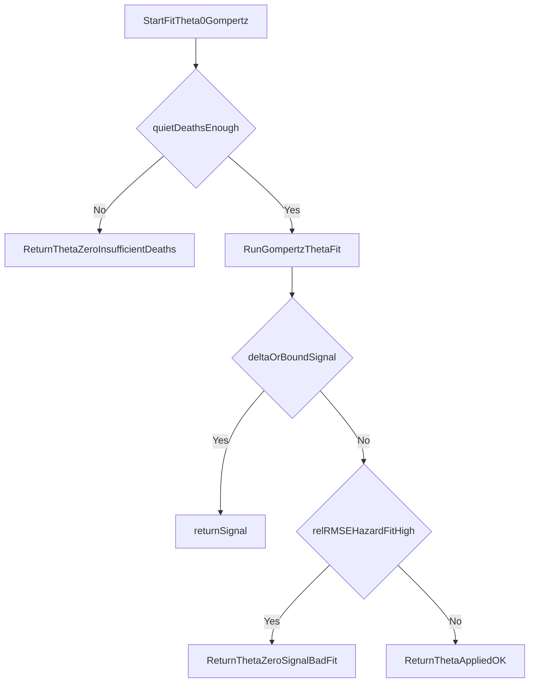

# KCOR.py Insufficient-Deaths/Safety Alignment

## Goal

Update [C:/Users/stk/Documents/GitHub/KCOR/code/KCOR.py](C:/Users/stk/Documents/GitHub/KCOR/code/KCOR.py) so `fit_theta0_gompertz` and downstream statusing match the behavior described in [C:/Users/stk/Documents/GitHub/KCOR/documentation/specs/KCORv7/insufficient_deaths.md](C:/Users/stk/Documents/GitHub/KCOR/documentation/specs/KCORv7/insufficient_deaths.md) and [C:/Users/stk/Documents/GitHub/KCOR/documentation/specs/KCORv7/insufficient_signal.md](C:/Users/stk/Documents/GitHub/KCOR/documentation/specs/KCORv7/insufficient_signal.md), while preserving existing v7.4 flow.

## Current Gaps To Address

- `min_quiet_deaths` guard runs after fitting (wasted/unstable fit attempts) instead of pre-fit gating.
- Missing post-fit bad-hazard-fit override (`relRMSE_hazard_fit > threshold`) and missing `[KCOR7_BAD_FIT]` log path.
- SA path behavior/logging is not fully aligned with main path for insufficient-deaths signaling.
- Status naming/priority is mostly correct downstream, but needs centralized normalization to avoid drift (`insufficient_signal` vs `INSUFFICIENT_SIGNAL` layers).

## Implementation Plan

1. Introduce a pre-fit deaths gate inside `fit_theta0_gompertz`:
  - Compute `total_quiet_deaths` from the same quiet-fit mask basis used for theta estimation.
  - If below configured `min_quiet_deaths`, return early with no optimizer call:
    - `theta_applied=0.0`, `theta0_raw=0.0`
    - machine status in diagnostics (`insufficient_deaths`), with consistent downstream mapping to report status `INSUFFICIENT_DEATHS`.
  - Reuse `_fail`-style field population so diagnostics rows remain complete and schema-compatible.
2. Add bad-fit safety override after successful fit attempt:
  - Add/compute `relRMSE_hazard_fit` in the fit diagnostics object (or alias to existing relRMSE if already equivalent).
  - If `relRMSE_hazard_fit > 1e6`, force:
    - `theta_applied=0.0`
    - status flag as insufficient signal (`insufficient_signal` -> `INSUFFICIENT_SIGNAL` in summary layer)
    - emit `[KCOR7_BAD_FIT]` with relRMSE value via `dual_print`.
3. Unify status/lifecycle handling across main + SA theta application paths:
  - Ensure insufficient-deaths and insufficient-signal events are treated consistently in both per-age and all-ages branches and SA block.
  - Add missing insufficient-deaths log emission in SA path when guard triggers.
  - Keep existing priority ladder semantics (`NOT_IDENTIFIED` > `INSUFFICIENT_DEATHS` > `INSUFFICIENT_SIGNAL` > `OK`).
4. Make thresholds/config explicit and backward-compatible:
  - Continue reading from [C:/Users/stk/Documents/GitHub/KCOR/data/Czech/Czech.yaml](C:/Users/stk/Documents/GitHub/KCOR/data/Czech/Czech.yaml) using existing keys under `time_varying_theta`.
  - Default `min_quiet_deaths=30` and `theta0_max=100` remain unchanged.
  - Add a dedicated bad-fit relRMSE threshold constant/config hook (default `1e6`) in the same config retrieval path to avoid hard-coded drift.
5. Diagnostics and summary consistency pass:
  - Verify `build_theta0_diagnostics_rows` consumes new flags/fields without schema breaks.
  - Ensure status summary generation (`theta0_status_summary`) correctly counts `INSUFFICIENT_SIGNAL` and `INSUFFICIENT_DEATHS` after new guard paths.
  - Preserve existing column names unless explicit schema update is requested.

## Control-Flow Target

Execution order to implement:

1. pre-fit deaths gate -> `INSUFFICIENT_DEATHS` (exit)
2. run fit
3. delta negative or theta bound hit -> `INSUFFICIENT_SIGNAL` (exit)
4. `relRMSE_hazard_fit > 1e6` -> `INSUFFICIENT_SIGNAL` with `BAD_FIT` log (exit)
5. return `OK`

## Validation Plan

- Run the existing KCOR pipeline on Czech config and verify logs/outputs:
  - no theta optimizer calls for cohorts failing quiet-deaths threshold,
  - `[KCOR7_INSUFFICIENT_DEATHS]` and `[KCOR7_BAD_FIT]` appear in expected scenarios,
  - `theta0_diagnostics` and `theta0_status_summary` produce stable schemas and expected status counts.
- Spot-check edge cohorts where `theta_hit_bound` and low-deaths conditions might overlap to confirm priority order.

## Files Expected To Change

- [C:/Users/stk/Documents/GitHub/KCOR/code/KCOR.py](C:/Users/stk/Documents/GitHub/KCOR/code/KCOR.py)
- (Optional only if needed for config default exposure) [C:/Users/stk/Documents/GitHub/KCOR/data/Czech/Czech.yaml](C:/Users/stk/Documents/GitHub/KCOR/data/Czech/Czech.yaml)

