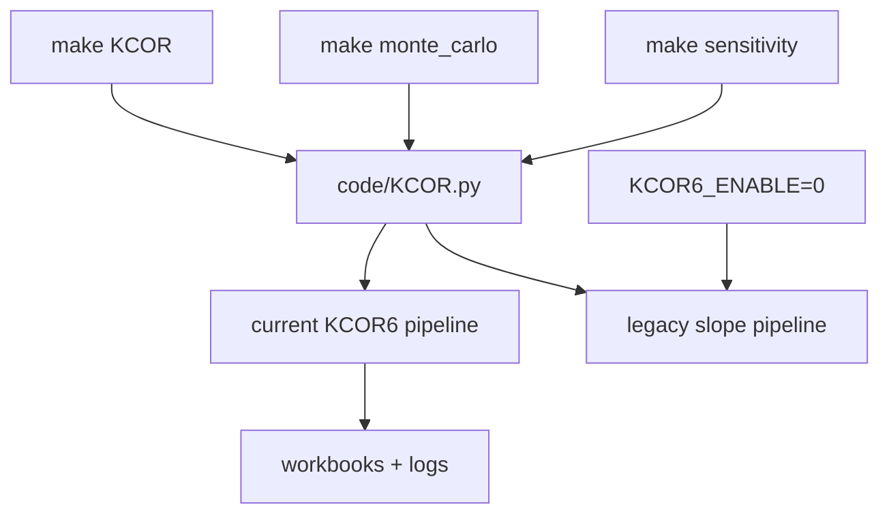

# KCOR v6: unify entrypoint for monte_carlo + sensitivity

## Goal

- Ensure **all operational entrypoints** (`make KCOR`, `make monte_carlo`, `make sensitivity`, `make test`) run the **current KCOR v6 (gamma-frailty) pipeline** by default.
- Remove MC/SA hardwiring to legacy slope logic.

## Current state (what we’re changing)

- `make monte_carlo` sets `MONTE_CARLO=1` and currently routes through a **Monte Carlo special-case branch** in [`code/KCOR.py`](code/KCOR.py) that applies **legacy slope normalization**.
- `make sensitivity` sets `SENSITIVITY_ANALYSIS=1` and currently runs a **tau × norm-weeks sweep** and disables KCOR6 via `kcor6_enabled_effective = ... and (not _is_sa_mode())`.

## Desired behavior

- **Monte Carlo**: bootstrap iterations should **refit (k, θ) per iteration** and apply KCOR6 normalization.
- **Sensitivity**: remove tau sweep; sweep only:
- **Baseline weeks**: `KCOR_NORMALIZATION_WEEKS` (e.g. default 2..8)
- **Quiet-window start offset** relative to `2022-24`: `[-12, -8, -4, 0, +4, +8, +12]` weeks
- Quiet-window end remains **fixed** at `2024-16`.

## Architecture: single “current KCOR” entrypoint

- Keep [`code/KCOR.py`](code/KCOR.py) as the stable entrypoint.
- Inside `process_workbook()`, refactor to have **one current pipeline path** used by Normal/MC/SA.
- Keep legacy behavior available **only** when explicitly requested (e.g. `KCOR6_ENABLE=0`).

## Implementation plan

### A) KCOR.py: make KCOR6 the default across modes

- In [`code/KCOR.py`](code/KCOR.py):
- Remove the SA suppression in `kcor6_enabled_effective` so SA/MC can use KCOR6.
- Ensure any remaining slope computations are only executed when `KCOR6_ENABLE=0`.

### B) Monte Carlo: run KCOR6 end-to-end

- In [`code/KCOR.py`](code/KCOR.py):
- Remove/disable the `MONTE_CARLO_MODE` branch that computes slope6 normalization and `continue`s early.
- Enable KCOR6 quiet-window fitting in MC runs (today it’s guarded by `if not MONTE_CARLO_MODE:`).
- Keep MC-specific *I/O* behavior (one sheet per iteration, MC summary table) unchanged.
- Acceptance checks:
    - `KCOR_MC_summary.log` contains `KCOR6_FIT,...` lines.
    - No `SLOPE8_FIT`, `[Slope6]`, etc. in MC logs.

### C) Sensitivity: redesign to sweep baseline weeks × quiet-start offsets (KCOR6 only)

- In [`code/KCOR.py`](code/KCOR.py):
- Replace the existing SA early-return (tau × norm weeks sweep) with a new sweep driver:
    - Baseline weeks list default: `[2,3,4,5,6,7,8]` (override via env)
    - Quiet start offsets default: `[-12,-8,-4,0,4,8,12]` (override via env)
    - For each (baseline_weeks, offset):
    - set `KCOR_NORMALIZATION_WEEKS` + derived `KCOR_NORMALIZATION_WEEKS_EFFECTIVE`
    - compute quiet-start ISO = `2022-24 + offset` weeks (calendar week arithmetic)
    - run the **current KCOR6** pipeline and extract the **YoB=-2** KCOR at the reporting date
    - Write `KCOR_SA.xlsx` as a 2D grid:
    - rows = baseline weeks
    - columns = quiet-start offset
    - one sheet per (cohort, dose pair)
- Add env interface (names can be finalized during implementation):
    - `SA_BASELINE_WEEKS` (list/range; replaces old `SA_NORM_WEEKS` semantics)
    - `SA_QUIET_START_OFFSETS` (explicit list like `-12,-8,-4,0,4,8,12`)
    - keep `SA_COHORTS`, `SA_DOSE_PAIRS`
- Remove tau handling (`SA_TAU_VALUES`) from SA logic.

### D) Makefiles: point SA/MC at “current KCOR” and update knobs

- Update [`code/Makefile`](code/Makefile):
- Ensure MC run explicitly sets `KCOR6_ENABLE=1` (overridable) when invoking `KCOR.py`.
- Update [`test/sensitivity/Makefile`](test/sensitivity/Makefile):
- Remove `SA_TAU_VALUES` usage.
- Add `SA_BASELINE_WEEKS` and `SA_QUIET_START_OFFSETS` passthrough.
- Update header comments to describe the new sweep.

### E) Validation

- Run:
- `make monte_carlo` (at least small `MC_ITERATIONS=5` quick check)
- `make sensitivity` (default sweep; then a quick override to reduce runtime)
- `make test`
- Grep logs to confirm no legacy slope tags.

## Risks / watchouts