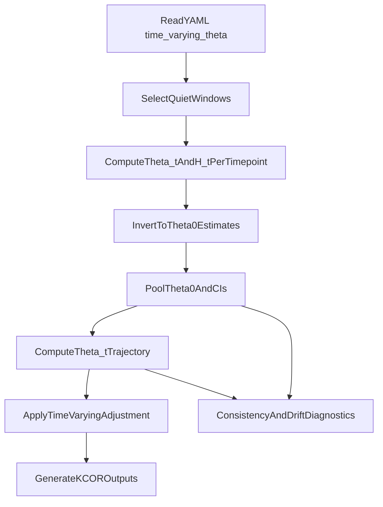

# KCOR v6 to v7 Upgrade Plan

## Scope and intent

- Preserve the current v6 implementation by copying `[code/KCOR.py](code/KCOR.py)` to `[code/KCORv6.py](code/KCORv6.py)` before introducing v7 behavior.
- Upgrade active `[code/KCOR.py](code/KCOR.py)` from fixed-theta (v6) to time-varying-theta (v7) per:
  - `[documentation/specs/KCORv7/KCOR_time_varying_theta.md](documentation/specs/KCORv7/KCOR_time_varying_theta.md)`
  - `[documentation/specs/KCORv7/KCOR_v7_spec.md](documentation/specs/KCORv7/KCOR_v7_spec.md)`
- Update root docs in `[README.md](README.md)` and dataset configuration examples (starting with `[data/Czech/Czech.yaml](data/Czech/Czech.yaml)`).

## Current code touchpoints (confirmed)

- v6 quiet-window constants and fixed-theta helpers are centralized in `[code/KCOR.py](code/KCOR.py)` (`KCOR6_QUIET_*`, `fit_k_theta_cumhaz`, `invert_gamma_frailty`).
- v6 fit/apply pipeline currently:
  - fits `(k, theta_hat)` on quiet-window `H_obs`
  - stores per-cohort `theta_hat`
  - applies a **single** `theta_hat` across full follow-up via `H0 = invert_gamma_frailty(H_obs, theta_hat)`.
- Dataset YAML loading currently supports `dosePairs`, `covidCorrection`, and a single `quietWindow` block.
- Root README is still branded/documented as v6.2 and does not yet describe v7 `time_varying_theta` config/diagnostics.

## Planned implementation steps

1. **Memorialize v6 code path**
  - Create `[code/KCORv6.py](code/KCORv6.py)` as an exact copy of current `[code/KCOR.py](code/KCOR.py)`.
  - Keep this file unchanged during v7 edits so there is a frozen, runnable v6 baseline.
2. **Add v7 configuration parsing and defaults**
  - Extend YAML parsing in `[code/KCOR.py](code/KCOR.py)` to read a new `time_varying_theta` block:
    - `enabled`
    - `apply_to`
    - `theta_estimation_windows`
    - `diagnostics` toggles
  - Keep backward compatibility:
    - if `time_varying_theta.enabled` is false/missing, preserve existing v6 behavior.
    - continue to honor existing `quietWindow` for v6 mode.
3. **Implement θ(0) estimation from multiple windows/timepoints**
  - Add v7 math helpers in `[code/KCOR.py](code/KCOR.py)`:
    - invert formula from `(theta_t, H_t)` to `theta0` using the numerically stable `-` root form:
      - `theta0 = 2*theta_t / (1 - 2*theta_t*H_t + sqrt(1 - 4*theta_t*H_t))`
    - enforce anchor-point validity checks at every inversion anchor:
      - verify `1 - 4*theta_t*H_t >= 0`
      - warn and skip invalid anchors (do not crash the run)
    - finite/positive guards for inversion inputs and outputs
    - pooling logic for per-timepoint `theta0` estimates with explicit default:
      - default pooled `theta0` = simple arithmetic mean of all valid anchor-level `theta0` estimates
      - default CI = normal-approximation CI from sample variance of valid anchor-level estimates
      - optional advanced mode (future) can add inverse-variance or likelihood-based pooling, but initial v7 implementation uses the simple-mean rule for determinism and transparency
      - always report window-level stats alongside pooled estimate.
  - Build per-window/per-timepoint extraction from existing cohort time series used in v6 fitting.
4. **Root selection / identifiability convention**
  - Document in both v7 spec comments and code comments that inversion from a single anchor is generally two-valued.
  - State that KCOR v7 intentionally uses the continuous small-`H` branch (numerically stable `-` root form) as the branch convention.
  - Add a brief guardrail comment near inversion code to prevent accidental future root swapping.
5. **Implement time-varying theta application in normalization**
  - Replace fixed `theta_hat` application in v7 mode with:
    - compute `theta_t = theta0 / (1 + theta0*H_obs)^2` at each timepoint
    - compute adjusted cumulative hazard with time-varying theta (v7 path).
  - Apply conditionally by cohort according to `apply_to` (`unvaccinated_only`, `vaccinated_only`, `both_cohorts`).
  - Preserve current output columns while adding v7-relevant theta fields where useful (e.g., theta0 and/or timepoint theta traces in diagnostics outputs).
6. **Diagnostics and logging**
  - Add consistency-test reporting to console/summary log using window-level and pooled theta0 metrics (including drift test outputs requested in spec).
  - Add optional diagnostic outputs controlled by YAML:
    - theta0 estimates by window/timepoint (tabular + plot artifact)
    - theta trajectory plot over follow-up.
  - Add explicit counters in logs for anchors skipped due to invalid discriminant and non-finite inputs.
7. **README and config documentation updates**
  - Update `[README.md](README.md)` to reflect v7:
    - version label and methodology description (time-varying theta replacing fixed theta)
    - new YAML section for `time_varying_theta`
    - migration note explaining preserved `KCORv6.py` and compatibility mode.
  - Update example config in `[data/Czech/Czech.yaml](data/Czech/Czech.yaml)` (or add commented template) to show v7 keys.
8. **Validation pass (regression + v7 checks)**
  - Run a focused regression to ensure v6-compatible mode still works when v7 disabled.
  - Run v7-enabled case on Czech config to verify:
    - successful theta0 estimation across configured windows
    - expected diagnostics emitted
    - no runtime/lint breakages in touched files.

## Acceptance tests (explicit pass/fail)

- **Branch recovery test:** add a unit test that generates valid `(theta0, H_t)` values, computes forward `theta_t`, then inverts using the chosen stable `-` branch and verifies recovery of `theta0` within tolerance.
- **Anchor skip accounting:** verify logs include counts of skipped anchors for:
  - invalid discriminant (`1 - 4*theta_t*H_t < 0`)
  - non-finite/invalid inversion inputs.
- **Cross-window consistency:** verify multi-window estimates are reported separately and checked for agreement (window-level means/dispersion and drift/consistency statistic), not only pooled mean/CI.

## Execution flow (v7 mode)

## Key files to change

- `[code/KCOR.py](code/KCOR.py)` (primary implementation)
- `[code/KCORv6.py](code/KCORv6.py)` (new frozen copy)
- `[README.md](README.md)` (v7 docs + config)
- `[data/Czech/Czech.yaml](data/Czech/Czech.yaml)` (v7 config example/default block)

## Risks to manage

- Correctly defining/estimating `theta(t*)` inputs for inversion from existing data objects (must align with current hazard pipeline).
- Ensuring all anchor points run the discriminant check (`1 - 4*theta_t*H_t >= 0`) with clear warnings and deterministic skip behavior.
- Avoiding behavior drift in legacy mode when `time_varying_theta` is disabled.
- Keeping existing outputs/consumers compatible while adding v7 diagnostics.

