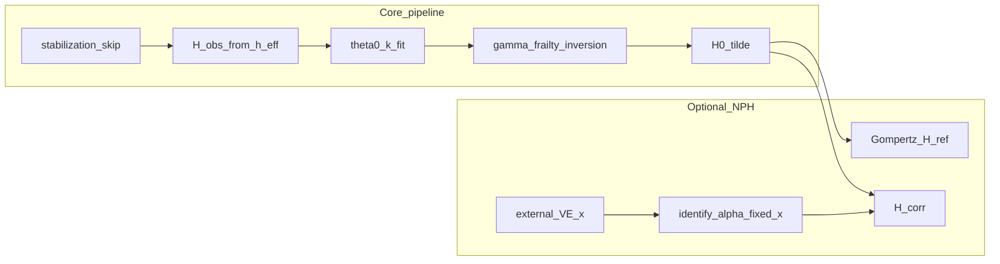

# Plan: NPH methods text per punch66 (paper + supplement)

## Context

- [documentation/preprint/punch66.md](documentation/preprint/punch66.md) asks for a **structural split** in the NPH exposition: (1) how $\alpha$ is **identified** when VE is external, (2) how the **correction is applied after gamma-frailty inversion**, (3) a short **workflow** checklist.
- The current manuscript still states that the NPH module preprocesses hazards **before** inversion (e.g. [§2.5](documentation/preprint/paper.md) ~L342, [§2.6](documentation/preprint/paper.md) ~L418, [§2.7.1](documentation/preprint/paper.md) ~L503, [§2.3](documentation/preprint/paper.md) ~L247, Box 2 ~L92, algorithm caption ~L622). That contradicts the implementation: [`apply_nph_correction_post_inversion`](code/KCOR.py) runs on `H0` from `invert_gamma_frailty`, builds a Gompertz reference path in the wave window, and corrects only **strictly positive** excess $\tilde H_{0,d}-H_{\mathrm{ref},d}$ by dividing by $F_d(t;\alpha)$ (with $H_{\mathrm{ref}}$ anchored to $\tilde H_{0,d}$ at wave entry for continuity—align prose with this discrete-time construction).

## 1. Restructure §2.7 in `paper.md`

**Keep** `### 2.7 Stabilization (early weeks)` and the skip-week material through the rebasing paragraph (current ~L452–473).

**§2.7.1 Optional NPH exponent model** (current ~L475–503):

- Retain the conceptual hazard decomposition, ratio cancellation, and weak-identification intuition.
- **Remove or rewrite** the paragraph that says $\alpha$ is estimated **before** frailty inversion and defines a preprocessing hazard stream (~L503).
- **Add** the punch66 sentence (after the optional-module framing): $\alpha$ is not separately identifiable from cohort-specific multiplicative intervention effects in minimal aggregated data, so using the module for $\alpha$ identification requires **externally supplied VE or another prespecified intervention-effect scale**, not an effect learned from the same wave-period contrasts as $\alpha$. Use this **exact phrasing** everywhere the manuscript refers to the external input (§2.7.1, §2.7.2, Box 2 if touched, supplement A8, abstract if touched).

**Replace current §2.7.2** (“Estimation of $\alpha$” with pairwise/collapse on raw $e_d$) with **§2.7.2 Identification of $\alpha$ given an externally estimated VE**:

- Use the punch66 logic: introduce external scalar $x$ (VE against wave-period hazard), relate **true** excess hazards between cohorts $A,B$, then multiply by $F_d(t;\alpha)$ for **observed** excess, derive the cross-cohort ratio identity that identifies $\alpha$ from mismatch vs $(1-x)\,F_A/F_B$.
- **Clean up punch66 LaTeX** when pasting: replace the spurious `====` lines with single `=`; fix comma typos like `(1-x),\Delta` to proper multiplication; use consistent notation with the rest of the paper (either keep $\Delta h^{\mathrm{true}}_d$ as in punch66 or map explicitly to the paper’s $e_d(t)$ symbols).
- Close with: operationally, pairwise/collapse-style objectives apply with **$x$ fixed**; weak localization $\Rightarrow$ not identified. **Point to SI** for full objective formulas and diagnostics.

**New §2.7.3 Application of the NPH correction once $\alpha$ is specified**:

- **First paragraph (mandatory — reviewer preemption):** Explain **why** correction is post-inversion. Paste-ready gist:

  > Applying the NPH correction after gamma-frailty inversion ensures that wave-period excess is defined relative to a **frailty-neutral** baseline. Applying the correction to raw observed hazards would confound depletion geometry with wave-period amplification and yield mis-scaled excess.

- **Explicit $\theta_{0,d}$ vs $\alpha$ separation (mandatory):** Add a short sentence that the NPH module **does not** change quiet-window estimation of $\theta_{0,d}$ (or $\hat k_d$); depletion geometry is identified from prespecified quiet windows **before** any wave-period cumulative correction. This reinforces core vs optional module.

- State ordering explicitly: correction applies **after** Eq. (@eq:normalized-cumhazard) on $\tilde H_{0,d}(t)$.

- **Discrete-time standard (mandatory):** Describe $H_{\mathrm{ref},d}$ using **weekly bins only**—no parallel continuous-time integral path unless as optional intuition. Match [§2.3](documentation/preprint/paper.md) and code: anchor $H_{\mathrm{ref}}$ to $\tilde H_{0,d}$ at the **first bin inside the wave window**, then forward-accumulate Gompertz weekly increments $\hat k_d e^{\gamma s}\Delta t$ with $\Delta t=1$ week (same rebased $s$ convention as elsewhere).

- Define $\Delta H_{\mathrm{wave},d}(t)=\tilde H_{0,d}(t)-H_{\mathrm{ref},d}(t)$; correction only when $\Delta H>0$; $H_{\mathrm{corr},d}=H_{\mathrm{ref},d}+\Delta H/F_d(t;\alpha)$; outside NPH window $H_{\mathrm{corr}}=\tilde H_{0,d}$. **Wording polish:** include one explicit reviewer-friendly sentence such as: *Only **wave-attributable** excess above the frailty-neutral Gompertz baseline path is rescaled* (i.e. tie $\Delta H>0$ to that phrase).

- **Monotonicity / numerical safety (mandatory):** One sentence that the implementation enforces **non-decreasing** $H_{\mathrm{corr},d}$ in event time (e.g. cumulative maximum repair) so corrected paths remain valid cumulative-hazard geometry—mirrors `np.maximum.accumulate` in [`apply_nph_correction_post_inversion`](code/KCOR.py).

- Note weekly hazard increments via differencing $H_{\mathrm{corr}}$ if needed; downstream KCOR uses the **corrected** cumulative scale when the module is active.

**Renumber current §2.7.3** checklist to **§2.7.4 Practical workflow for the optional NPH module** using punch66’s seven steps (quiet-window $\hat\theta_{0,d},\hat k_d$; external VE; identify $\alpha$ with fixed $x$; **inversion**; post-inversion correction; continue pipeline; diagnostic failure $\Rightarrow$ inactive module).

## 2. Pipeline consistency edits outside §2.7 (`paper.md`)

Update every place that still implies NPH **pre**-inversion preprocessing:

| Location | Change |
|----------|--------|
| [§2.3](documentation/preprint/paper.md) ~L247–252 | Say $h_d^{\mathrm{adj}}=h_d^{\mathrm{eff}}$ (stabilization only) for accumulating $H_{\mathrm{obs},d}$; optional NPH adjusts **frailty-neutral** cumulative hazards after §2.6 (cross-ref §2.7.3). |
| [§2.5](documentation/preprint/paper.md) ~L342 | Remove “NPH exponent preprocessing … prior to inversion”; $h_d^{\mathrm{adj}}=h_d^{\mathrm{eff}}$ for the core pipeline; NPH is post-inversion on $\tilde H_{0,d}$ (§2.7.3). |
| [§2.6](documentation/preprint/paper.md) ~L418 | Same: inversion input is skip-only preprocessing; NPH correction is optional **subsequent** step on $\tilde H_{0,d}$. |
| [§2.8](documentation/preprint/paper.md) ~L567–578 | Define $\mathrm{KCOR}(t)$ as ratio of **$H_{\mathrm{corr}}$** when NPH correction is applied, else $\tilde H_{0,d}$ (one sentence). |
| [§2.9.1](documentation/preprint/paper.md) ~L599 | Bootstrap “optional NPH module settings” should describe **post-inversion correction + external $x$** if used, not hazard preprocessing. |
| Box 2 ~L92 | Replace “before cumulative-hazard accumulation and inversion” with order: inversion then optional post-inversion NPH correction. |
| §1.2 ~L49, §5.4 ~L958, contributions ~L77 if needed | Update “§2.7.1–§2.7.2” (and similar) to **§2.7.1–§2.7.3** or “§2.7”. |
| Algorithm figure caption ~L622 **(C)** | Align with post-inversion NPH + external VE for $\alpha$ ID. |
| Abstract ~L15 | If it still says NPH only in generic terms, add a **minimal** clause that VE for $\alpha$ identification is external under minimal data (only if it fits length). |

## 3. `supplement.md`

- **[§S2.1](documentation/preprint/supplement.md)** (~L72–114): Realign with main text: (1) non-identifiability of $\alpha$ vs cohort-specific multiplicative effects without **externally supplied VE or other prespecified intervention-effect scale**; (2) **why** post-inversion (frailty-neutral excess; avoid confounding depletion with amplification)—can be one sentence echoing §2.7.3; (3) post-inversion correction in **discrete** $H$-space (anchor, positive excess, monotonicity); (4) pairwise/collapse with **fixed** external scale; (5) failure signatures unchanged in spirit.
- **Table @tbl:si_assumptions row A8** (~L41): Same external-input wording as main text; post-inversion correction; optional mention of monotonicity if row length allows.

## 4. Build and consistency check

- Run `make paper` from repo root so [documentation/preprint/paper.tex](documentation/preprint/paper.tex) / PDF match `paper.md`.
- Grep `paper.md` for `prior to inversion`, `before frailty inversion`, `NPH exponent preprocessing` and resolve stragglers.
- Grep `paper.md` + `supplement.md` for `externally` / `VE` in NPH context and ensure **one** standard phrase: externally supplied VE **or** other prespecified intervention-effect scale (avoid “VE only” unless clearly synonymous).
- Before finalizing §2.7.3, confirm all three mandatory additions are present: (1) post-inversion **why**, (2) **$\theta_{0,d}$ unchanged by NPH module** for estimation, (3) **monotonic** $H_{\mathrm{corr}}$.

## 5. Optional narrative tightening (if scope allows)

- Consider retitling `### 2.7` to reflect both stabilization and NPH (e.g. “Stabilization and optional wave-period module”) **without** renumbering §2.8–2.10, or leave numbering as-is if churn is too high.

