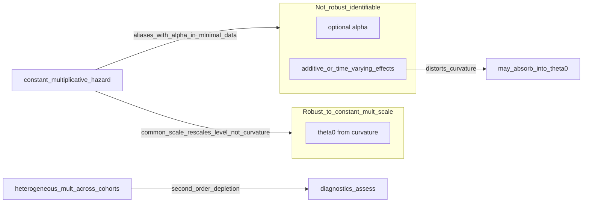

# Plan: Identifiability and θ₀ vs α in `paper.md`

## Problem the draft creates today

The same logical claim appears in **four** places and **contradicts** the refinement you want:

- [§1.5](documentation/preprint/paper.md) (contribution paragraph, ~line 79)
- [§2.1](documentation/preprint/paper.md) (~lines 117–119)
- [§2.4.4](documentation/preprint/paper.md) (~lines 331–333): the bold “Additional identifiability limitation” block explicitly says constant multiplicative effects can make normalization **biased** and attribute effects to $\theta_{0,d}$
- [§4.1](documentation/preprint/paper.md) (~lines 838–841): repeats the “no constant multiplicative” condition and says depletion, constant PH shifts, and time-varying hazards are “not generically separable”

Your target narrative is a **clean partition**:

**Reviewer preemption:** Do **not** claim unconditional “multiplicative effects do not bias $\theta_{0,d}$.” Cohort-specific multiplicative levels (e.g., different VE) can induce **second-order** curvature differences through differential depletion; the plan treats these as typically small relative to primary depletion geometry and covered by diagnostics.

## 1. §2.4.4 — replace conflicting blocks (critical)

**Location:** [`#### 2.4.4 Quiet-window validity and identifiability`](documentation/preprint/paper.md) after the numbered list (items 1–4).

**Actions:**

- **Delete** the entire **“Additional identifiability limitation”** paragraph (~lines 331–332) that claims proportional hazard differences can bias $\theta_{0,d}$ and normalization.
- **Replace** the following sentence (~line 333) that conditions $\theta_{0,d}$ identifiability on “no constant multiplicative hazard effect” and “confounded with frailty-induced curvature.”
- **Insert** the **“Refinement: effect-scale invariance of curvature-based identification”** block, with these **mandatory edits** to the draft text:
  - Where the original punch list said multiplicative scaling **“does not bias $\theta_{0,d}$”**, use wording along the lines of **“does not alter curvature-based identification under a common or approximately common multiplicative scaling across cohorts”** (or equivalent precise LaTeX).
  - **Add immediately after** (same subsection): *“Heterogeneous multiplicative effects across cohorts may introduce second-order curvature differences through differential depletion, but these are typically small relative to primary depletion geometry and are assessed via diagnostics.”*
- **Preserve** a short closing bridge: quiet-window / alignment / diagnostics still gate when the **joint** identification regime fails (non-multiplicative contamination, Gompertz misspecification, **and** material failure of the common-scale approximation when diagnostics break down).

## 2. §2.1 — fix the logical inconsistency (important)

**Location:** [§2.1 Conceptual framework and estimand](documentation/preprint/paper.md), ~lines 117–119.

**Actions:**

- **Replace** this sentence **in full** (do not tweak in place with vague “reconcile”):

  > *“KCOR cannot distinguish depletion-induced heterogeneity from a constant proportional hazard shift within a quiet window without additional information.”*

  **With (paste-ready):**

  > KCOR does not identify constant multiplicative hazard effects as separate parameters; however, such effects do not affect curvature-based identification of $\theta_{0,d}$ under the working model **when multiplicative scaling is common or approximately common across cohorts** (see §2.4.4 for heterogeneous scaling and diagnostics).

  (Optional: drop the parenthetical if §2.4.4 already back-references clearly; keep cross-section consistency.)

- **Replace** the final identifiability sentence (the one beginning “Under minimal aggregated data, the cohort-specific frailty variance…”) with the original punch-list paragraph (curvature-based $\theta_{0,d}$; constant multiplicative not separately identifiable from **baseline scale** but does not affect curvature identification under the common-scale qualification; non-multiplicative effects may distort curvature). Align wording with §2.4.4 so **common vs heterogeneous** multiplicative scaling is consistent.

## 3. Propagate the same correction (consistency)

Without this, the paper still contradicts itself after §2.1/§2.4.4 edits.

| Section | Current issue | Direction |
|--------|----------------|-----------|
| [§1.5](documentation/preprint/paper.md) ~L79 | Ends with “identifiable only conditional… no constant multiplicative… confounded with curvature” | Rewrite the tail to match §2.1/§2.4.4: curvature-based $\theta_{0,d}$; **common / ~common** multiplicative scale vs **heterogeneous** cross-cohort scaling (second-order, diagnostics); **non-multiplicative** threats; optional $\alpha$ fragile under cohort-specific multiplicative structure. |
| [§4.1](documentation/preprint/paper.md) ~L838–841 | Repeats old conditional + L841 lumps “constant proportional hazard shifts” with non-separable curvature | Same partition as §2.4.4: drop unconditional “no constant multiplicative” for $\theta_{0,d}$; separate **shared multiplicative scale** (curvature ID) vs **differential multiplicative effects across cohorts** (can perturb depletion paths; ties to $\alpha$ confounding); **additive / time-varying** curvature contamination. |

## 4. §4.1 — add interpretation guardrail

**Location:** [§4.1 Limits of attribution and non-identifiability](documentation/preprint/paper.md), after the opening “strength / complementary to Cox” material and **before** or **immediately after** the **“Identifiability under the revised estimator”** sub-paragraph—whichever reads more smoothly (goal: readers see **curvature vs level** before dense identifiability bullets).

**Action:** Insert your **“Separation of curvature and level effects”** short paragraph; tune **“agnostic to constant multiplicative shifts”** if needed to align with §2.4.4 (e.g., emphasis on **level** not being separately estimated, and curvature identification under **common** multiplicative scale, with heterogeneous scaling covered by diagnostics / optional $\alpha$ limits).

## 5. §3.4.4 — link empirical $\alpha$ outcome to theory (recommended)

**Location:** [§3.4.4 Summary of identification status](documentation/preprint/paper.md) (Czech pooled $\alpha$ reported as not identified).

**Action:** After the paragraph that states non-identification / shallow optimum (or at the end of the subsection before “Future work”), **add:**

> This non-identification is consistent with the structural confounding between $\alpha$ and cohort-specific multiplicative effects described in §5.4.

(Ensure §5.4 is edited first or in the same pass so the forward reference is accurate.)

## 6. §5.4 — add “why $\alpha$ fails” paragraph

**Location:** [§5.4 Optional NPH exponent model…](documentation/preprint/paper.md), **after** the paragraph ending with “inactive or unreliable” (~L949) or **after** the Czech “not identified” paragraph (~L953)—best narrative flow: after you describe weak identification signatures, add your **“Non-identifiability under simultaneous multiplicative effects”** block (minimal data; $\alpha$ vs cohort-specific multiplicative effects; flat objectives / boundaries; simulation vs real data). Ensures Limitations explicitly ties **VE-style confounding** to **$\alpha$**, not to **$\theta_{0}$** curvature logic.

## 7. Abstract — optional one-liner

**Location:** [Abstract](documentation/preprint/paper.md), after the sentence that introduces the optional NPH module and $\alpha$ (“…estimates a single shared exponent $\alpha$ from cross-cohort structure.” per your punch list).

**Action:** Add your sentence on curvature-based depletion geometry vs non-identifiability of optional $\alpha$ under constant multiplicative effects in minimal data.

**Note:** Metadata lists **Word count: 10,909**; after edits, bump that number if you keep it accurate (optional housekeeping).

## 8. Post-edit consistency (recommended, outside strict `paper.md` scope)

[documentation/preprint/supplement.md](documentation/preprint/supplement.md) still states in Tables S* that $\theta_{0,d}$ is conditional on “no constant multiplicative hazard effect” and that such an effect is “confounded with frailty-induced curvature” (~lines 36, 63, 70). After `paper.md` is updated, **mirror the same partition** there or the SI will undermine the main text.

**Build:** Per [BUILD_README.md](documentation/preprint/BUILD_README.md), regenerate `paper.tex` / PDF via `make paper` from the repo root so the LaTeX intermediate matches `paper.md`.

## Quick verification checklist (no new prose required)

- Grep `paper.md` for `no constant multiplicative` and `observationally confounded with frailty` — should be **gone** or **only** in the new $\alpha$-specific wording you intend.
- Read §2.1 → §2.4.4 → §4.1 → §5.4 once in sequence: **one** story (θ₀ curvature; α fragile; VE as multiplicative confound for α).
