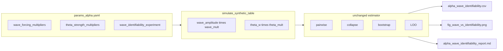

# Wave-size vs differential-scaling alpha identifiability plan

## Context

The design doc ([documentation/plans/alpha_identification.md](documentation/plans/alpha_identification.md)) asks for a **synthetic-only** study showing whether **larger wave forcing** alone improves identifiability versus **stronger cross-cohort frailty spread** (theta). The real data path and `code/KCOR.py` stay untouched; work stays in [test/alpha/code/estimate_alpha.py](test/alpha/code/estimate_alpha.py) and [test/alpha/params_alpha.yaml](test/alpha/params_alpha.yaml).

Today, synthetic forcing is built in `simulate_synthetic_table` ([~995–1076](test/alpha/code/estimate_alpha.py)): `wave_amplitude` comes from `wave_amplitude_peak`, cohort initial frailty from cycling `theta_w_values`, then `propagate_theta` and `gamma_moment_alpha` produce excess. There is **no** wave/theta multiplier axis yet.

## Config design

Add optional fields under the existing `synthetic:` block (not new top-level keys) so defaults preserve current behavior:

- `wave_forcing_multipliers: [1.0]` — when multiple values are present, the experiment grid uses them; default `[1.0]` means no extra dimension for normal runs.
- `theta_strength_multipliers: [1.0]` — multiply each cohort’s **baseline** `theta_w` after drawing from `theta_w_values` (i.e. `theta_effective = theta_w * theta_multiplier`), then use that everywhere `theta_w` is used in the synthetic path (propagation and `gamma_moment_alpha`).
- `wave_identifiability_experiment.enabled: false` — when `true`, run the **dedicated** wave×theta identifiability pipeline (below) in addition to the existing Czech + synthetic recovery flow.

For the **documented experiment run**, set in yaml (or a copy of the config):

- `synthetic.wave_forcing_multipliers: [1.25, 1.5, 2.0]`
- `synthetic.theta_strength_multipliers: [0.5, 1.0, 2.0]`
- `synthetic.synthetic_vaccine_effect.enabled: false` (and keep `conditional_VE_enabled: false` for that run) so VE does not confound.
- Optionally restrict `noise_models` to a single model (e.g. `lognormal_fixed`) and tune `reps` for this grid so runtime stays reasonable (full Cartesian product is `len(alphas) × len(noise) × len(wave) × len(theta) × reps`).

**Note:** The doc’s names `synthetic_wave_multipliers` / `synthetic_theta_multipliers` map to these nested keys; using nested names avoids polluting the root of the yaml and matches `wave_amplitude_peak` / `theta_w_values`.

## Code changes in `simulate_synthetic_table`

Extend the signature with optional `wave_multiplier: float = 1.0` and `theta_multiplier: float = 1.0`:

1. **Wave:** After building `wave_amplitude` from the peak and Gaussian shape, use `wave_amplitude = wave_amplitude * wave_multiplier` (and keep `delta_h_path = cumsum(0.5 * wave_amplitude + …)` so cumulative hazard scales with forcing, consistent with “multiply A(t)”).
2. **Theta:** Replace `theta_w = float(theta_values[...])` with `theta_w = float(theta_values[...]) * theta_multiplier` before the week loop.

No changes to pairwise/collapse objectives, bootstrap, or LOO logic.

## New experiment driver (avoid blowing up `synthetic_recovery`)

Do **not** fold wave×theta loops into the existing `synthetic_recovery` nested loops (that would multiply runtime by 9+). Instead:

- Add something like `run_wave_identifiability_experiment(cfg, alpha_values) -> dict` that:
  - Returns early with empty frames if `wave_identifiability_experiment.enabled` is false.
  - Iterates `noise_models`, `alpha_true_values`, `wave_forcing_multipliers`, `theta_strength_multipliers`, and `reps` (reuse `synthetic.seed` and a deterministic seed mix similar to [1227–1258](test/alpha/code/estimate_alpha.py)).
  - For each combo: `simulate_synthetic_table(..., wave_multiplier=..., theta_multiplier=...)`, then **`evaluate_synthetic_best_with_diagnostics`** ([1148–1224](test/alpha/code/estimate_alpha.py)) so each row gets bootstrap boundary fraction, curvature, LOO, etc., without duplicating that logic.
- **Output rows:** Build [alpha_wave_identifiability.csv](test/alpha/out/alpha_wave_identifiability.csv) with columns aligned to the doc: `alpha_true`, `wave_multiplier`, `theta_multiplier`, `noise_model`, `rep`, `estimator`, `alpha_hat_raw`, `identified` (0/1), `curvature_metric`, `bootstrap_boundary_fraction`, plus useful extras (`identification_status`, `boundary_optimum`) if cheap. Using **both** estimators matches the rest of the alpha tooling; figures can default to **pairwise** for “identification rate” unless you prefer “both must identify.”

## Figure: `fig_wave_vs_identifiability.png`

Add a plotting helper (pattern: [3346–3386](test/alpha/code/estimate_alpha.py), `_import_matplotlib` / `_save_figure`):

- **Panel A:** Subset `theta_multiplier == 1.0` (float-safe), aggregate across reps: `identification_rate = mean(identified)` by (`wave_multiplier`, `alpha_true`); plot x = wave multiplier, y = identification rate, one line per `alpha_true`.
- **Panel B:** Subset `wave_multiplier == 2.0`, aggregate by (`theta_multiplier`, `alpha_true`) or pool alphas if too busy — doc fixes wave at 2.0 and varies theta; y = identification rate.

## Report and console

- Write [alpha_wave_identifiability_report.md](test/alpha/out/alpha_wave_identifiability_report.md) with the interpretation bullets from the doc (wave-only vs theta-only tests and the stated conclusion template).
- Add `print_wave_identifiability_summary(...)` printing the “WAVE IDENTIFIABILITY TEST” lines for the illustrative combos from the doc (filter the result dataframe for those `(wave, theta)` pairs and show aggregated identification rate or example reps).

## Wire into `main` / `write_outputs`

- In [main()](test/alpha/code/estimate_alpha.py) (~3585), call the new runner when enabled; pass resulting CSV path content into [write_outputs](test/alpha/code/estimate_alpha.py) (extend signature with optional DataFrame + report string + figure path, or write files inside the runner and only pass empties when disabled — prefer **centralized `write_outputs`** for consistency with other alpha artifacts).
- When disabled, write no files (or empty CSV) and skip figure — match behavior of other optional sections (`conditional_ve_*`).

## Hard enforcement (VE off)

In `run_wave_identifiability_experiment`, **assert** before any simulation:

- `synthetic.synthetic_vaccine_effect.enabled` is false (no VE modes in the DGP for this experiment).
- `synthetic.conditional_VE_enabled` is false.

This prevents accidental contamination if someone enables the experiment with a VE-heavy config.

## Definition of `identified` in outputs

For each **estimator** row in `alpha_wave_identifiability.csv`:

- **`identified` = 1** iff `alpha_hat_reported` is finite **and** the same **bootstrap stability** gates as `build_bootstrap_summary` / `bootstrap_ok` pass for that estimator (finite fraction, IQR, boundary fraction vs `identifiability` thresholds).
- Do **not** define identification from raw `alpha_hat` alone; `alpha_hat_reported` is already NaN unless the curve passes curvature/boundary checks in `summarize_best_curve`.

(Pairwise/collapse **agreement** is a separate production gate for Czech primary ID; this experiment records per-estimator strict rows so the figure can use pairwise-only rates.)

## Figures: estimator choice

**Use the pairwise estimator only** for identification-rate panels (mean of `identified` over reps), unless a future option says otherwise.

## Regression guarantee

When `wave_multiplier = 1.0` and `theta_multiplier = 1.0`, numeric outputs from `simulate_synthetic_table` + `evaluate_synthetic_best_with_diagnostics` must match what the same call would produce without the new parameters (defaults). Same seeds → pairwise/collapse `alpha_hat_raw`, `curvature_metric`, and bootstrap diagnostics **within floating tolerance** as the existing synthetic path.

## Expected outcome (report block)

Include in `alpha_wave_identifiability_report.md`:

- Increasing `wave_multiplier` alone should have **limited** effect on pairwise identification rate.
- Increasing `theta_multiplier` should **increase** identification rate and curvature.
- If that pattern holds, alpha identifiability is driven by **cross-cohort divergence** (frailty spread), not absolute wave magnitude.

## Optional polish (before / during implementation)

These are **not required** for correctness but help debugging and sanity checks.

### 1. Log effective signal size

In the wave identifiability runner (or `simulate_synthetic_table` when multipliers ≠ 1), emit a concise line **once per distinct `(wave_multiplier, theta_multiplier)`** on the first rep (or first alpha/noise) so logs stay readable, for example:

- `wave_mult`, `theta_mult`
- `max(delta_h_path)` after scaling `wave_amplitude` (confirms cumulative hazard scales with forcing), **or** `max(abs(excess))` on the generated table as a cheap observable proxy

Purpose: confirm the wave multiplier actually moves the DGP and to debug surprising identification curves.

### 2. Extreme `theta_multiplier` (watch, don’t over-engineer)

If `theta_strength_multipliers` includes values like `2.0` and the DGP behaves oddly (numerical edge cases, absurd frailty spread):

- Prefer **logging a warning** when effective baseline theta exceeds a generous threshold, rather than silent clipping.
- Add **clipping** only if a concrete failure mode appears; document the cap in yaml comments if introduced.

Default plan: warn-only unless implementation shows instability.

## Verification

- Run `estimate_alpha.py` with a **small** grid (e.g. single noise model, `reps: 2`, enabled experiment) and confirm CSV row counts and that figure/report emit under `outdir`.
- Confirm default config (`enabled: false`, multipliers `[1.0]`) produces **no** extra outputs and does not change existing synthetic recovery numerics (regression: same seeds → same `simulate_synthetic_table` when multipliers default to 1.0).

## Out of scope (per doc)

- No edits to [code/KCOR.py](code/KCOR.py).
- No mixing conditional-VE logic into this experiment’s DGP; keep VE off for the clean identifiability read.

