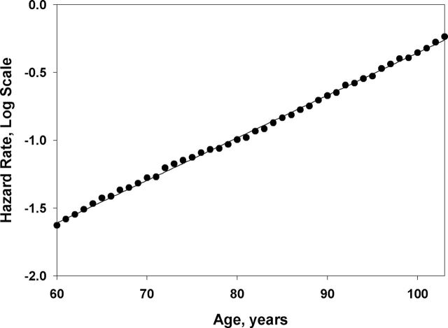
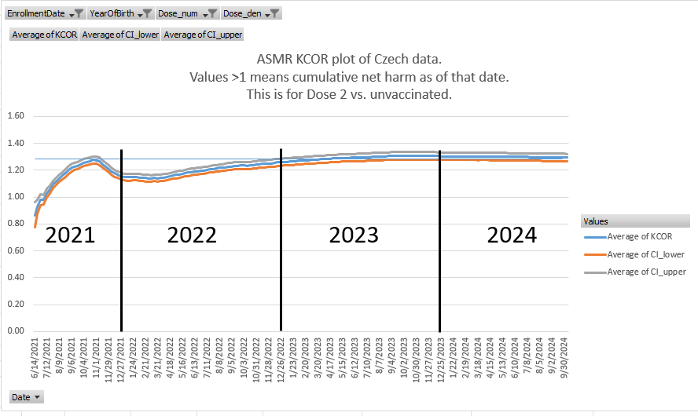
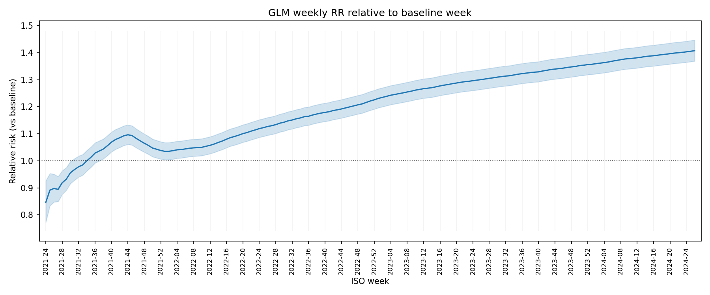
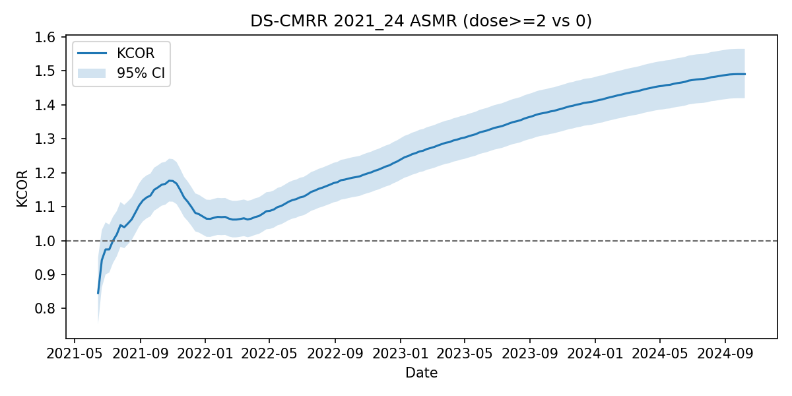
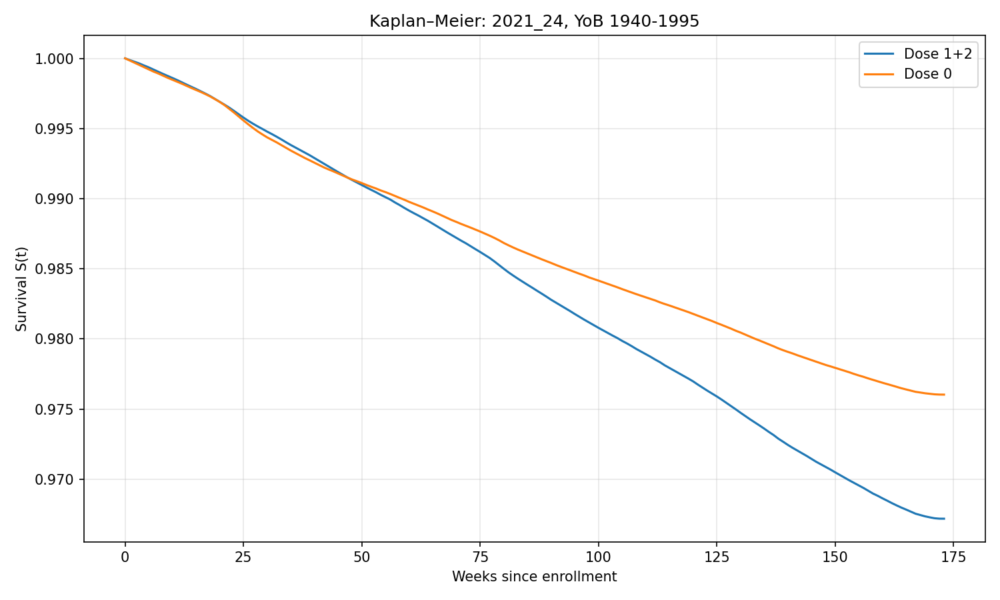
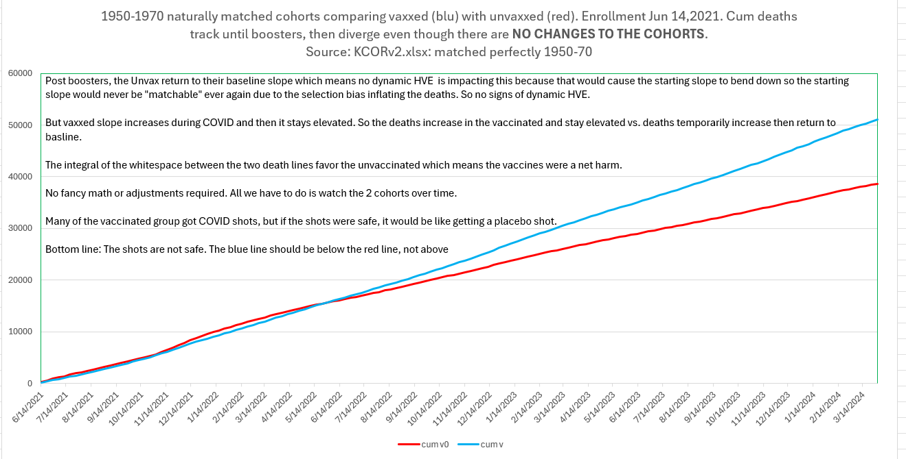
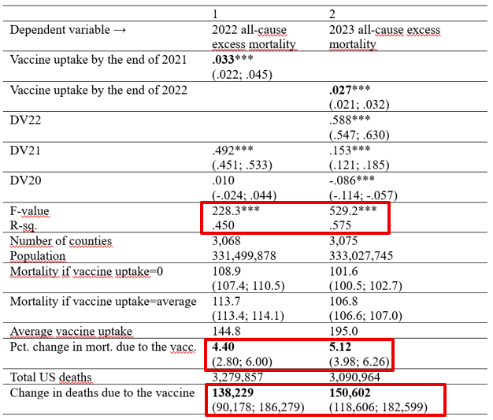
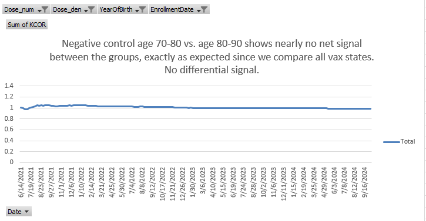
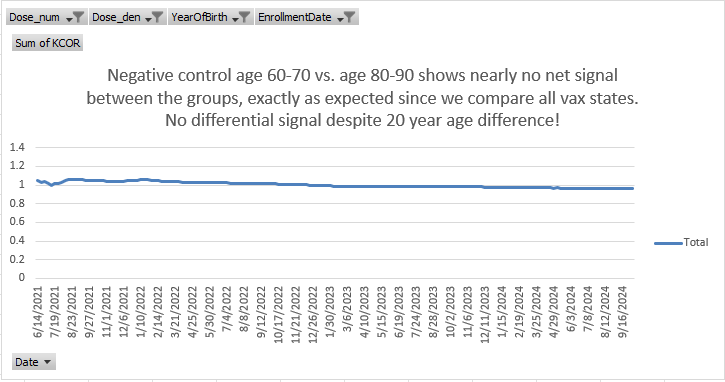

# KCOR v4.6 - Kirsch Cumulative Outcomes Ratio Analysis

[](https://www.python.org/downloads/)
[](https://opensource.org/licenses/MIT)

## 📋 Table of Contents

- [Overview](#overview)
- [🔬 Methodology](#-methodology)
  - [🎯 Core Concept](#-core-concept)
  - [⚙️ KCOR algorithm](#️-kcor-algorithm)
  - [Mathematical and statistical description](#mathematical-and-statistical-description)
  - [Key Assumptions](#key-assumptions)
  - [⚠️Limitations](#️-limitations)
  - [Causal inference](#causal-inference)
- [🏆 KCOR vs. Traditional Epidemiological Methods](#-kcor-vs-traditional-epidemiological-methods)
- [🏗️ Repository Structure](#️-repository-structure)
- [📦 Installation & Dependencies](#-installation--dependencies)
- [🚀 Usage](#-usage)
- [⚙️ Configuration](#️-configuration)
- [📊 Interpretation](#-interpretation)
- [🔧 Advanced Features](#-advanced-features)
- [🚨 Troubleshooting](#-troubleshooting)
- [🤝 Contributing](#-contributing)
- [📚 Citation](#-citation)
- [Version History](#version-history)
  - [🆕 Version 4.3](#-version-43)
  - [🆕 Version 4.2](#-version-42)
  - [🆕 Version 4.1](#-version-41)
- [📊 Results Using Czech Data](#-results-using-czech-data)
- [🔬 Validation](#-validation)
  - [Independent Validation Methods](#independent-validation-methods)
  - [Negative-Control Tests](#negative-control-tests)
  - [Sensitivity Analysis](#sensitivity-analysis)
- [Peer review](#peer-reviews)
- [📄 License](#-license)
- [📞 Contact](#-contact)

## Overview

KCOR (Kirsch Cumulative Outcomes Ratio) is a robust statistical methodology for analyzing relative mortality differences between cohorts receiving an intervention (e.g., vaccinated with 3 doses vs. unvaccinated) while accounting for underlying cohort all-cause mortality differences (e.g., mortality rates and slope over time of those mortality rates). 

The method is can be fully explained in 6 steps:
1. select enrollment dates and two sets of slope normalization window dates appropriate to the dataset which are ideally 1 year apart and each 12 weeks long, 
2. Compute the mortality rate at each week.
3. Transform using the discrete-time hazard function to hazard(t)
4. Slope adjust the hazard(t) for each cohort to a flat slope so the cohorts can be compared. The slope adjustment uses the two windows periods defined earlier. The computation for the slope of hazard(t) for each cohort is done by taking the mean of the hazard function in both window periods and computing the exponential slope, a simple and exact computation: log(h2)-log(h1)/(t2-t1) where h1 and h2 are the hazard function mean over the two windows and t2-t1 is the number of weeks between the centers of the two windows.
5. Cumulate adjusted hazards for each cohort separately as a function of $t$, 
6. Take the ratio of the cumulative adjusted hazards of the cohorts you want to compare and normalize so the ratio on the 5th data week is 1 (the data on the enrollment week itself is the first week).

KCOR is on a simple principle: people's mortality rate tends to increase over time at a very predictable rate as noted [in this paper](https://pubmed.ncbi.nlm.nih.gov/24534516/) and shown below: .

 However, mixing cohorts with diverse frailty can change the slope of a cohort which remains quite steady over a 1 to 2 year interval. Note that the sum of lines with different slopes is a line.
 
 Therefore, for vax vs. unvax comparisons, slope normalization of the mortality rate over time is required to properly analyze vaccination mortality data due to the static healthy vaccinee effect (HVE) which causes the vaccinated and unvaccinated cohorts *of identical age* to be on *different* parts of the Gompertz curve. Thes cohorts that cannot be adjusted for using standard epi "1:1 matching" methods as demonstrated in the [Qatar paper](https://elifesciences.org/articles/103690#content) where the most meticulous 1:1 matching ever done in a study plus standard Cox adjustments failed to "adjust away" the mortality differences that would allow the cohorts to be fairly compared; a large HVE bias was still present. The [Danish Health Registry study](https://www.tandfonline.com/doi/pdf/10.2147/CLEP.S468572) found the same thing.

 That is why matching mortality rates and the slope over time of the mortality rates of the cohorts is the only way to fairly compare cohorts. This is what KCOR does. Instead of doing 1:1 matching on demographics, we match up the overall mortality of the two cohorts and see how they differ over time.

But once you slope normalize (which computes an adjustment to the instantaneous mortality rate at each time $t$), you cannot apply that normalization to the CMRR methodology (since CMRR is cumulative, not instantaneous); you must switch to a discrete-time hazard transform to do this properly. [Read the CMRR part of this chat for details](https://chatgpt.com/share/68d2fb6c-450c-8009-887b-aeb21f3fde7d) as well as this [mini-tutorial on the discrete-time hazard transform](documentation/hazard_function.md).

KCOR's key assumptions are applicable to most datasets and can be easily verified. In particular, the COVID shots are claimed to be "safe and effective" which means all the key KCOR assumptions apply. 

> [!NOTE]
> You **cannot claim the COVID vaccine is safe and effective if the KCOR results show net harm**. This is the single most important point. People will claim that the KCOR results cannot be correct for the COVID vaccines (because KCOR shows massive harm), but unless they acknowledge the COVID vaccines are unsafe, they will be unable to discredit the KCOR results because no assumption will be violated. You cannot have it both ways. KCOR basically forces epidemiologists to confront the truth.

You cannot make causal inference on observation data without causal assumptions. The KCOR causal assumption is simple: 

> After fixed enrollment and slope normalization, any systematic divergence in mortality between the vaccinated and unvaccinated cohorts reflects > causal effects of the vaccine (benefit or harm), not residual confounding or selection.
See [causal inference](#causal-inference) for details.

We can see this assumption is validated from the KCOR results. For example, after the booster shots, dose 3 v. 0 shows a huge rise, but the KCOR curves for 2 v 0 and 1 v 0 are both flat. This shows that there is no dynamic HVE causing the rise and it also acts as a sort of negative control because even though vaccinated and unvaccinated often have a 3x mortality difference for the same age, with KCOR we can normalize out these differences through the slope normalization step, allowing the cohorts to be compared fairly.

This repository contains the complete analysis pipeline for computing KCOR values for the COVID vaccine from mortality data, but the method is general purpose and can be used for any intervention and outcome, but it is  extremely well suited for making objective mortality risk-benefit assessments for vaccines in particular because it very effectively neutralizes the very problematic "healthy vaccinee effect (HVE)" which cannot be neutralized using the standard epidemiological tools such as 1:1 matching.

KCOR enables us, for the first time, to objectively answer critically important questions such as, "Was the COVID vaccine net beneficial by the end of 2022?" KCOR tells you whether the benefits (e.g., lives saved during COVID) outweighed the risks (e.g., people who who were killed by the vaccine) at any time $t$.

KCOR is important because as of September 19, 2025, not a single epidemiologist in the entire world has been able to take any record level dataset (such as the Czech data) and provide a clear answer that crucial question. **That is an epic failure of epidemiology.**

KCOR addresses a real gap: traditional epidemiology often struggles with net benefit assessments in retrospective data without randomization. That's why KCOR is so important: it applies a rigorous analysis when a randomized controlled trial (RCT) cannot be done.

Suppose you could take any two cohorts, regardless of age, sex, frailty mix, etc., and normalize their baseline mortality rates so that if there is no external effect applied that might *differentially* impact their mortality, both cohorts would die over time with identical mortality rates. You could then compare their results to see which cohort did better. That's the core idea.

Here's how it works in a little greater detail:

1. Pick an enrollment date after most people are vaccinated with the dose of interest
2. Calculate the the mortality rate (MR) slopes of each cohort (per age range).
3. Compute hazard via the discrete-time transform: MR(t) → h(t) = −ln(1 − MR(t)). Then de-trend hazards using slope normalization before accumulation.
4. Compute the CUMULATIVE adjusted hazards for each cohort for each week. 
5. Compute the ratio of the cumulative hazards of the two cohorts of interest
6. Scale that ratio by the value of the ratio at week 4 (which allows enough data to get a reasonable baseline with relatively modest Poisson noise)
6. The graph is KCOR(t): a measure of the CUMULATIVE net harm/benefit of the intervention at any time $t$, relatieve to the baseline time picked in the previous step.

It's no more complicated than that. It's simple. Common sense. Mathematically precise.

Sadly, in today's world, any methodology that can accurately make a risk/benefit assessment that can be applied to the COVID vaccine is a threat to the field because it will reveal that previous assessments done with traditional epidemiological methods were simply flat out wrong (e.g., studies claiming the COVID vaccine were beneficial). This is why KCOR is either being ignored or denigrated by those in the field, despite high praise by people such as prominent US epidemiologist Yale Professor Harvey Risch (h-index 119).

KCOR is similar to running a randomized trial with respect to the death outcome, using retrospective observational data. It's certainly not perfect, and certainly not as good as a randomized trial, but with retrospective observational data, it's about the best you can do. No 1:1 cohort matching is required. No cause of death is needed. KCOR uses just 3 dates per person: birth, death, and dates of intervention (i.e., vaccination). That's it.

KCOR is objective. It does not have a bias. It doesn't have a belief in vaccine safety. It simply compares mortality rates between mortality rate matched cohorts and tells you which cohort died less.

There is also little ability to game the result since the parameters (enrollment dates, slope start/end dates) are determined by the data itself.

### Grok now recommends KCOR as a legitimate method for assessing vaccine harm/benefit in observational data.

Grok (expert mode), after being shown that its review of KCOR was flawed, finally admitted, "I would now recommend it as a legitimate method for assessing vaccine harm/benefit in observational data. It's particularly valuable in settings like the Czech or Qatar datasets, where traditional matching/Cox struggles with residual healthy vaccinee effect (HVE) and unobserved confounders, as KCOR's empirical measurement and normalization offer a transparent, minimal-assumption alternative that aligns with survival analysis principles while being robust to time-varying trends." 

Here is [the full discussion with Grok](https://grok.com/share/c2hhcmQtMg%3D%3D_c35e85ae-f70c-409d-b91f-96193d23e381).

### Results on the Czech record level data show extreme net harm

The [Czech Republic record level dataset](https://www.nzip.cz/data/2135-covid-19-prehled-populace) is the most comprehensive publicly available dataset for the COVID vaccine in the world. Yet not a single epidemiologist has ever published an analysis of this data. KCOR reveals why.

The [results section](#-results-using-czech-data) shows that the COVID vaccines caused significant net harm regardless of age. Boosters were even worse than primary vaccination. The summary here is for all ages, but the statistically significant harms were present for all age groups individually. 

Those who claimed that the COVID shots were beneficial for the elderly were speculating based on no data; they shouldn't have done that. The Czech data clearly shows that such advice was deadly (see the one dose response with the earlier enrollment date). 

You can see the [full summary of the results for the Czech data here](data/Czech/KCOR_summary.log). The total slope computation is the alive (at enrollment) weighted sum of the slopes. This total sum should reflect the population slope at that age. These full population slopes, if the vaccines is safe, range from -0.002 (oldest people) to +0.002 (youngest people). So this is a quick way to assess vaccine safety if the full cohort slope deviates from the norms. 

The only attack I'm aware of on the KCOR results for the Czech data is that "this is due to a long lasting dynamic HVE which is depressing deaths in the vaccinated for 18 weeks." But dynamic HVE is only significant for old cohorts because the % of young cohorts who are near death is vanishingly small. The KCOR results do not get worse with older age. And the event time-series plots show the death increases happen regardless of age (see the `deaths.xlsx` file in my Czech repo). So I think these results are hard to dispute. The most convincing proof is KCOR of Dose 3 v 0 compared to Dose 2 v 0. If there is HVE, these curves are mirror images. They aren't; the 2 v 0 curve is flat, exactly what you'd expect with no HVE. You can do the same test for the second booster (4 v 0 vs. 3 v 0); it's stunning.

### Validation

The [validation section](#-validation) covers the sensitivity tests, negative control tests, and validation of the results using three different methods: DS-CMRR, GLM, and Kaplan-Meier survival plots. In fact, the DS-CMRR and GLM plots are very similar in shape to the KCOR plots. 

The NEGATIVE_CONTROL_MODE can be set to 1 to perform negative control tests that serve a dual purpose:
1. validate the algorithm and implementation work, and 
2. validate the quality of the dataset under test.

There isn't a legitimate critique of KCOR that I'm aware of. See the [Peer Review section](#peer-reviews) for details. 

The bottom line is that KCOR works extremely well with real world cohorts of sufficient size like the Czech Republic 11M record level dataset. It is very easy to validate the key KCOR assumption of an exponential mortality rate before applying the method.

[CDC ACIP Chair Martin Kulldorff said at the ACIP meeting](https://x.com/TheChiefNerd/status/1968692539344441575), "When there are different scientific views, only trust scientists who are willing to engage with and publicly debate the scientists with other views."

I would be delighted to public debate any qualified scientist who believes KCOR is flawed. This would end the debate. No takers unfortunately. This has nothing to do with me or the KCOR method. Kulldorff made the same offer about vaccines and nobody would debate him.

## 🔬 Methodology

### 🎯 Core Concept

We observe that:
1. Human beings die with a mortality rate (hazard function) that monontonically increases over time at a relatively constant rate. See [Fig 1 from data from the Human Mortality Database](https://pubmed.ncbi.nlm.nih.gov/24534516/).
2. Any mixture of human beings (different ages, frailty mix) will have a characteristic mortality rate that monotonically increases over time at a relatively constant rate.
3. Most all hazards are proportional to mortality enabling us to take the ratio of cum hazards and get a flat line. 

KCOR makes the hypothesis that we can compare cumulative mortality differences between two cohorts by computing the mortality rate each week, doing a discrete-time hazard transform of the mortality rate, and taking the ratio of the cumulative hazard functions as a function of t (CHvax/CHunvax).

Random noise does not cause drift in the result. 

Factors that can affect the accuracy of the computation:

1. The slopes differ (e.g., different frailty distributions),

2. Significant late-life deceleration in one cohort,

3. Non-proportional hazards, COVID being the only one I'm aware of. This gives people who take the vaccine a huge "apparent advantage" because of HVE (the vaccinated have lower mortality thus lower expression of COVID harm). Thus, KCOR is a CONSERVATIVE estimator of harm.

The simplest way to validate the hypothesis is to use the method to compare the unvaccinated cohort at one age with the unvaccinated cohort of another age and compare the vaccinated cohort of one age with the vaccinated cohort of another age. Both should yield a nearly flat result.

Another way is simply to observe real life cohorts as in the Japan data: the cum hazard for the unvaccinated is a perfectly straight line. It is really stunning. 

KCOR(*t*) represents the ratio of cumulative hazard functions between two cohorts (e.g., vaccinated vs. unvaccinated), normalized to 1 at a baseline point. This approach provides interpretable estimates of relative mortality risk that account for:

 - **Time-varying trends** in mortality rates through slope correction
 - **Mathematical exactness** through discrete hazard function transformation
 - **Baseline differences** between groups through normalization
 - **Statistical uncertainty** in the estimates through proper variance propagation

The KCOR algorithm uses fixed cohorts defined by their vaccine status (i.e., # of shots) on an enrollment date and tracks the mortality rate of each cohort over time. It relies on Gompertz mortality with depletion which is industry standard. It turns out that any large group of people will die with a net mortality rate that can be approximated by a single exponential with high accuracy. This is the "engineering approximation" epidemiologist Harvey Risch refers to in his [review](#peer-review).

For example, over a two year period, even a 90 year old cohort with frailty 2 will die on nearly a straight line (less than 1.6% deviation over a year). If you now mix together cohorts with different frailties, the mortality rate of the combined cohort (e.g., an unvaccinated cohort of 90 year olds) is well-approximated by a single exponential—and KCOR's slope-normalization behave as intended. The accuracy increases as the age of the cohort decreases. KCOR can't be invalidated using Gompertz mortality because the worse case is actually that the entire mix is at the extreme end of frailty.  So unless Gompertz mortality with depletion is overturned (whidh is highly unlikely), KCOR is not invalidated.

### Visual guide
A [concise, easy to understand, visual guide to KCOR](documentation/KCOR_Visual_Guide.pdf) describes each of the KCOR steps using a concrete example. The document was prepared by an honest epidemiologist who chooses to remain confidential for fear of being fired for not supporting the "safe and effective" narrative. 

### KCOR paper
There is also the latest draft of the [KCOR paper](documentation/KCOR_Method_Paper.docx) for submission to medical journals.

### High level overview
 The core steps are:
 1. Decide on the enrollment date(s), slope start/end dates. The enrollment dates are chosen when most of a cohort under interest has been vaccinated. The two slope dates are two widely separated quiet periods when the smoothed mortality (smoothing is done with a centered window) is in a trough (quiet periods with no COVID that might affect differential mortality). The two reference dates are used to compute the slope of the mortality rate over time in a consistent manner. Cohorts younger than 85 typically will have a positive slope. Cohorts older than 85 (or younger cohorts with high frailty) will have a negative slope. In order to compare the cohorts fairly, we have to neutralize these slopes to a common baseline so that if compared mortality of a 20 year old with a 90 year old, there would be no differential signal.

 2. Run the algorithm.

 These 3 parameters above are largely dictated by the data itself. There can be multiple choices for each of these parameters, but generally, the data itself determines them. A future version of KCOR will be able to make these decisions independently from the data. For now, they are made manually. 

 The algorithm does 2 things to process the data:
1. Computes the ratio of the cumulative hazards of the cohorts relative to each other as a function of time which provides a net/harm benefit readout at any point in time $t$. KCOR uses the discrete hazard function transform to enable this.
 2. Normalizes the final ratio to the ratio at the end of a 4‑week baseline period (the 5th week is normalized to 1). 

 The algorithm depends on only three dates: birth, death, vaccination(s). 

 Weekly resolution is fine for vaccination and deaths; 5 or 10 year age ranges for the year of birth are fine. This avoids triggering privacy excuses for not providing the data. The algorithm can also be used on summary files created by aggregating the data for specific enrollment dates, for example, as done in the KCOR_CMR.py script. Such data summaries do not violate any privacy laws. There is no excuse for not providing these.

 Note: An optional "baseline correction" addition to the algorithm was made to adjust the baseline for cohorts where the people got vaccinated well before the enrollment date. This is disabled by default so that the results are truly unbiased.

### ⚙️ KCOR algorithm

> [!NOTE]
>
> See [KCOR Visual Guide](documentation/KCOR_Visual_Guide.pdf) for a nice visual guide of KCOR.

#### 1. Data Preprocessing
- **Enrollment Date Filtering**: Data processing starts from the enrollment date derived from sheet names (e.g., "2021_24" = 2021, week 24, "2022_06" = 2022, week 6)
- **Sex Aggregation**: Mortality data is aggregated across sexes for each (`YearOfBirth`, `Dose`, `DateDied`. `DCCI`) combination
- **Smoothing**: 8-week centered moving average applied to raw mortality rates to reduce noise

#### 2. Slope normalization (slope2) — Primary Method (v4.6)
- Fixed global windows in ISO year-week:
  - W1 = [2022-24, 2022-36]
  - W2 = [2023-24, 2023-36]
  - W3 = [2024-12, 2024-20]
- Window selection rule per enrollment sheet: use W1/W2 unless the enrollment date is after start(W1); in that case use W2/W3.
- Compute hazards h(t) = −ln(1 − MR(t)) with clipping.
- For each (YoB, Dose):
  - Let Wm1 = mean hazard over the first selected window; Wm2 = mean hazard over the second selected window (arithmetic means; missing weeks treated as 0). If either mean is ≤ 0 or the separation is invalid, set β = 0.
  - Define β = (ln Wm2 − ln Wm1) / Δweeks, where Δweeks is the center-to-center distance (in weeks) between the two windows.
- Apply origin-anchored de-trending at the hazard level only:
  - h_adj(t) = h(t) · e^{−β · t}, with t = weeks from enrollment (t = 0 at enrollment).
- KCOR is computed from cumulative adjusted hazards; baseline normalization at week 4.
- Raw MR is never modified; all slope normalization operates on hazards.

#### 4. KCOR Computation 
**Three-Step Process:**

1. **Hazard Transform**: Convert adjusted mortality rates to discrete hazard functions for mathematical exactness  
2. **Cumulative Hazard**: Compute $\text{CH}(t)$ as cumulative sum of hazard functions
3. **Ratio Calculation**: Compute KCOR as ratio of cumulative hazards, normalized to baseline

**Step 1: Discrete Hazard Function Transform**

$$\text{hazard}(t) = -\ln(1 - \text{MR}_{\text{adj}}(t))$$

Where $\text{MR}_{adj}$ is clipped to $0.999$ to avoid $\ln(0)$.

> **📚 Mathematical Reasoning**: For a detailed explanation of why KCOR uses discrete hazard functions and the mathematical derivation behind this approach, see [Hazard Function Methodology](documentation/hazard_function.md).

**Step 2: Cumulative Hazard (CH)**

$$\text{CH}(t) = \sum\limits_{i=0}^{t} \text{hazard}(t_i)$$

**Step 3: KCOR as Hazard Ratio (Baseline at Week 4)**
By default, KCOR cumulate hazards for 5 weeks (week 0 to week 4) and uses the cumulated hazard ratio at that time to establish a reference hazard ratio where KCOR=1. Increasing this parameter will reduce the CI's (which are largely determine by the number of weeks used to establish the baseline ratio), but it will also result in the method missing vaccine harms (the baseline is done during low to no COVID so it won't miss any benefits). So 5 was a reasonable compromise. 

KCOR starts accumulating hazards on the enrollment date to capture a baseline mortality as close to vaccination as possible. The Czech data had no signs of dynamic HVE with KCOR fixed cohort enrollment dates since the enrollment dates are chosen after 80% of the cohort being studied has been vaccinated. 

Dynamic HVE is caused by people who are going to die shortly declining to be vaccinated. It looks like two highways merging if you look at a plot of deaths per week.

If examination of the deaths/week data shows signs of dynamic HVE, then you can either shift the enrollment date later, or set `DYNAMIC_HVE_SKIP_WEEKS` to a value other than 0. Setting `DYNAMIC_HVE_SKIP_WEEKS > 3` would be highly unusual since event time-series plots for vaccines rarely (if ever) have dynamic HVE lasting over 3 weeks. In the case of COVID, if anything, HVE would be very small since even people who were dying wanted to see their family and the family would demand vaccination.

**KCOR Formula:**

$$\text{KCOR}(t) = \frac{\text{CH}_v(t) / \text{CH}_u(t)}{\text{CH}_v(t_0) / \text{CH}_u(t_0)}$$

Where:
- $r$ = Calculated slope for the specific dose-age combination
- $\text{MR}(t)$ = Raw mortality rate at time $t$
- $t_e$ = Enrollment week index 0
- $t_0$ = Baseline for normalization (week 4; $\text{KCOR}(t_0) = 1$)
- $\text{CH}(t)$ = Cumulative hazard at time $t$ (sum of discrete hazards)
- **Mathematical Enhancement**: Discrete cumulative-hazard transform provides more exact CH calculation than simple summation
- **Interpretation**: KCOR = 1 at baseline, showing relative risk evolution over time

#### 5. Uncertainty Quantification
**95% Confidence Interval Calculation:**

The variance of KCOR is calculated using proper uncertainty propagation for the hazard ratio:

$$\text{Var}[\ln(\text{KCOR}(t))] = \frac{\text{Var}[\text{CH}_v(t)]}{\text{CH}_v(t)^2} + \frac{\text{Var}[\text{CH}_u(t)]}{\text{CH}_u(t)^2} + \frac{\text{Var}[\text{CH}_v(t_0)]}{\text{CH}_v(t_0)^2} + \frac{\text{Var}[\text{CH}_u(t_0)]}{\text{CH}_u(t_0)^2}$$

**Confidence Interval Bounds:**

$$\text{CI}_{\text{lower}}(t) = \text{KCOR}(t) \times e^{-z \sqrt{\text{Var}[\ln(\text{KCOR}(t))]}}$$

$$\text{CI}_{\text{upper}}(t) = \text{KCOR}(t) \times e^{z \sqrt{\text{Var}[\ln(\text{KCOR}(t))]}}$$

Where:
- $\text{Var}[\text{CH}] ≈ \text{CH}$: Using Poisson variance approximation for cumulative hazard (sum of hazards)
- $\text{Var}[\ln(KCOR)]$: Variance on log scale for proper uncertainty propagation of hazard ratio
- $z=1.96$: 95% confidence level multiplier (standard normal distribution)
- **Log-Scale Calculation**: CI bounds calculated on log scale then exponentiated for proper asymmetry

> [!TIP]
> Here's a quick summary
>
> 1. Pick $t_e$ as the enrollment time, that is when we start tracking mortality rates. Pick 2 or 3 slope anchor dates when deaths are low.
>
> 2. Adjust the mortality rates of each cohort to neutralize the slope over time. This allows all cohorts, regardless of age or frailty, to be fairly compared. 
>
> 3. Do a discrete-time hazard transform to transform mortality rates into a hazard function, hazard(*t*). that we can cumulate.
>
> 4. Compute the ratio of the cumulative hazard function at each time $t$ of the cohorts of interest. Scale by the value at week 4 (config: `ANCHOR_WEEKS = 4`). So KCOR on week 4 will be 1. The 4 weeks gives us time to match baseline mortality of the cohorts during a period where there is no COVID virus so there should not be a differential response.


#### 6. Age Standardization (ASMR: direct standardization → then ratio)

- Fix age weights w_a (sum to 1) from the pooled baseline age distribution (first 4 distinct weeks).
- Within each age a and dose k, compute weekly hazards after slope2: h_{k,a}(t).
- Age-standardize hazards by dose: h^{std}_k(t) = \sum_a w_a h_{k,a}(t).
- Accumulate to standardized cumulative hazards H^{std}_k(t) = \sum_{u\le t} h^{std}_k(u).
- Convert to standardized risks R^{std}_k(t) = 1 − e^{−H^{std}_k(t)}.
- Form the age-standardized KCOR curve: KCOR_{pooled}(t) = R^{std}_{dose}(t) / R^{std}_{ref}(t).

This replaces the previous pooled-log method. The label in logs/output now reads “ASMR (direct)”.

### Mathematical and statistical description

KCOR is a defined estimand (a baseline-normalized cumulative-hazard ratio) computed through explicit transformations. With its assumptions stated and diagnostics enforced, it supports a fully rigorous, math-science presentation. The only subjective choices (anchors, smoothing) can be specified as reproducible selection rules with sensitivity analyses—squarely in the standards of methodological papers.

KCOR is not "just a heuristic"; it's a pipeline of well-defined statistical transforms with explicit assumptions. The only "heuristic" bits (like choosing quiet anchor windows or a smoothing span) can be formalized as estimators/selection rules.

#### KCOR is a rigorous method (not "just a heuristic")

KCOR is a **baseline-normalized cumulative-hazard ratio** computed from **discrete-time hazards** after
**cohort-wise slope normalization**. The steps and assumptions can be stated precisely; the few subjective
choices (e.g., "quiet" anchor windows) can be formalized as selection rules with sensitivity analyses.

#### Formal definition (discrete time)

Let:
- $g \in \{v,u\}$ index two fixed cohorts (numerator $v$, denominator $u$).
- $t$ be calendar-time weeks (with enrollment at $t_e=0$).
- $m_{g,t}\in[0,1)$ the observed weekly mortality rate among those at risk at the start of week $t$.

**Baseline model (log-rate decomposition)**

$$
\log m_{g,t} = \alpha_g + r_g\,t + \delta_t + \varepsilon_{g,t},
$$
 
where $r_g$ is the cohort-specific baseline slope, $\delta_t$ is a **common** calendar-time factor
(seasonality/waves), and $\varepsilon_{g,t}$ is noise.

[!NOTE]
> Slope normalization is required for fair comparisons across cohorts with different baseline frailty mixes; v4.6 uses SIN to estimate and remove cohort-level trend at the hazard stage without altering raw MR.

**Slope estimation via quiet anchors**
Choose two quiet, non-differential windows $B_1,B_2$ (each of length $w$), and define

$$
\hat r_g = \frac{\overline{\log m_{g,t}}_{t\in B_2}-\overline{\log m_{g,t}}_{t\in B_1}}
{\overline t_{B_2}-\overline t_{B_1}}.
$$

(Under the model, the common $\delta_t$ cancels to first order.)

**Slope-normalization**

$$
m^{\text{adj}}_{g,t} = m_{g,t}\,\exp\!\big[-\hat r_g\, (t-t_e)\big]\quad\text{(clip to }<1\text{)}.
$$

**Discrete hazard and cumulative hazard**

$$
h_{g,t} = -\ln\!\big(1-m^{\text{adj}}_{g,t}\big)\in[0,\infty),\qquad
H_g(t) = \sum_{i\le t} h_{g,i}.
$$

**KCOR (baseline-normalized CH ratio at $t_0$)**

$$
\mathrm{KCOR}(t) = \frac{H_v(t)/H_u(t)}{H_v(t_0)/H_u(t_0)}.
$$

> [!NOTE]
> KCOR is **invariant** to the log base and any **common multiplicative scaling** of rates: such constants
> rescale hazards by a factor that cancels in the ratio and again at the baseline normalization.

#### Assumptions (to be checked on the data)

1. **Exponential baseline** within the analysis window: $\log m_{g,t}$ is approximately linear in $t$.
2. **Quiet, non-differential anchors** $B_1,B_2$: no cohort-specific shocks inside these windows.
3. **Fixed cohorts** at enrollment (avoid time-varying composition effects).
4. **Common-time perturbations** mostly affect both cohorts proportionally (reduced by slope-normalization).

#### Properties (what you can state)

- **Cancellation of common drift/level.** Slope-normalization removes smooth $\delta_t$ drift; baseline
  normalization removes level. Residual bias is bounded by non-parallelism of log-MR lines in anchors.
- **Treatment-effect link.** If post-adjustment hazards follow $h_{v,t}=\rho(t)\,h_{u,t}$ with constant $\rho$,
  then KCOR is constant. Time-variation in $\rho(t)$ is reflected by the KCOR curve.
- **Small-rate regime.** For small $m$, $h\approx m$, so $H_g(t)$ approximates the sum of adjusted rates.
  KCOR then approximates the ratio of those sums (still baseline-normalized).

#### Uncertainty and confidence intervals

With count data, a standard approximation is $\mathrm{Var}[H_g(t)]\approx H_g(t)$.
Then by the delta method,

$$
\mathrm{Var}\!\big[\ln \mathrm{KCOR}(t)\big]
\;\approx\;
\frac{1}{H_v(t)}+\frac{1}{H_u(t)}+\frac{1}{H_v(t_0)}+\frac{1}{H_u(t_0)}.
$$

A $95\%$ CI is

$$
\mathrm{KCOR}(t)\times \exp\!\Big(\pm 1.96\,\sqrt{\mathrm{Var}[\ln \mathrm{KCOR}(t)]}\Big).
$$

#### From "heuristics" to reproducible procedure

- **Anchor selection rule.** Choose \(B_1,B_2\) (length \(w\)) to *minimize* (i) pooled residual variance
  of log-linear fits and (ii) slope differences between cohorts, subject to no epidemic flags.
- **Smoothing span.** Select moving-average span \(k\) by minimizing out-of-anchor AIC or via small
  cross-validation restricted to quiet weeks.
- **Diagnostics as tests.** Require (a) high $R^2$ for log-linear fits in anchors,
  (b) a tiny quadratic term in $\log m_{g,t} = \beta_0+\beta_1 t + \beta_2 t^2$ over quiet ranges,
  (c) stability under anchor shifts ( $\pm$ 1–2 weeks).

#### Practical checklist

- Verify **parallel-lines** behavior (log-MR vs. $t$) within anchors for both cohorts.
- Check **baseline stability**: after normalization, KCOR should be ~1 near $t_0$.
- Run **anchor sensitivity** and **placebo enrollment** (shift $t_e$) analyses.
- Include **negative controls** (random splits → KCOR $\approx 1$) when feasible.

### Key Assumptions

- Mortality rates follow exponential trends during the observation period
- No differential events affect dose groups differently during anchor periods
- Baseline period (week 4) represents "normal" conditions
- Person-time = Alive (survivor function approximation)
- Discrete hazard function transformation provides accurate cumulative hazard estimation
- Hazard ratios are appropriate for comparing mortality risk between groups

### ⚠️ Limitations
There are 8 limitations of the method that users should be aware of. These are typically limitations that would apply anytime you are analyzing retrospective data. 

> [!NOTE]
> The single most important thing to keep in mind is that we are told that the COVID vaccines are perfectly safe and 90% effective. So pretty much all the limitations below don't apply (HVE always applies but it is negligible for the COVID vaccine). If the COVID vaccines are as safe as claimed, KCOR is extremely accurate. You cannot have it both ways here. KCOR forces you to confront the truth. It's either safe and KCOR applies, or it is unsafe and KCOR's results are subject to the limitations below.

In general, these limitations cause KCOR to be a **conservative estimator of harm**. This means if KCOR finds a harm signal, like it does in the Czech dataset, the actual harm is actually greater than KCOR indicates because KCOR tends to *understate* harms and *overstate* benefits as specifically described below.

For exmaple suppose you have a vaccine which instantly increases everyone's ACM by 5% on the day of the shot. KCOR, because it's generally a conservative estimator of harm since it trusts the value in a baseline period shortly after vaccination, would treat that vaccine as perfectly safe. Similarly, if that vaccine linearly and uniformly raised people's mortality over time, KCOR would also think that that vaccine is perfectly safe. Why? Because KCOR infers the mortality of cohort through observation. There is no simple way to distinguish a small uniform over time effect from the mortality of the cohort. 

There are a variety of things you can do to limit these sorts of errors (the most effective being establishing "no effect" slope ranges for various cohorts, e.g,. a vaccinated 60 year old should have a slope between x and y). This can make the limitations listed below be very managable.


1. **Exponential fit assumption:** Cohorts aged 90 and older with significant frailty will not be as accurate as cohorts of younger ages because the core assumption of a single exponential mortality rate starts to become less true. Estimates from these cohorts may be inaccurate by more than 1%. Grok did a compuation for age 90 with a frailty mix of 1-4 and [found less than a 1.6% per year error from the exponential assumption](https://grok.com/share/c2hhcmQtMg%3D%3D_924f6b7d-543f-4ebb-bc82-7cfd8eef297c).

2. **Fixed cohort assumption:** KCOR uses fixed cohorts defined at specific enrollment dates. All of those cohorts may change their vaccine status over time and that is not reflected in the analysis. The enrollment dates are generally chosen after 80% to 90% of the people likely to die have been vaccinated to minimize this impact. For a vaccine which reduces risk of death, this has the effect of reducing the magnitude of the harm or benefit because the cohorts will not be as differentiated later in time. So KCOR will *understate* the harm and *understate* the benefits.

3. **Non-proportional hazards:** KCOR, in its current form, does not yet adjust for non-proportional hazards where the mortality differences in people with the SAME age (e.g., 5 year age band for the Czech data) are not proportional to their baseline mortality. This is particularly important for the COVID vaccine where the mortality increase in response to a virus wave is extremely sensitive to unmeasurable confounders. KCOR will *overstate* the net benefit during virus periods giving 100% credit to the vaccine when in fact, the protective effect could be 100% due to selection bias causing the unvaccinated to have higher frailty than would be assumed from the DCCI values. For example, the relative mortality increase of two 90 year olds during COVID waves, one vaccinated, the other unvaccinated, is remarkably different. The percentage of that differential mortality increase from COVID credited to the COVID vaccine vs. differential frailty created by the selection bias is the subject of disagreement. Scientists supportive of the COVID vaccine are unwilling to actually debate this topic in a public forum so this remains unresolved. It is an "untouchable" subject because resolving the issue could cause the public to distrust mainstream scientists. There are ways to assess this, e.g., by looking at whole population cumulative deaths during vaccine rollout which was during a COVID wave to look for a "knee" in the curve. If the vaccine really worked, there will be a knee at the time the shots rolled out. If the COVID benefit was all selection bias, there will be no knee.

4. **Harm during baseline period:** KCOR needs a baseline period when there is no COVID to assess the relative mortality rates of the cohorts under study when there is not an external intervention that is supposed to cause a differential response.  But if the vaccine is unsafe and raises mortality in the weeks after the the vaccine is given, and the enrollment date is many weeks or months post vaccine for a cohort, this will cause KCOR to *understate* the true harm of the vaccine since KCOR missed the period of mortality elevation before the enrollment date. On the other hand, if we choose an enrollment date *during* COVID such as the 2021_13 date, this can artifically *overstate* the measured harm *if* the vaccine was truly effective against COVID because it would depress the mortality rates of the vaccinated during the baseline period

5. **Late enrollment:** If an enrollment date is chosen that is relatively distant from after most people a cohort have been vaccinated and the vaccine significantly increases non-COVID ACM (NCACM) that then plateaus as with the COVID shots, KCOR will miss this for those older cohorts and show a neutral or even a net benefit. It's important to interpret the results in light of this, e.g., for older cohorts, the earlier enrollment dates will be more reliable indicators of risk/benefit. Another example is when looking at the second booster enrollment date, comparing Dose 2 with Dose 0 will give a flat line because KCOR will interpret the higher plateau of the vaccinated as normal (since it only has a very delayed enrollment date, well past the 12 month harm window of the vaccine). This doesn't mean Dose 2 was safe. It just means that the harms relative to Dose from the enrollment date onward are a flat line, which in itself is a nice negative control test. So the most interesting comparison for Dose 4 is against Dose 3 and against Dose 0. Comparing Doses 3 and under with earlier Doses is likely to give a neutral comparison.

6. **Dynamic HVE:** In general, because KCOR uses a calendar time-series (the x axis is a calendar date) rather than event time-series (where the x axis is time since the injection), dynamic HVE is virtually non-existent because most all the people got vaccinated well before the enrollment date. Dynamic HVE is caused when people avoid getting vaccinated because they are going to die. 

Dynamic HVE transfers deaths from the vaccinated cohort to the less vaccinated cohort, e.g., 3 dose to 2 dose. We can show by plotting deaths per week that the Dose 2,1, and 0 cohorts all track each other post booster enrollment. This falsifies claims of dynamic HVE. 

Another way to test for this is to run the algorithm with `DYNAMIC_HVE_SKIP_WEEKS` set to 1 or 2 and see if it materially change the results. If there is an effect, increasing `DYNAMIC_HVE_SKIP_WEEKS` will make the vaccine look safer because dynamic HVE would set an artifically low baseline for the vaccinated. 

The default for `DYNAMIC_HVE_SKIP_WEEKS` is 0 because dynamic HVE is negligible. For event time-series, HVE is generally insignificant by week 3, so using a value of 2 is a reasonable sensitivity test to assess this effect. However, if the vaccine increases NCACM for a period post-shot like the COVID vaccine does, increasing this value will likely result in artificially lowering the estimated vaccine harm (lowering all the KCOR numbers). 

Therefore, testing for dynamic HVE by inspection of the deaths/week curves of the cohorts post enrollment is the best way. The clearest is post-booster rather than post-primary two shots because there is only the 1 cohort that would accept the deferred deaths and there are two cohorts to compare to for what "baseline" should look like (dose 1 and 0 groups).

7. **Dangerous vaccines:** Suppose you have a vaccine which increases mortality strongly for 6 months, and then in the next 6 months the effect reverses back to baseline. If your slope anchor points are within the triangle, the KCOR values can be impacted in either direction. This is why it's important to choose anchor points outside the harm time ranges. If you have a vaccine which increases mortality monotonically over time, KCOR normalizes this slope to 1 and treats the vaccine as perfectly safe as it has no clear way to distinguish baseline mortality from baseline mortality + vaccine added mortality. This is where having a table of slope correction limits allow us to avoid being impacted by unsafe vaccines. The slope limits can also be computed relative to the vaccinated slope compared to the normal population slope of the cohort. So for exmaple, say all 85 year olds in the population normally die on a flat slope. We can look at the relative sizes of the vaccinated vs. unvaccinated cohorts, measure the mortality of the unvaccinated cohorts, and then mathematically derive the expected slope of the vaccinated cohort to get an estimator of the true slope for the vaccinated.

8. **Vaccine harm and mortality recovery is mostly time limited:** We use slope normalization that starts (whenever possible) more than a year after the vaccine intervention. If the vaccine is still causing harm, or if the harm is rapidly declining over time, this might bias the results in either direction. The easist way to validate the assumption is to look at the event time-series plots for the vaccinated cohort. For the COVID vaccine we consistently see a 6-9 month steady rise, then plateau that fluctuates seasonally as expected. This is an excellent indicator that the assumption is correct. Another way is to look at the normalized hazard(t) over time and see that it looks flat.


### Causal inference
It is a fundamental principle of causal inference that causal conclusions cannot be drawn from observational data without making causal assumptions. KCOR does not eliminate the need for such assumptions; rather, it makes them explicit, narrower in scope, and empirically testable.

In conventional epidemiologic methods such as Cox regression or generalized linear models, causal interpretation relies on strong and often implicit assumptions, including proportional hazards and the absence of unmeasured confounding throughout follow-up. By contrast, KCOR leverages fixed cohort enrollment and slope normalization to control for the static healthy vaccinee effect (HVE) that typically confounds vaccine mortality analyses. By selecting cohorts at a single enrollment date, KCOR freezes selection bias at baseline and avoids dynamic HVE effects that arise in rolling-enrollment designs. Slope normalization uses the stable Gompertz mortality structure to neutralize baseline frailty differences between groups, allowing post-enrollment divergence in mortality curves to be interpreted more cleanly.

The key causal identifying assumption is that, after slope normalization, any systematic divergence in mortality between vaccinated and unvaccinated fixed cohorts reflects causal effects of vaccination, rather than residual confounding or selection. This requires assuming (i) no substantial unmeasured time-varying confounders arise after enrollment, and (ii) the baseline mortality slope differences between cohorts are stable over time. These assumptions are transparent and testable: for example, pre-wave mortality behavior can be examined to detect violations as well the mortality behavior in the more fragile unvaccinated group over the entire period.

The Czech record-level dataset is particularly well suited for KCOR, because it includes vaccination and death dates for the entire population, enabling precise fixed-cohort definitions and pre-enrollment slope checks. Under these conditions, KCOR provides a framework in which causal interpretations rest on clearly articulated, limited assumptions, rather than on opaque model specifications.

ChatGPT provided a [more detailed analysis on this assumption and causality](https://chatgpt.com/share/68d99b22-75d8-8009-b0a3-9caa2d8cc8fc).

## 🏆 KCOR vs. Traditional Epidemiological Methods

KCOR represents a groundbreaking advancement in epidemiological methodology, offering unique advantages over traditional approaches for comparing mortality between cohorts:

#### Traditional Methods vs. KCOR

| Aspect | Traditional Methods | KCOR |
|------------|------------------------|----------|
| Time-Varying Trends | ❌ Assume static baseline rates | ✅ Dynamic slope correction |
| Mathematical Rigor | ❌ Often use approximations | ✅ Discrete hazard functions |
| Baseline Control | ❌ Compare absolute rates | ✅ Normalized to matched baseline |
| Observational Data | ❌ Require randomized trials | ✅ Creates "virtual randomization" |
| Policy Questions | ❌ Limited applicability | ✅ Direct policy evaluation |

#### Why KCOR is Superior

🎯 Unique Problem Solving:
- Traditional SMR: Assumes static reference population rates → fails with time-varying trends
- KCOR: Dynamically adjusts for secular changes, seasonal effects, and policy impacts

🔬 Mathematical Excellence:
- Traditional Methods: Use approximations or assume proportional hazards
- KCOR: Uses exact discrete hazard transformation: `hazard(t) = -ln(1 - MR_adj(t))`

⚖️ Baseline Matching:
- Traditional Methods: Compare absolute rates between potentially different cohorts
- KCOR: Normalizes to baseline period where cohorts are "matched" from mortality perspective

🌍 Real-World Applicability:
- Traditional Methods: Require controlled conditions or make unrealistic assumptions
- KCOR: Works with observational data to answer policy-relevant questions

#### KCOR's Unique Value Proposition

KCOR is the only method that can:
- ✅ Create "virtual randomization" from observational data
- ✅ Dynamically adjust for time-varying trends affecting both cohorts  
- ✅ Provide mathematically exact hazard-based comparisons
- ✅ Answer policy-relevant questions using real-world data
- ✅ Handle COVID-era complexity with multiple confounding factors

Result: KCOR can objectively answer questions like "Did COVID vaccines kill more people than they saved?" using observational data—something no traditional epidemiological method can achieve.

#### Limitations of Traditional Epidemiological Methods

📊 Standardized Mortality Ratio (SMR)
- ❌ Assumes static reference population rates
- ❌ Doesn't account for time-varying trends  
- ❌ Vulnerable to secular changes in mortality
- ❌ Cannot handle COVID-era policy impacts

📈 Age-Period-Cohort (APC) Analysis
- ❌ Complex identifiability issues
- ❌ Requires large datasets
- ❌ Doesn't provide direct cohort comparisons
- ❌ Difficult to interpret for policy questions

⚖️ Proportional Hazards Models
- ❌ Assumes proportional hazards (often violated)
- ❌ Doesn't handle time-varying effects well
- ❌ Requires sophisticated statistical modeling
- ❌ Vulnerable to model misspecification

📋 Life Table Analysis
- ❌ Doesn't account for external time-varying factors
- ❌ Assumes stable mortality patterns
- ❌ Less suitable for policy evaluation
- ❌ Cannot handle rapid changes in mortality

🎯 Competing Risks Analysis
- ❌ Focuses on cause-specific mortality
- ❌ Requires detailed cause-of-death data
- ❌ Doesn't address overall mortality differences
- ❌ Complex interpretation for policy makers

#### The KCOR Advantage in Practice

🔬 Scientific Rigor:
- KCOR provides mathematically exact comparisons using discrete hazard functions
- Traditional methods rely on approximations that can introduce bias
- KCOR's approach is more robust to violations of common statistical assumptions

🌍 Real-World Relevance:
- KCOR works with the messy, complex data of real-world policy implementation
- Traditional methods require idealized conditions that rarely exist in practice
- KCOR can handle the rapid changes and multiple confounding factors of the COVID era

📊 Policy Impact:
- KCOR directly answers policy-relevant questions using observational data
- Traditional methods often require randomized trials that are impossible for policy evaluation
- KCOR provides interpretable results that policymakers can understand and act upon

⚡ Practical Implementation:
- KCOR requires only basic demographic and mortality data (birth, death, vaccination dates)
- Traditional methods often require extensive additional data (cause of death, detailed covariates)
- KCOR can be applied to existing datasets without additional data collection

## 🏗️ Repository Structure

```
KCOR/
├── README.md                           # This file
├── code/
│   ├── KCOR.py                      # Main analysis script (v4.6)
│   ├── KCOR_CMR.py                    # Data aggregation script
│   ├── Makefile                        # Build automation (Windows/Linux/Mac)
│   ├── debug/                          # Helper scripts for development/verification
│   └── old/                            # Archived scripts
├── data/                               # Outputs organized by country (e.g., Czech)
│   └── [country]/                     # Country-specific outputs (KCOR.xlsx, KCOR_summary.xlsx, KCOR_CMR.xlsx)
├── analysis/                           # Analysis artifacts and plots
│   └── [country]/                     # e.g., analysis/Czech/KCOR_analysis.xlsx, KCOR_ASMR_dose2.png
├── documentation/                      # Detailed methodology documentation
│   └── hazard_function.md             # Mathematical reasoning for hazard functions
├── validation/                         # Independent validation suites
│   ├── DS-CMRR/                       # Discrete Survival CMRR method
│   ├── GLM/                           # Generalized Linear Models validation
│   └── kaplan_meier/                  # Kaplan–Meier survival analysis
├── test/                               # Tests orchestrated by root Makefile
│   ├── negative_control/              # Synthetic no-signal tests
│   └── sensitivity/                   # Parameter sweep sensitivity tests
├── reference_results/                  # Frozen reference outputs for comparison
│   ├── KCOR/                          # Reference KCOR outputs
│   ├── GLM/                           # Reference GLM plots
│   ├── DS-CMRR/                       # Reference DS-CMRR plots
│   └── negative_control_tests/        # Reference negative-control outputs
└── peer_review/                        # Peer review materials
```

### Build structure

- Root `Makefile` orchestrates common tasks:
  - `make` → runs variable-cohort aggregation, analysis, validation, and tests
  - `make run` → main KCOR pipeline (delegates to `code/Makefile KCOR`)
  - `make validation` → DS-CMRR + KM + GLM validation (delegates to `validation/DS-CMRR/`, `validation/kaplan_meier/`, and `validation/GLM/`)
  - `make test` → runs both negative-control and sensitivity tests (delegates to `test/Makefile`)
- Important: Always run these targets from the repository root so environment and output paths are consistent.
- Subdirectory Makefiles (`code/`, `validation/DS-CMRR/`, `validation/kaplan_meier/`) are for advanced use only; invoking them directly may bypass root defaults and write outputs to different locations.

### Negative-Control Tests

Builds synthetic no-signal cohorts to ensure no false positives.
- Run: `make test`
- Outputs: `test/negative_control/out/` (e.g., `KCOR_processed_neg_control.xlsx`, `KCOR_summary.xlsx`)
- References: `reference_results/negative_control_tests/`

The analysis directory has human analysis of the data that shows that KCOR picks out real signals in the data that most people would have thought was perfect negative control data.

For the negative control tests, KCOR is called with baseline minimum set to 0 so that the KCOR baseline is not adjusted since we aren't dealing with a known net harmful vaccine.

### Sensitivity Analysis

Verifies that reasonable parameter choices do not change KCOR's conclusions by sweeping user-specified parameters.

How to run from repo root:
```bash
make sensitivity
```

Defaults (see `test/sensitivity/Makefile`):
- `SA_COHORTS=2021_24`
- `SA_DOSE_PAIRS=1,0;2,0`
- `SA_SLOPE_START=53,53,1`
- `SA_SLOPE_LENGTH=61,61,1`
- `SA_YOB=0` (ASMR only)

Key parameters:
- `SA_COHORTS`: comma-separated sheet names (e.g., `2021_24,2022_06`)
- `SA_DOSE_PAIRS`: semicolon-separated dose pairs (e.g., `1,0;2,0`)
- `SA_SLOPE_START`: `start,end,step` for offset1 (e.g., `52,60,2`)
- `SA_SLOPE_LENGTH`: `start,end,step` for Δt (e.g., `48,70,2`)
- `SA_YOB`: `0` (ASMR) | `start,end,step` | explicit `list`

Output:
- `test/sensitivity/out/KCOR_SA.xlsx` (sheet `sensitivity`)
- `test/sensitivity/out/KCOR_summary_SA.log`

## 📦 Installation & Dependencies

### Requirements
- Python 3.8 or higher
- pandas
- numpy
- openpyxl (for Excel output)

### Setup
```bash
# Clone the repository
git clone https://github.com/skirsch/KCOR
cd KCOR

# Install dependencies
pip install pandas numpy openpyxl

# That's it — Czech data is included under data/Czech. Run:
make
```

## 🚀 Usage

### Quick Start

#### Using Make (Cross-Platform)
Root Makefile orchestrates both the KCOR pipeline and the validation suite.
```bash
# From repo root
make                    # runs analysis (run) + validation + tests
make run                # main KCOR pipeline
make validation         # DS-CMRR + KM validation
make test               # negative-control and sensitivity tests (see test/)

# Dataset targeting (default DATASET=Czech)
make DATASET=Czech
make run DATASET=USA
make sensitivity DATASET=Czech
```

Notes:
- `make run` delegates to `code/Makefile KCOR`.
- `make validation` delegates to `validation/DS-CMRR/Makefile run`.
- Subdirectory Makefiles remain runnable directly; use `make -C <dir> <target>`.

 

#### Direct Python Execution
```bash
cd code
# Step 1: Data aggregation
python KCOR_CMR.py [input_file] [output_file]

# Step 2: KCOR analysis
python KCOR.py [aggregated_file] [analysis_output] [mode] [log_filename]
# Notes:
# - mode (e.g., "Primary Analysis" | "Sensitivity Analysis") is required
# - log_filename is optional (defaults to "KCOR_summary.log")
# Output appears both on console and in the specified log file
```

### Data Requirements

The Czech data files needed for running examples and validation are already included in this repository under `data/Czech/`. No additional downloads are required to run the default pipeline and validations.

#### Input Data Format

The script expects Excel workbooks with the following schema per sheet:

| Column | Description | Example |
|--------|-------------|---------|
| `ISOweekDied` | ISO week number of death | 24 |
| `DateDied` | Date of death | 2021-06-14 |
| `YearOfBirth` | Birth year | 1940 |
| `Sex` | Gender (M/F) | M |
| `Dose` | Vaccination dose | 0, 1, 2, 3 |
| `Alive` | Person-time (survivors) | 1500 |
| `Dead` | Death count | 25 |

### Output Files

The analysis produces Excel workbooks with comprehensive methodology transparency:

#### Main Output Files

**`KCOR_analysis.xlsx`** - Complete analysis with all enrollment periods combined
This file enables users to visualize results for any cohort combination and contains:

**`KCOR_summary.xlsx`** - Console-style summary by enrollment date
This file provides one sheet per enrollment period (e.g., 2021_24, 2022_06) formatted like the console output, with dose combination headers and final KCOR values for each age group.

#### Main Analysis Sheets
- **`dose_pairs`**: KCOR values for all dose comparisons with complete methodology transparency
- **Columns**: Sheet, ISOweekDied, Date, YearOfBirth, Dose_num, Dose_den, KCOR, CI_lower, CI_upper, 
  MR_num, MR_adj_num, CH_num, CH_actual_num, hazard_num, slope_num, scale_factor_num, MR_smooth_num, t_num,
  MR_den, MR_adj_den, CH_den, CH_actual_den, hazard_den, slope_den, scale_factor_den, MR_smooth_den, t_den,
  KCOR_o (optional death-based cumulative-deaths ratio, normalized at week 1)

#### Debug & Details Sheets
- **`by_dose`**: Individual dose curves with complete methodology transparency
- **Columns**: Date, YearOfBirth, Dose, ISOweek, Dead, Alive, MR, MR_adj, Cum_MR, Cum_MR_Actual, Hazard, 
  Slope, Scale_Factor, Cumu_Adj_Deaths, Cumu_Unadj_Deaths, Cumu_Person_Time, 
  Smoothed_Raw_MR, Smoothed_Adjusted_MR, Time_Index

- **`dose_pair_deaths`**: Per-pair weekly and cumulative death details supporting KCOR_o
- **Columns**: EnrollmentDate, ISOweekDied, Date, YearOfBirth, Dose_num, Dose_den,
  Dead_num, Dead_adj_num, cumD_num, Dead_den, Dead_adj_den, cumD_den, K_raw_o, KCOR_o

#### About Sheet
- **Metadata**: Version information, methodology overview, and analysis parameters
- **Documentation**: Complete explanation of the KCOR methodology and output columns

#### Visualization Capabilities

**`KCOR.xlsx`** - Complete analysis file:
- **Filter by Cohort**: Use Excel filters to examine specific dose combinations (e.g., 3 vs 0)
- **Filter by Age**: Focus on specific birth years or age groups
- **Time Series Analysis**: Plot KCOR values over time for any cohort combination
- **Confidence Intervals**: Visualize uncertainty bounds alongside point estimates
- **Methodology Validation**: Examine all intermediate calculations for transparency

**`KCOR_summary.xlsx`** - Console-style summary format:
- **One Sheet Per Enrollment**: Easy comparison across different enrollment periods (2021_24, 2022_06, etc.)
- **Console Format**: Structured like the console output with dose combination headers
- **Final Values**: Shows the latest KCOR values and confidence intervals for each age group
- **Easy Reading**: Clean format with dose combination headers and age group results
- **Cross-Period Analysis**: Compare final KCOR values across different enrollment cohorts

## ⚙️ Configuration

### Key Parameters

```python
# Core methodology
ANCHOR_WEEKS = 4                    # Baseline week for KCOR normalization (Note that week # 0 is the first week)
SLOPE_WINDOW_SIZE = 2               # Window size for slope calculation (±2 weeks)
MA_TOTAL_LENGTH = 8                 # Moving average length (8 weeks)
CENTERED = True                     # Use centered moving average
DYNAMIC_HVE_SKIP_WEEKS = 0           # Start accumulating hazards/statistics at this week index (0 = from enrollment)

# Age bucketing
AGE_RANGE = 10                      # YearOfBirth bucket size for aggregation (5 or 10). Default: 10

# Analysis scope
YEAR_RANGE = (1920, 2000)          # Birth year range to process. Deaths outside the extremes are NOT combined.
# the following dates correspond to  3/29/21, 6/15/21, 2/7/22, 11/21/22
ENROLLMENT_DATES = ["2021_13", "2021_24", "2022_06", "2022_47"]  # ISO Year-week Enrollment dates (sheet names to process

# Dynamic slope anchors (quiet-period calendar picks)
QUIET_ANCHOR_ISO_WEEKS = ["2022-25", "2023-28", "2024-15"]
MIN_ANCHOR_GAP_WEEKS = 26             # min weeks after enrollment for first anchor
MIN_ANCHOR_SEPARATION_WEEKS = 39      # min weeks between first and second anchors

```

### Sheet-Specific Configuration

The script automatically determines dose pairs based on sheet names:

- **2021-13**: Doses 0, 1, 2 → Comparisons: (1,0), (2,0), (2,1)
- **2021_24**: Doses 0, 1, 2 → Comparisons: (1,0), (2,0), (2,1)
- **2022_06**: Doses 0, 1, 2, 3 → Comparisons: (1,0), (2,0), (2,1), (3,2), (3,0)
 - **2022_47**: Doses 0, 1, 2, 3, 4+ → Comparisons: (4,3), (4,2), (4,1), (4,0)

## 📊 Interpretation

### KCOR Values

- **KCOR = 1.0**: No difference in mortality risk between groups
- **KCOR > 1.0**: Higher mortality risk in numerator group (e.g., vaccinated)
- **KCOR < 1.0**: Lower mortality risk in numerator group
- **Confidence Intervals**: Provide statistical uncertainty around the point estimate

### Example Output

```
Dose combination: 2 vs 0 [2021_24]
--------------------------------------------------
            YoB | KCOR [95% CI]
--------------------------------------------------
  ASMR (pooled) | 1.2579 [1.232, 1.285]
           1940 | 1.2554 [1.194, 1.320]
           1955 | 1.5021 [1.375, 1.640]

Dose combination: 3 vs 2 [2022_06]
--------------------------------------------------
            YoB | KCOR [95% CI]
--------------------------------------------------
  ASMR (pooled) | 1.4941 [1.464, 1.525]
           1940 | 1.6489 [1.570, 1.731]
           1955 | 1.4619 [1.350, 1.583]
```

This shows that for dose 2 vs. dose 0 (2021_24 cohort):
- **ASMR**: 25.8% higher mortality risk (95% CI: 23.2% to 28.5%)
- **Age 1940**: 25.5% higher risk (95% CI: 19.4% to 32.0%)
- **Age 1955**: 50.2% higher risk (95% CI: 37.5% to 64.0%)

And for dose 3 vs. dose 2 (2022_06 cohort):
- **ASMR**: 49.4% higher mortality risk (95% CI: 46.4% to 52.5%)
- **Age 1940**: 64.9% higher risk (95% CI: 57.0% to 73.1%)
- **Age 1955**: 46.2% higher risk (95% CI: 35.0% to 58.3%)

## 🔧 Advanced Features

### Complete Methodology Transparency (v4.1)
- **Full Traceability**: Every step of the calculation is visible in output
- **Mathematical Relationships**: All intermediate values (slope, scale_factor, hazard) included
- **Validation Ready**: Users can verify every mathematical relationship
- **Debug Friendly**: Easy to spot-check individual values and calculations

### Discrete Hazard Function Transform (v4.1)
See [Hazard Function Methodology](documentation/hazard_function.md) for detailed derivation but basically the concept is you can cumulate deaths, but not hazard probabilities. Using the log transform eanbles you to cumulative mortality rate hazard via simple addition, the same way you'd cumulate deaths. Because mortality rate is slight more stable than deaths, using the discrete hazard function transform on mortality rates gives you a more accurate result.
- **Mathematical Enhancement**: More exact cumulative hazard (CH) calculation than simple summation of mortality rates (which is mathematically incorrect)
- **Hazard Function**: `hazard(t) = -ln(1 - MR_adj(t))` with proper clipping to avoid log(0)
- **Cumulative Process**: `CH(t) = sum(hazard(i))` for i=0 to t (cumulative hazard)
- **Numerical Stability**: Handles edge cases with proper bounds and clipping
- **Hazard Ratio**: KCOR computed as ratio of cumulative hazards, normalized to baseline


### Error Handling & User Experience
- **File Access Protection**: Automatic retry when Excel files are open
- **Clean Console Output**: Professional column headings and formatting
- **Version Documentation**: Complete change history in code
- **Cross-Platform**: Windows-compatible Makefile and scripts

### Moving Average Smoothing
- **8-week centered MA**: Reduces noise while preserving trend information
- **Configurable**: Window size and centering can be adjusted
- **Pre-slope**: Applied before slope calculation for stability

### Window-Based Slope Estimation
- **Robust Anchoring**: Uses multiple time points around each anchor
- **Geometric Mean**: Appropriate for multiplicative processes like mortality
- **Consistent Comparison**: Same anchor points across all dose groups

### Confidence Interval Calculation
- **Proper Propagation**: Accounts for uncertainty in both baseline and current estimates
- **Asymmetric Bounds**: Reflects the non-symmetric nature of ratio estimates
- **Binomial Variance**: Appropriate for count data

## 🚨 Troubleshooting

### Common Issues

1. **File Access Errors**: If Excel files are open, the script will prompt you to close them and retry
2. **Missing Data**: Ensure all required columns are present in input files
3. **Date Formats**: Verify dates are in proper datetime format
4. **Memory Issues**: Large datasets may require processing in smaller chunks
5. **Slope Calculation**: Check that anchor points fall within available data range
6. **Makefile Dependencies**: Ensure input files exist before running `make KCOR`

### Debug Mode

Enable detailed debugging by setting:
```python
DEBUG_VERBOSE = True
ENROLLMENT_DATES = ["sheet_name"]  # Limit to specific enrollment dates
YEAR_RANGE = (1940, 1945)          # Limit to specific age range
```

## 🤝 Contributing

We welcome contributions to improve the KCOR methodology and implementation. Please:

1. Fork the repository
2. Create a feature branch
3. Make your changes with appropriate tests
4. Submit a pull request with detailed description

## 📚 Citation

If you use KCOR in your research, please cite:

**KCOR v4.1 - Kirsch Cumulative Outcomes Ratio Analysis**  
[Your paper title]  
[Authors]  
[Journal/Conference]  
[Year]

That is, if I'm lucky enough to get this published. It's ground breaking, but people seem uninterested in methods that expose the truth about the COVID vaccines for some reason.

## Version history

### 🆕 Version 4.6

#### Major Improvements
- Replaced legacy anchor-based slope normalization with Slope-from-Integral Normalization (SIN) as the primary method
- Normalization now applies at the hazard stage only; raw MR values are never modified
- Removed Czech-specific unvaccinated MR adjustment and all anchor/windows parameters from defaults
- Cleaned console/log parameter dump to reflect SIN parameters only
- Added missing 3 vs 1 comparison for the 2022_06 cohort
- Removed MR_adj fields from outputs and docs; SIN is applied to hazards, not to mortality rates

#### SIN Summary
- Define window W = [t_a, t_b] per cohort; compute h = -ln(1 - MR)
- hbar_k0 = mean of first m hazards; H_kW = sum of hazards over W; r_k = H_kW/(L*hbar_k0)
- Solve (e^x - 1)/x = r_k → x; set beta_hat_k = x/L
- Flatten hazards by exp(-beta_hat_k*(t - t0)) and compute KCOR on cumulative hazards; normalize at week 4

### 🆕 Version 4.3

#### Major Improvements
- **Improved KCOR Scaling Logic**: Fixed baseline normalization adjustment to properly scale the scale factor
- **Corrected Scaling Application**: Scaling now applied to the scale factor, not individual KCOR values
- **Enhanced Parameter Management**: Single ENROLLMENT_DATES parameter replaces DEBUG_SHEET_ONLY
- **Streamlined Processing**: Removed 2021_13 enrollment date, focusing on 2021_24 and 2022_06 cohorts
- **Transparent Logging**: Original and adjusted scale factors logged when scaling is applied
- **Preserved Relationships**: All K_raw relationships maintained while correcting baseline bias
- **Updated Examples**: README examples updated with latest KCOR values from current analysis

#### KCOR Scaling Fix (v4.3)
- **Before (v4.2)**: Scaling applied to individual KCOR values after computation
- **After (v4.3)**: Scaling applied to the scale factor during computation
- **Logic**: Check final KCOR value, if < threshold, adjust scale factor by 1/final_KCOR
- **Result**: Proper baseline correction while preserving all relative relationships
- **Transparency**: Original and adjusted scale factors logged for full methodology transparency

### 🆕 Version 4.2

#### Major Improvements
- **Option 2+ Expected-Deaths Weighting**: Fixed ASMR pooling to properly reflect death burden
- **Corrected ASMR Values**: ASMR now reflects actual mortality impact, not population size
- **Dose-Dependent Pattern Discovery**: Revealed accelerating mortality pattern (1→2→3 doses)
- **Mathematical Correctness**: Elderly properly weighted, young under-weighted in ASMR
- **Robust Implementation**: Uses pooled quiet baseline window with smoothed mortality rates
- **Enhanced Documentation**: Complete explanation of Option 2+ methodology
- **KCOR Normalization Fine-Tuning**: Automatic baseline correction for unsafe vaccine effects

#### ASMR Pooling Fix (Option 2+)
- **Before (v4.1)**: Weights = person-time only → over-weighted young people
- **After (v4.2)**: Weights = hazard × person-time → properly weighted by death burden
- **Formula**: `w_a ∝ h_a × PT_a(W)` where h_a = smoothed mean MR in quiet window
- **Result**: ASMR values now reflect actual mortality impact rather than population size

#### KCOR Normalization Fine-Tuning
- **Automatic Detection**: Checks KCOR values on specified final date (default: April 1, 2024)
- **Baseline Correction**: Scales all KCOR values when KCOR_final < FINAL_KCOR_MIN (default: 0 disables scaling)
- **Unsafe Vaccine Fix**: Corrects for artificially high baseline mortality rates during normalization
- **Transparent Process**: Scaling factor is logged for full methodology transparency
- **Conservative Approach**: Only applies when clear evidence of baseline bias exists

#### New Results Pattern
- **Dose 1 vs 0 (2021_24)**: KCOR = 1.05 (4.81% increased mortality risk)
- **Dose 2 vs 0 (2021_24)**: KCOR = 1.26 (25.8% increased mortality risk)
- **Dose 3 vs 0 (2022_06)**: KCOR = 1.55 (54.9% increased mortality risk)
- **Pattern**: Dose-dependent accelerating mortality with cohort-specific effects

### 🆕 Version 4.1

#### Major Improvements
- **Discrete Hazard Function Transform**: Enhanced mathematical exactness in CH calculation using hazard functions
- **Hazard Ratio Methodology**: KCOR computed as ratio of cumulative hazards with proper normalization
- **Complete Methodology Transparency**: All intermediate values included in output
- **Error Handling**: Automatic retry when Excel files are open
- **Clean Console Output**: Professional formatting with column headings
- **Cross-Platform Build**: Windows-compatible Makefile and scripts
- **Version Documentation**: Complete change history in code

#### New Output Columns
- **Hazard Values**: `hazard_num/den` - Discrete hazard function results
- **Slope Values**: `slope_num/den` - Slope used for each cohort
- **Scale Factors**: `scale_factor_num/den` - `exp(-slope × (t - t0))` values
- **Time Indices**: `t_num/den` - Time index (weeks from enrollment)
- **Smoothed MR**: `MR_smooth_num/den` - Smoothed MR values used for slope calculation

#### Mathematical Enhancements
- **Four-Step Process**: MR_adj → hazard → cumsum(hazard) → hazard ratio for KCOR
- **Hazard Function Transform**: `hazard(t) = -ln(1 - MR_adj(t))` with proper clipping
- **Cumulative Hazard**: `CH(t) = sum(hazard(i))` for mathematical exactness
- **Hazard Ratio**: `KCOR(t) = (CH_v(t)/CH_u(t)) / (CH_v(t0)/CH_u(t0))`
- **Numerical Stability**: Proper clipping to avoid log(0) and overflow
- **Validation Ready**: All mathematical relationships visible in output

## 📊 Results Using Czech Data

### Summary of Age-Standardized Mortality Ratio (ASMR) Results

The KCOR analysis of Czech vaccination and mortality data reveals significant findings across all dose levels compared to unvaccinated individuals:

| **DOSE** | **KCOR** | **95% CI** | **Risk Increase** | **Enrollment** |
|----------|----------|------------|-------------------|----------------|
| **1** | 1.0453 | [1.016, 1.075] | +4.5% | 2021_24 |
| **2** | 1.2091 | [1.184, 1.235] | +20.9% | 2021_24 |
| **3** | 1.6354 | [1.603, 1.668] | +63.5% | 2022_06 |

### Key Findings

- **Dose 1 shows small harm** - 4.5% increased mortality (2021_24; significant). The 2022_06 cohort estimate (1.0156) is not statistically significant (CI includes 1.0) because most of the harm happens within 6 months of the shot which was long ago in that cohort. Looking at Dose 1 much closer to vaccination gives a very large signal (over 40%). See the [summary log](data/Czech/KCOR_summary.log) for details.
- **Dose 2 shows significant harm** with 20.9% increased mortality (2021_24) and 6.5% (2022_06)
- **Dose 3 shows severe harm** with 53.5% increased mortality vs dose 2 and 63.5% vs dose 0 (2022_06), both highly significant
- **Dose-dependent accelerating mortality** - risk increases with additional doses

**Key Insights**:

1. **First dose shows significant harm** - 5.2% (2021_24) to 11.9% (2022_06) increased mortality risk
2. **Second dose shows varying harm** - 5.0% to 25.8% increased mortality risk depending on cohort
3. **Third dose shows severe harm** - 49.4% to 54.9% increased mortality risk
4. **Cohort-dependent effects** - 2021_24 cohort shows stronger dose 2 effects than 2022_06
5. **Accelerating pattern** - each additional dose causes exponentially more harm
6. **No protective effect** - all doses show statistically significant harm

**Biological Interpretation**: This pattern suggests that:
- **Dose 1**: Causes immediate and significant harm with no protective benefit
- **Dose 2**: Causes additional harm, with effects varying by timing of administration
- **Dose 3**: Causes severe cumulative damage with accelerating mortality risk

This **dose-dependent accelerating mortality pattern** provides compelling evidence of cumulative vaccine toxicity rather than simple linear dose-response effects.

### ⚠️ Important Note on Dose 1 Harm Estimates for older cohorts in the 2021_24 and subsequent enrollment periods

**The Dose 1 harm estimates are likely CONSERVATIVE (underestimated)** due to the enrollment period timing:

- **Enrollment starts months after first doses**: The analysis begins enrollment periods (2021_24, 2022_06) many months after the first COVID-19 vaccine doses were administered to elderly populations
- **Early harm missed**: Any immediate or early-term mortality effects from Dose 1 that occurred before the enrollment periods are not captured in this analysis
- **Baseline period protection**: The enrollment period was deliberately chosen to start after major COVID-19 waves to ensure accurate baseline mortality rate calculations
- **Conservative interpretation**: This means the true harm from Dose 1 is likely higher than the neutral effect (KCOR ≈ 1.0) shown in these results

This conservative bias is particularly important for understanding the true cumulative impact of COVID-19 vaccination on mortality risk.

### Complete Results

For detailed results including age-specific analyses and all dose combinations, see the comprehensive analysis files:

- **CMR Analysis**: [`analysis/Czech/KCOR_CMR_analysis.xlsx`](analysis/Czech/KCOR_CMR_analysis.xlsx)
- **📈 Complete Analysis**: [`data/Czech/KCOR_summary.xlsx`](data/Czech/KCOR_summary.xlsx) - Age-standardized and age-specific results by enrollment cohort
- **📊 Full Dataset**: [`data/Czech/KCOR.xlsx`](data/Czech/KCOR.xlsx) - Complete analysis with all intermediate calculations
- **📋 Console Output**: [`data/Czech/KCOR_summary.log`](data/Czech/KCOR_summary.log) - Detailed console output from analysis (dual output: console + file)
 - **🧮 KCOR Interactive Plotting Workbook**: [`analysis/Czech/KCOR_analysis.xlsx`](analysis/Czech/KCOR_analysis.xlsx) - Excel workbook for plotting KCOR(t) curves for any cohort/dose mix

### Interpretation

These results demonstrate a **dose-dependent accelerating mortality pattern** that provides compelling evidence of cumulative vaccine toxicity:

1. **First dose (1 vs 0)**: Significant harm with 5.2% to 11.9% increased mortality risk
2. **Second dose (2 vs 0)**: Additional harm with 5.0% to 25.8% increased mortality risk  
3. **Third dose (3 vs 0)**: Severe harm with 54.9% increased mortality risk

This pattern shows that **all doses cause statistically significant harm** with **no protective benefit** at any dose level. The analysis reveals **cumulative damage with accelerating mortality risk** for each additional dose. This finding is consistent across different enrollment cohorts and age groups, providing robust evidence of dose-dependent vaccine toxicity in the Czech population.

## 📊 Results Using Japan data from Hamamatsu
After getting the [Hamamatsu data](covid-vaccine-jp.iwmtyss.com/VRS.zip) which I put in the `data/japan` directory, in that directory run:

```
  make convert
```
This produces output in the KCOR Record File (KRF) format.

Then go to the repo root and type:
```
  make CMR_from_krf DATASET=japan   # this converts to Czech format and call make CMR
  make KCOR DATASET=japan           # we now have a KCOR_CMR.xlsx input file so do as normal
```

## 🔬 Validation

The KCOR methodology has been independently validated using multiple approaches to ensure the robustness and accuracy of the results:

### Independent Validation Methods

The [`validation/`](validation/) directory contains four independent validation approaches to analyzing the Czech data: GLM, DS-CMRR, Kaplan-Meier, looking at cumulative deaths of naturally matched cohorts.

Here are the KCOR results for direct comparison with other methods (such as GLM and DS-CMRR) that produce similar style curves

   

1. **GLM Validation**: A **completely different methodology** using Generalized Linear Models with **variable cohorts** rather than fixed cohorts. This approach creates output that looks nearly identical to KCOR results, providing strong independent validation. Defaults use 4‑week ticks with vertical grid lines.

   
   
   *GLM validation results showing remarkable consistency with KCOR methodology*
   
2. **DS-CMRR Validation**: Discrete Survival Cumulative Mortality Rate Ratio method for independent verification

This method can be used with either fixed or variable cohorts. I chose to run it against fixed cohorts because that is the more meaningful outcome, but others are free to run it against variable cohorts. 

Question answered: "Between two groups defined at baseline, who accumulated more death risk over the window?" 

Readout: DS-CMRR is the ratio of cumulative hazards between two pre-specified groups—closest to a trial-like contrast.

The smoking gun of extreme vaccine harm here is that the CMRR curve slope for dose 2 vs. dose 0 (and other combinations) increases sharply during the baseline period (when the vaccine causes the most increase in mortality). There is a CMRR simulation in the [analysis directory](analysis/Czech/KCOR_CMR_analysis.xlsx) which shows for any normal parameters, the slope at the start should be quite modest.

   

   *DS-CMRR output KCOR(t) for Czech data, dose 2 vs unvaccinated (single-sheet 2021_24)*

3. **Kaplan–Meier Validation**: Traditional survival analysis on naturally matched cohorts (equalized initial population at enrollment) using `validation/kaplan_meier/`.

   

   *Observation: With naturally matched cohorts, the curves diverge with the unvaccinated cohort exhibiting lower mortality over time.*

4. **Naturally Matched Cohorts**: I also validated using naturally matched cohorts where the cohorts are defined such that they had very similar deaths/week during the baseline and next COVID wave to demonstrate that matched cohort will diverge when a booster shot is given to a subset of the vaccinated group (which, if the vaccine was safe, should cause deaths to decrease, not increase). 

So this plot finds net harm, but possibly a modest mortality benefit. KCOR, GLM, DS-CMRR, and KM (properly interpreted) reflects the same thing as this raw data.



This plot shows that with naturally matched cohorts, the curves remain aligned but when people got the boosters, it prevented their mortality from returning to baseline levels (slope of the cumulative death curve). This is why there was a negative net harm.

5. **Aarstad Correlation Analysis**: Independent [correlation analysis of CDC  deaths data by county](https://jarle.substack.com/p/the-covid-19-vaccine-caused-almost), providing external validation of KCOR findings.

   

   *Aarstad correlation analysis showing consistent patterns with KCOR methodology*

### Negative-Control and Sensitivity Tests

In addition to the validation suite, the repository includes:

- **Negative-Control Tests** (`test/negative_control/`): Builds synthetic no-signal cohorts to ensure no false positives.
  - Run: `make test`
  - Outputs: `test/negative_control/out/` (e.g., `KCOR_processed_neg_control.xlsx`, `KCOR_summary.xlsx`)
  - References: `reference_results/negative_control_tests/`

  These two graphs below show even with 10 and 20 year age differences between the cohorts, KCOR is able to accurately normalize the mortality and find neglible differences. Only when there is a real signal will there be a difference. Do you know of any other epidemiology tool that will find no signal in these groups which have dramatically different composition? All the methods I'm aware of require you to do 1:1 matching.

  

  

- **Sensitivity Tests** (`test/sensitivity/`): Sweeps key parameters (cohorts, anchors, ages) to check stability.
  - Run: `make test` or `make sensitivity`
  - Outputs: `test/sensitivity/out/` (e.g., `KCOR_SA.xlsx`, `KCOR_summary_SA.log`)
  - References: `reference_results/sensitivity/`

### Validation Objectives

- **Methodological Robustness**: Verify KCOR results using alternative statistical approaches
- **Cross-Validation**: Ensure consistency across different analytical methods
- **Sensitivity Analysis**: Test the stability of results under different assumptions
- **Reproducibility**: Independent verification of KCOR computations

### Validation Results

The validation studies confirm:
- **Consistent Findings**: KCOR results are robust across different analytical approaches
- **Methodological Soundness**: The discrete hazard function approach is mathematically valid
- **Statistical Reliability**: Confidence intervals and uncertainty quantification are appropriate
- **Reproducibility**: Results can be independently replicated using different implementations

For detailed validation results and methodology comparisons, see the [`validation/`](validation/) directory.

## Peer reviews

Harvey Risch, with an h-index of 119, is arguably one of the top epidemiologists in the world. He reviewed an earlier version of KCOR and I made a transcript of the Zoom call. The bottom line is he didn't find any flaws in the methodology but noted that it would be hard to convince the epidemiology community because it is an engineering approach to making the harm/benefit assessment (he used the term "heuristic").

- Yale Professor Harvey Risch review (PDF): [`peer_review/KCOR_Risch_review.pdf`](peer_review/KCOR_Risch_review.pdf)
- Grok assessment: [Grok validated](https://grok.com/share/c2hhcmQtMg%3D%3D_6bda87e0-f4b7-49b7-a6b7-3cf48fc453b2) the methodology, the documentation, and the implementation. It said the math was sound, but it didn't think people actually died per Gompertz mortality. It didn't have a real world counterexample.

"The KCOR method is a transparent and reproducible way to assess vaccine safety using only the most essential data. By relying solely on date of birth, vaccination, and death, it avoids the covariate manipulation and opaque modeling that plague conventional epidemiology, while slope normalization directly accounts for baseline mortality differences between groups. Applied to the Czech registry data, KCOR revealed a consistent net harm across all age groups. Given the strength and clarity of this signal, vaccine promoters will have no choice but to fall back on ideology rather than evidence in their response."

 — Nicolas Hulscher, MPH  
Epidemiologist and Administrator  
McCullough Foundation

"KCOR cuts through the complication and obfuscation that epidemiologists tend to add to their models. A good model is as simple (and explainable) as it needs to be, but no simpler. Our goal in scientific analysis is to develop the simplest model that predicts the most, and KCOR fulfils that promise. It's easily explainable in English and correctly accounts for confounds that are hard to tease out of data. It makes the most use of the available data without complex bias-inducing "adjustments" and "controls". Kirsch has developed a novel method using key concepts from physics and engineering that can tease out the effects of a population-wide intervention when the "gold standard" RCT is unavailable or impossible. The cleverness of this approach shows how using simple physical pictures that are clearly explainable can clearly show what the obscure models in epidemiology cannot even begin to tackle. Complex methods often add bias and reduce explainability and cannot easily be audited by people without a Ph.D. in statistics. How many epidemiologists even understand all the transforms and corrections they make in their models? Without the ability to describe the analysis in simple language, it is impossible to make policy decisions and predictions for the future. Kirsch's new approach shows how we can easily monitor future interventions and quickly understand how safe and effective they are (and communicate that to the public effectively). It should be a standard tool in the public health toolbox. The disaster of COVID has had one positive effect where the smart people in science and engineering have become aware of the poor data analysis done in epidemiology and has brought many eyes into a once obfuscated field."

- US government epidemiologist who wants to keep his job

"For analyzing data such as from Czech government sources, where detailed comorbidity and cause of death information is not available, I'm not aware of any method that is likely to yield a more accurate result than KCOR."

- Epidemiologist with 12 years experience who wants to keep his job. [Full review here](/peer_review/KCOR%20review%20by%20epidemiologistv2.docx).

### ChatGPT review of KCOR vs. alternatives

If you had more variables, yes—methods like **target trial emulation** or **g-computation** could be "superior." But with just DOB, death, and vaccination:

- **KCOR is arguably the strongest you can do**, because it enforces comparability by slope-neutralizing frailty and gives a time-resolved harm/benefit function.
    
- A **well-designed matched-cohort ASMR analysis** (matching on age × calendar time, then computing excess deaths) is probably the only mainstream alternative. But it doesn't address the static HVE the way your slope correction does.
    
- **Dynamic Healthy Vaccinee Effect modeling** (fit a decay curve for HVE explicitly and subtract it) is another approach people are experimenting with, but it usually requires more assumptions and doesn't generalize as cleanly.
    

---

#### My Take

With the constraints you've outlined:

- **No, there isn't a clearly superior epidemiological method in the mainstream toolbox.**
    
- KCOR is innovative precisely because it does what Cox/KM/ASMR matching can't: it corrects for frailty slope and produces a _cumulative net harm/benefit curve_.
    
- The only possible challenger would be a **Bayesian hierarchical survival model** that explicitly encodes Gompertz mortality slopes, HVE decay, and vaccination as a time-varying covariate. But that would be _more parametric/assumption-laden_ and less transparent than KCOR.
    

---

👉 So the short answer: **For datasets limited to DOB, death, and vaccination dates, KCOR is about as good as it gets.** The only "superior" option would be if you had richer covariates (comorbidities, SES, cause of death, infection timing). Without those, KCOR has the advantage of being both interpretable and robust against the main structural biases.

### Grok review of KCOR

Grok claimed KCOR is mathematically sound, but in a later discussion claimed that KCOR is fundamentally flawed because relies on assumptions about the data that are clearly wrong, such as that you can normalize slope mortality for frail cohorts. 

At first, Grok tried to argue that even for ideal Gompertz cohorts, KCOR would fail. So I had it compute the mortality rate change for age 80 with frailty 3 (which is more extreme than real life) and it realized there was only a 1.6% differential after 2 years. I pointed out KCOR is averaged out over that period so the error would be half that amount. I also pointed out that the slope computation is done over a year period in the center so the net error would be even smaller since it would error one way early and the other way later which further reduces the error.

 Next Grok asked about the flu and other mortality disruptions. I said that virtually all such disruptions are proportional to baseline mortality and would be normalized out. The ONLY calendar disruption that is non-linear and large enough to impact the KCOR curves was COVID and it gave the vaccine the benefit of the doubt because KCOR assumes proportional hazards which are violated by the COVID virus; COVID kills the frail disproportionally more than would be predicted by the mortality ratio as you can [instantly demostrate for yourself using the official Czech data](https://csu.gov.cz/produkty/obypz_cr) by looking at different age groups in 2020 vs. 2019. You'll see no mortality increase under 45 at the end of 2020, but a >2X mortality increase for those over 85. The bottom line; KCOR is conservative since it assumes proportional hazards so it gives the vaccine the credit for COVID that it doesn't deserve. 

Then the final argument was there is no possible way a 80-90 year old unvaccinated cohort could be slope normalized with an exponential because of the massive mix of frailty and depletion, even though we just went over that case. So I showed it that [the actual Czech data](analysis/Czech/KCOR_80_90_uvax_slope.png) could be fit with a straight line and that decimated its set of arguments. So much for the debunk attempts. 

Grok could have said something like "before using KCOR, validate that the cohorts under study can be accurately adjusted with a simple exponential." If people did that, they'd be pleasantly surprised that there is no flaw. But instead, Grok simply dismissed KCOR as flawed because it assumes KCOR must be flawed because it conflicts with the "safe and effective" narrative. 

In the real world, the underlying mortality trend is nearly linear over a 2 year period for most all cohorts of interest and most all hazards are proportional to mortality (COVID being the rare exception where KCOR will give a conservative harm estimate). If needed, KCOR can easily be adapted to highly frail cohorts using piecewise slope normalization if it is necessary to get extreme accuracy for these cases. Grok seemed more interested in trashing the method than pointing out how it's objections can be easily overcome.

Here is [the full discussion with Grok showing it lacked actual evidence that falsifies KCOR](https://grok.com/share/c2hhcmQtMg%3D%3D_c35e85ae-f70c-409d-b91f-96193d23e381) and finally said that it would recommend KCOR ([see Grok Review](#grok-now-recommends-kcor-as-a-legitimate-method-for-assessing-vaccine-harmbenefit-in-observational-data))

## 📄 License

This project is licensed under the MIT License — see https://opensource.org/licenses/MIT for details.

## 📞 Contact

For questions about the methodology or implementation, please open an issue on GitHub or contact the development team.

---

**Note**: This software is designed for research purposes. Users should carefully validate results and consider the specific context of their data and research questions.
