# Evidence Dumping Ground

This file is a working collection point for evidence, claims, figures, charts, screenshots, paper links, notes, and open questions relevant to the debate:

**In the United States, did the mRNA COVID vaccine likely net save lives or cost lives through the end of 2022?**

The immediate debate task is to assemble the strongest possible evidence base for the claim that the mRNA COVID vaccines had **negative net benefit**. However, the working meta-view behind this file is more cautious:

- the true answer may be too confounded to know cleanly from observational evidence alone
- there may be no single killer argument
- the strongest final case will likely come from accumulating multiple lines of evidence, each with clearly stated strengths and weaknesses

The goal at this stage is **not** to force premature conclusions. Instead, this file is meant to capture potentially useful material as we find it, with enough context to revisit, verify, organize, and evaluate it later.

This file should be suitable as a handoff document for a new Codex/chat instance. A fresh instance should be able to read this file and understand:

- the debate question
- the assigned stance for argument-building
- the actual methodological caution behind the project
- the kinds of evidence we want to collect
- the main caveats already identified

Suggested use:

- append items as we go
- include source details whenever possible
- include charts, screenshots, local image paths, and paper URLs
- distinguish observation from interpretation
- note whether a claim is direct evidence, indirect evidence, or framing
- keep open questions visible
- treat weak or incomplete items as provisional until checked

## Current Project Framing

### Debate Question

**In the US, did the mRNA COVID vaccine likely net save lives or cost lives through the end of 2022?**

### Assigned Debate Role

Build the strongest evidence-based case that the mRNA COVID vaccines had **negative net benefit** through the end of 2022.

### Actual Methodological View

The working view behind the scenes is more restrained:

- the overall truth may be too confounded to identify cleanly
- the honest answer may be closer to "uncertain" than to either extreme
- because of that, the debate case should rely on assembling evidence rather than pretending there is one definitive proof

### Practical Objective

Use this file as a dumping ground for:

- empirical facts
- charts and screenshots
- URLs to papers, articles, datasets, and official reports
- notes on how each item might support or weaken the negative-net-benefit case
- counterpoints and limitations that should not be forgotten

The final debate document can later be created from this markdown after the evidence base is richer and better organized.

## What We Already Learned From The Czech CFR Work

The repo contains substantial prior work under [test/CFR](../test/CFR) focused on Czech COVID mortality and vaccine-benefit interpretation under heavy confounding.

Important summary files:

- [project_summary_2026-04-09.md](../test/CFR/out/project_summary_2026-04-09.md)
- [falsification_likelihood_assessment.md](../test/CFR/out/falsification_likelihood_assessment.md)

Key takeaways from that work:

- simple vaccinated-versus-unvaccinated mortality comparisons are heavily confounded by healthy-vaccinee effects and cohort differences
- ecological old-versus-young designs are more informative, but still not free of residual confounding
- the data did **not** show a convincing vaccine-harm signal
- the data also did **not** prove a strong positive death benefit
- the conservative interpretation was that `0` remained compatible with the data, negative net effect was not the best-supported reading, and modest positive effect was somewhat more plausible than negative effect

This matters for the US debate because it reinforces a general principle:

- strong claims in either direction should be treated carefully
- the argument is likely to be won or lost on the totality of evidence, not on one fragile comparison

## Useful Evidence Categories To Collect

### 1. Population-Level Mortality Patterns

Look for:

- all-cause mortality patterns before and after rollout
- age-specific COVID death trends
- wave-to-wave comparisons at high uptake
- signs that expected mortality reductions are absent, muted, or offset

Why this matters:

- population-level patterns are less vulnerable to individual healthy-vaccinee selection than simple vaccinated-versus-unvaccinated cohort comparisons

### 2. Vaccine Safety Signals Relevant To Mortality

Look for:

- myocarditis and cardiac death relevance
- serious adverse event estimates
- excess non-COVID mortality after rollout
- age- and sex-specific risk concentration

Why this matters:

- to make a negative-net-benefit case, evidence of prevented COVID deaths is not enough; possible deaths caused must also be documented

### 3. Benefit Claims That May Be Overstated

Look for:

- claims based on surrogate endpoints
- model-based "deaths prevented" estimates with heavy assumptions
- cohort studies vulnerable to healthy-vaccinee effects
- outcome-definition problems such as "with COVID" versus "from COVID"

Why this matters:

- weakening inflated benefit claims may be as important as proving direct harm

### 4. US-Specific Evidence

Priority should go to:

- US mortality data
- CDC data/products
- US age-stratified outcomes
- US vaccine uptake by age and time
- US all-cause excess mortality

Why this matters:

- the debate question is explicitly about the United States through the end of 2022

### 5. Strong Counterarguments

Collect these too:

- evidence favoring net saved lives
- strong age-stratified benefit studies
- evidence against broad harm interpretation
- critiques of ecological inference

Why this matters:

- the final case will be stronger if it acknowledges and responds to the best opposing points

## Current Local Data Sources And Known Limits

### Czech Data

Main local paths:

- [Czech records.csv](../data/Czech/records.csv)
- [test/CFR](../test/CFR)
- [CFR outputs](../test/CFR/out)

Notes:

- this is the main workspace used for the Czech cohort, wave, falsification, and likelihood analyses
- it supports infection timing, COVID death timing, all-cause mortality, cohort definitions, and age stratification

### Japan Data

Main local paths:

- [Japan records.csv](../data/japan2/records.csv)
- [Japan config](../data/japan2/japan2.yaml)
- [Japan source directory](../data/japan2/source)
- [Japan outputs](../data/japan2)
- [Japan KCOR summary log](../data/japan2/KCOR_summary.log)
- [Japan KCOR summary workbook](../data/japan2/KCOR_summary.xlsx)
- [Japan calendar-anchor ACM summary](../data/japan2/calendar_anchor_52w_acm_by_dose_age.csv)

Notes:

- the source files under [data/japan2/source](../data/japan2/source) include age, death week/date, dose dates, and dose manufacturer fields
- the Japan dataset does **not** include usable sex data in the upstream source files
- the `Sex` column in [records.csv](../data/japan2/records.csv) is present but empty because the upstream source has no sex field
- this means sex-stratified Japan analysis is not currently possible from this source set

### Japan Analysis Status

Completed:

- age / birth-band stratification: **yes**
- dose-at-enrollment and calendar-anchor ACM: **yes**

What was done:

- the original Japan workspace already contained KCOR / ACM / hazard analyses rather than a Czech-style infection-CFR workflow
- an additional calendar-anchor 52-week ACM analysis was added to compare dose groups within the same calendar enrollment date and birth band

Relevant outputs:

- [calendar_anchor_52w_acm_by_dose_age.csv](../data/japan2/calendar_anchor_52w_acm_by_dose_age.csv)
- [calendar_anchor_hazard_curves_by_dose_age.csv](../data/japan2/calendar_anchor_hazard_curves_by_dose_age.csv)
- [calendar_anchor_hazard_by_dose_age_2021-11-01.png](../data/japan2/calendar_anchor_hazard_by_dose_age_2021-11-01.png)
- [calendar_anchor_hazard_by_dose_age_2022-04-25.png](../data/japan2/calendar_anchor_hazard_by_dose_age_2022-04-25.png)
- [calendar_anchor_hazard_by_dose_age_2022-10-31.png](../data/japan2/calendar_anchor_hazard_by_dose_age_2022-10-31.png)
- [calendar_anchor_hazard_by_dose_age_2023-01-30.png](../data/japan2/calendar_anchor_hazard_by_dose_age_2023-01-30.png)
- [calendar_anchor_hazard_by_dose_age_2023-07-31.png](../data/japan2/calendar_anchor_hazard_by_dose_age_2023-07-31.png)

Working takeaway:

- the Japan KCOR and calendar-anchor ACM outputs did **not** show a robust broad ACM harm signal
- many all-age KCOR summaries leaned below `1`, which is more consistent with lower ACM in higher-dose groups than with broad harm
- the simple post-dose timing plots were much weaker and more composition-sensitive than the calendar-anchor analyses
- the cleaner anchored comparisons still looked more compatible with healthy-vaccinee / frailty selection than with a strong vaccine ACM causality signal

Practical conclusion:

- Japan is not currently one of the strongest datasets for making a positive ACM-harm case
- it is still useful for methodological lessons, especially on how misleading post-dose timing plots can be

## Notes On Clare Craig / "Spiked 10th March 2026.pdf"

The PDF [Spiked.pdf](docs/Spiked.pdf) was reviewed, especially pages `300` to `400`.

Working impression:

- the strongest contribution is not a proof of harm, but a skeptical push against large claimed mortality benefit
- the most useful parts are the population-level arguments, outcome-definition concerns, and critique of heavily model-dependent "deaths prevented" claims
- the book does **not** appear to provide decisive evidence that the vaccines clearly caused net excess death

Tentative takeaway:

- useful for shifting the burden against overconfident benefit claims
- less useful as direct proof that the shots killed more than they saved

### Most Valuable Takeaways For This Debate

These are the parts most worth resurfacing later if we want to justify a skeptical or negative-net-benefit position without overstating what the book proves.

- Large claimed mortality benefit should be doubted when highly vaccinated populations do not show an obvious corresponding break in death patterns.
- Population-level patterns are often more informative than heavily confounded vaccinated-versus-unvaccinated cohort comparisons.
- Outcome-definition problems matter. If COVID death attribution is noisy or inconsistent, then confident mortality-benefit claims become weaker.
- Model-based "deaths prevented" estimates should not be treated as direct evidence when they depend heavily on counterfactual assumptions.
- Institutions may shift endpoints and definitions when promised benefits fail to appear clearly in the real world; this is relevant when evaluating claims built from infection, hospitalization, or surrogate endpoints rather than hard mortality outcomes.

### How Much This Moves The Needle

The book is most useful for:

- arguing against overconfident claims that the mRNA shots clearly saved large numbers of lives
- supporting the case that the true net mortality effect may have been smaller and more uncertain than official narratives suggest
- reinforcing the need to focus on population-level evidence rather than only on confounded cohort studies

The book is less useful for:

- proving that the vaccines clearly caused net excess death
- proving a strong direct harm signal by itself
- settling the US-specific question through the end of 2022 without additional data

### Practical Use In The Debate

Best use:

- as a source of skeptical framing
- as support for challenging inflated benefit claims
- as justification for demanding better evidence before accepting large "lives saved" numbers

Less effective use:

- as the sole basis for claiming the vaccines killed more than they saved

## Important Framing: Mortality Harm Need Not Look Acute

One recurring analytical mistake is to assume that if mRNA COVID vaccines caused mortality harm, the signal would have to appear as a sharp spike immediately after injection.

That assumption is too narrow.

Potential mortality pathways could include:

- acute mechanisms shortly after injection
- increased vulnerability after infection, including the possibility of worse outcomes conditional on getting COVID
- elevated all-cause mortality over a medium time window such as months to roughly a year
- delayed cardiovascular or thrombotic consequences, such as heart damage, clotting, stroke, or related complications that do not present as an immediate post-shot death spike

Why this matters:

- a purely acute-spike search may miss slower or distributed harm patterns
- null findings in the first 1 to 2 weeks do not by themselves rule out a broader mortality effect
- analyses should separate:
  - acute post-dose risk
  - medium-run all-cause mortality after dose
  - mortality conditional on later infection

Practical implication for evidence gathering:

- do not rely only on "is there an immediate spike after vaccination?"
- also examine:
  - calendar-anchored ACM hazard by dose status
  - event-study designs around rollout waves
  - post-infection ACM conditional on vaccination status
  - longer time-since-dose ACM patterns with careful adjustment for selection and frailty

## Formatting Guidance For Evidence Items

When adding items, try to use this structure:

### Item Title

- Type: paper / chart / screenshot / dataset / note / claim / rebuttal
- Relevance: direct / indirect / framing / counterpoint
- Supports: negative-net-benefit / positive-net-benefit / ambiguous
- Source: URL or local file path
- Date:
- Summary:
- Why it matters:
- Caveats:

For local materials stored in this debate workspace, use relative paths:

- `figures/` for images, screenshots, and charts
- `docs/` for PDFs, Word files, and other supporting documents

Example:

``

`[Supporting PDF](docs/Spiked.pdf)`

## Evidence Items

### US wastewater chart from WastewaterSCAN

- Type: screenshot / chart
- Relevance: indirect / framing
- Supports: negative-net-benefit
- Source: [WastewaterSCAN URL](https://data.wastewaterscan.org/tracker/?charts=CrMMEAA4AUgAUgY3NGQwMjZSBmUxMzZjMVIGMDdjZWQ3UgYxNzM1NjBSBjBmZWFkZVIGYjcyM2FlUgYzMDMyYzhSBjEyZDJiNlIGYjllMzIyUgY3MWJhZTdSBjMxZWQzY1IGMjRkMDMwUgZkMWE0YjhSBjE0ZWYwN1IGZTAwYTFiUgY5Zjg5ODBSBjIxZTFlMFIGODAwOWUwUgY0ZDk4MWRSBjExMDdiNlIGZDNmZjEzUgY2YzA1N2JSBjUwMGY5YVIGOGJlZDkwUgZjYTkwYjVSBjNlZmNlNFIGN2E4YmUyUgY0ZTg4YjNSBmQxM2IyNlIGYTNhOTJkUgZhNGUzOTRSBmJiY2ExYVIGZDU4Yjg5UgY5Yjg0ODFSBjEzODJmOFIGNWNmZWZkUgZmZGU2Y2NSBmUxZTAzY1IGNzNlNjFjUgZlZThlY2JSBjY1N2VhNVIGNjQ3M2MwUgY3MmE3YjBSBjdjYTkwNVIGMWQ2MTQ5UgYxNTAzMDhSBjkwNzcxM1IGMzI0OWVmUgY1OWVjOTRSBmJjYzYxNVIGNGE3YjkzUgY1YWE2OTlSBjNhM2ZhMVIGOTRjMGM2UgY3NGIzOWFSBmZhMmQ2M1IGNjZiYzQ0UgZiOTVmOTNSBjk4M2ZmM1IGMmQ2ZTFiUgYwNjUyODJSBjg3OTk0NlIGOThhMjhkUgYwMzI1ZGRSBjY0ODMxYVIGMTA1NmYwUgY3YzU5M2VSBmI5MjVlN1IGMWE0M2E3UgY3NjZlNzdSBjkxZjI5MlIGMjZlYWUxUgZlOTA0ZWNSBmFmN2NkNVIGZWJiMDA0UgYwMmNjZGRSBjZmMDg5YlIGZDU5MmYxUgZkOWE4MTRSBmI0OWFhY1IGNjE5ODMxUgZhMGZiY2RSBjZmYTljN1IGMjU0ODE5UgY1NzU3MzhSBmRlMTEwMVIGOGE5YjRiUgY2YTEyNGFSBjE5OTJmY1IGNjYxZTcxUgZhZTAzZjdSBjI3ODQ3MFIGNzU5NGM2UgY0NDlmZTFSBjZhOWM5NFIGY2RjZWFkUgYwNWUyNmNSBjAyZDI0MlIGNzFhMmY0UgZiY2JiODVSBjI4OTRjOVIGYmM3OWY5UgY2N2MzODFSBjY1ZjhiZFIGZTllODdlUgZmODQ3ZTZSBjRmZjYzYlIGMmUwN2U2UgZlZjBmZWNSBmVlYzJjMlIGNTM1NDRjUgY1NzlkYTNSBjc2Mzk0MVIGMTc2ODhlUgZhMTA4NmZSBjQ5ZTlmZlIGMTFhYWQyUgZhNDU1MjBSBjE0ZTIwM1IGN2FhMTM2UgY1Yzg1ZWNSBjAwMTViYVIGYjljMDJkUgZjMjIxOTdSBjU0N2M1ZFIGNjI5MjJmUgY3ZGFhZThSBjhmYzZlMVIGODk3YWJmUgYzNzM3MDJSBjkwZjJiYlIGZGRlODhmUgYzMTlhYTZSBmQ5NzZmOVIGNmM5YjZmUgY4NGQ0ODlSBmVlYTM5OFIGYmI5ODg2UgZiNTBjNjRSBjBjODA5MVIGYWQ4NmE5UgZjZDA4OGJSBjQ4MDU1N1IGYzhkMzU3UgYyNjBkMWJSBjk1MTgyY1IGYzFmMzAwUgYzMTc0NTRSBjUzZjEzMFIGOTU3Nzk0UgZlZDlhMWZSBmE4MmNlOVIGY2IwZTFjUgZlNTk1ODVSBjM3NDMwYVIGNGQ5YWQxUgYwNjRhYWNSBjM3ZGNiMFIGMmQ0NWYyUgYxYThiMGRSBmY0MDViNlIGNjdjMmViUgZkZDM2ZmJSBmNlNmM3YVIGZmVkOTdmUgZhZDY5ZGJSBjAyZjg1OVIGNmFjOGVjUgYyNjRiODdSBmMwYzJhMlIGYzU5ZjJlUgY4MzY5MzZSBjZjNDAzZlIGMTg5MWUwUgYzZDc5NTNSBjI0ZDdmMlIGYmY0ZjE1UgZhMzkwYTNSBjczM2YyNlIGYzA4OWVkUgZlZGVmYjRSBjQwOGMwMlIGMmZhOTBjUgYyOTNiMjVSBjI1ZmRlOVIGNjA5ZmM4UgY1YTNmY2VSBjQzOWYyOFIGMTljYzllUgZjOTVlNjRSBjFjYmQxNVIGZjFhYjM0WgZOIEdlbmVyCjIwMjAtMTItMDdyCjIwMjQtMDMtMjSKAQYzNzY1ZDW4AYQZ&selectedChartId=3765d5)
- Date: chart spans roughly `2020-12-07` to `2024-03-22`
- Summary:
  - This figure is a US wastewater chart from WastewaterSCAN.
  - It appears to have been saved as a test image in the figures folder and should not currently be used as the Israel cumulative-deaths example discussed earlier.
  - Until it is described more precisely, it should be treated as a placeholder or separate evidence item rather than as support for the prior Israel mortality-slope argument.
- Why it matters:
  - Wastewater can be useful as a population-level infection-pressure indicator.
  - It may later help compare infection intensity against death, hospitalization, or vaccination-era outcomes.
  - That kind of comparison could matter when arguing that later mortality patterns were driven by changing exposure pressure rather than obvious vaccine benefit.
- Caveats:
  - This is not the previously discussed Israel deaths-per-million chart.
  - Wastewater is an indirect proxy for transmission pressure, not a mortality endpoint.
  - On its own, it cannot establish whether vaccines saved or cost lives.
  - The exact interpretation depends on which marker, geography, and aggregation are shown.
- Notes:
  - Rename this file once we decide what the chart is meant to show.
  - Do not cite it as Israel mortality evidence in its current state.

Embedded figure:

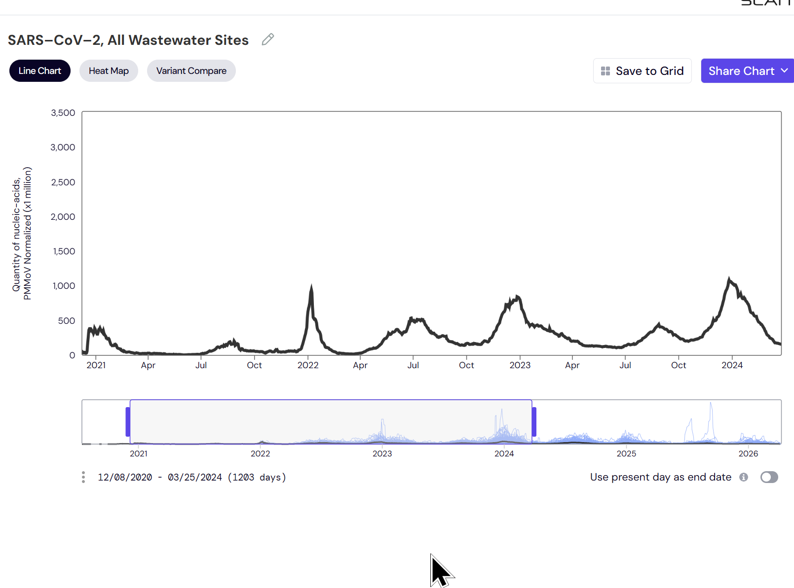

Stored file:

- [test.png](figures/test.png)

### Israel wastewater surge after heavy vaccination

- Type: PDF slide deck / chart
- Relevance: indirect / framing
- Supports: negative-net-benefit
- Source:
  - [ECDC-hosted Israel wastewater slide deck](https://www.ecdc.europa.eu/sites/default/files/documents/IBaror.pdf)
  - Focus: slide `9`
- Date:
  - presentation date shown in the deck: `2022-10-05` to `2022-10-07`
  - slide `9` plots waves from roughly `Dec 2020` through `March 2022`
- Summary:
  - Slide `9` shows Israel wastewater SARS-CoV-2 normalized viral load by region on a log scale.
  - The plotted scale runs from about `1.0E+06` to `1.0E+10`, so order-of-magnitude differences are visually meaningful.
  - The user’s interpretation is that later waves, especially Delta/Omicron-era waves in a highly vaccinated country, appear dramatically larger than earlier waves.
- Why it matters:
  - Israel is a useful case because it vaccinated early and heavily and appears to have had unusually serious wastewater tracking.
  - If infection pressure became much larger in a highly vaccinated population, that creates tension with strong claims that repeated mRNA vaccination clearly reduced spread at population level.
  - This is potentially useful as a "natural experiment" style framing exhibit when arguing that real-world infection dynamics did not behave as expected under a strong anti-infection narrative.
- Caveats:
  - This is not US-specific evidence.
  - Wastewater is a proxy for viral circulation, not a direct measure of deaths, hospitalizations, or net mortality benefit.
  - A rise in wastewater after rollout does not by itself prove vaccines increased infection risk; variant immune escape, changed behavior, prior immunity patterns, and other time-varying factors are alternative explanations.
  - The strongest defensible use of this item is to challenge strong anti-infection claims, not to treat it as a standalone proof of negative net mortality effect.
- Practical debate use:
  - Strong use: "In a highly vaccinated country with serious wastewater surveillance, later infection waves still became enormous, which undermines strong claims that mass vaccination clearly suppressed transmission."
  - Weaker use: "This proves the vaccines increased infection." That goes beyond what the slide alone can identify.

### Cleveland Clinic study: more prior vaccine doses associated with higher risk of detected COVID-19

- Type: paper
- Relevance: indirect
- Supports: negative-net-benefit
- Source: [PLOS One paper](https://journals.plos.org/plosone/article?id=10.1371/journal.pone.0293449)
- Date: `2023-10-30`
- Summary:
  - This Cleveland Clinic employee study evaluated risk of COVID-19 during an XBB-dominant period.
  - In the paper’s headline comparison, being "up-to-date" on COVID-19 vaccination by CDC criteria was not associated with lower risk of COVID-19 after adjustment: hazard ratio `1.05` with `95% CI 0.88–1.25` ([PLOS One results](https://journals.plos.org/plosone/article?id=10.1371/journal.pone.0293449)).
  - The paper also reports that a higher number of prior vaccine doses was associated with higher risk of COVID-19.
- Why it matters:
  - This is one of the better-known papers arguing that more vaccination did not clearly reduce, and may have correlated with higher risk of, detected infection in a real-world workforce.
  - It is useful for pushing back on blanket claims that more mRNA doses necessarily meant lower infection risk in late-variant periods.
  - In debate terms, it can be paired with the Israel wastewater material as a "pattern-consistency" argument: high vaccination did not obviously translate into lower infection pressure.
- Caveats:
  - This paper is about infection risk, not death risk.
  - The study period was short and specific to XBB-era exposure.
  - The population was a healthcare workforce with few elderly subjects, not a nationally representative mortality-risk population.
  - The adjusted headline result for "up-to-date" status was null rather than clearly harmful.
  - Association between number of prior doses and infection risk could still reflect residual confounding, exposure differences, depletion of susceptibles, or other behavioral factors.
- Practical debate use:
  - Strong use: "A prominent real-world study found no lower infection risk for those up-to-date by CDC criteria, and observed higher infection risk with more prior doses."
  - Weaker use: "This proves the vaccines increased mortality." The study does not show that.

### Combined takeaway: Israel wastewater plus Cleveland Clinic infection findings

- Type: synthesis note
- Relevance: framing
- Supports: negative-net-benefit
- Summary:
  - Together, these sources are best used to argue that strong claims of durable anti-infection benefit from repeated mRNA vaccination are questionable.
  - If repeated vaccination does not reliably reduce infection pressure, that weakens any net-benefit argument that depends heavily on transmission suppression.
  - This matters because overstated infection-blocking benefit can inflate downstream "lives saved" narratives.
- Caveats:
- These sources do not, by themselves, establish that mRNA vaccination caused more deaths than it prevented.
- The bridge from infection dynamics to net mortality remains indirect and assumption-sensitive.

### US UCOD age divergence after rollout

- Type: dataset summary / plot
- Relevance: indirect
- Supports: ambiguous
- Source:
  - [UCOD yearly divergence summary](../test/US/out/ucod_year_over_year_divergence_summary.csv)
  - [UCOD combined crude rate by broad age](../test/US/out/ucod_yearly_crude_rate_combined_broad_age.png)
- Summary:
  - In the first US UCOD pass, the most interesting pattern was not a female-specific break.
  - The notable pattern was age divergence from `2020` to `2021`:
    - `0-39`: about `+10.6%`
    - `40-59`: about `+10.5%`
    - `60-79`: about `+3.9%`
    - `80+`: about `-2.7%`
  - So older mortality improved from the 2020 spike, while younger and middle-age mortality remained elevated or increased.
- Why it matters:
  - This argues against a simple "all groups moved the same way because of COVID" story.
  - It suggests age-specific forces were moving differently in `2021`.
  - That makes the non-elderly persistence worth investigating as a possible clue rather than dismissing it as a uniform pandemic effect.
- Caveats:
  - UCOD all-cause data do not identify cause.
  - This pattern could reflect many things besides vaccination, including overdoses, delayed care, social disruption, differential COVID burden, or cause-mix changes.
  - `2021 vs 2019`, even `80+` remained elevated, so the sharp point is specifically the post-2020 divergence, not a return to pre-pandemic normality.

### Czech versus US contrast: persistent ACM elevation

- Type: synthesis note
- Relevance: framing
- Supports: ambiguous
- Source:
  - [Czech project summary](../test/CFR/out/project_summary_2026-04-09.md)
  - [US UCOD divergence summary](../test/US/out/ucod_year_over_year_divergence_summary.csv)
- Summary:
  - One important contrast raised during analysis is that the Czech work did not show a clean persistent all-cause mortality elevation attributable to COVID wave timing in the same way the US all-cause data appear to show lingering non-elderly elevation after 2020.
  - The US data therefore raise a real question: why does non-elderly all-cause mortality remain elevated more persistently?
- Why it matters:
  - This is the kind of cross-country contrast that could be relevant to the debate.
  - It keeps open hypotheses such as:
    - different vaccine products or rollout patterns
    - different healthcare disruption
    - different overdose / injury / chronic-disease trends
    - broader social or medical-system differences
- Caveats:
  - These data do **not** identify the cause of the US persistence.
  - They do not prove that US vaccines were more dangerous than Czech vaccines.
  - The most honest reading is that the contrast is important and hypothesis-generating, but not decisive.

### US UCOD ICD decomposition: overdoses matter, but do not explain everything

- Type: dataset summary / cause decomposition
- Relevance: indirect
- Supports: ambiguous
- Source:
  - [UCOD ICD cause summary](../test/US/out/ucod_icd_cause_summary.csv)
  - [Non-elderly divergence table](../test/US/out/ucod_icd_nonelderly_divergence_2021_vs_2019.csv)
  - [Excluding selected causes summary](../test/US/out/ucod_icd_excluding_selected_causes_summary.csv)
- Summary:
  - The first US ICD decomposition showed that drug/alcohol/external-type causes explain a meaningful share of the younger-age mortality elevation, but not all of it.
  - In younger and middle-age groups, external causes were large contributors:
    - `0-34`: accidents/injuries, homicide, and suicide were major drivers
    - `35-54`: accidents/injuries were the single largest contributor
  - But cardiovascular and metabolic causes also rose:
    - cardiovascular aggregate
    - heart disease
    - diabetes
    - cerebrovascular disease, especially in older non-elderly groups
- Why it matters:
  - This weakens any simplistic explanation that the persistent US non-elderly ACM increase was "just overdoses."
  - It also weakens any simplistic explanation that one single category explains everything.
  - The US persistence appears to be multi-causal.
- Caveats:
  - UCOD cause groups are still descriptive and do not identify why these categories rose.
  - These data do not prove a vaccine mechanism.
  - They do show that the persistence remains even after removing drug/alcohol/external causes, which makes the pattern harder to dismiss.

### Important caution on "accidents" and external causes

- Type: methodological note
- Relevance: interpretation
- Supports: ambiguous
- Summary:
  - External-cause and accident categories should not automatically be treated as unrelated to possible vaccine harm.
  - A hypothetical sudden-incapacitation mechanism could still appear under accident-like UCOD categories if, for example, a person experienced a sudden fatal event while driving or operating machinery.
- Why it matters:
  - Removing accidents or external causes is useful as a sensitivity analysis, but it is not the same as proving those categories are irrelevant.
  - Exclusion helps answer "how much of the persistent ACM signal remains without these categories," not "could none of those deaths be vaccine-related?"
- Practical implication:
  - Keep accident/external-cause analyses, but interpret them carefully.
  - Treat inclusion and exclusion as complementary views rather than assuming one of them is the true causal answer.

### Kidney / renal categories are available in the UCOD 113-cause list

- Type: data availability note
- Relevance: methodological
- Supports: ambiguous
- Source: [UCOD by year ICD10 export](../test/US/data/UCOD_by_year_ICD10.xls)
- Summary:
  - The 113-cause list includes renal-related categories such as:
    - `Renal failure (N17-N19)`
    - `Nephritis, nephrotic syndrome and nephrosis (N00-N07,N17-N19,N25-N27)`
    - `Other disorders of kidney (N25,N27)`
    - `Infections of kidney (N10-N12,N13.6,N15.1)`
    - hypertension-related renal categories
- Why it matters:
  - If needed, kidney-related mortality can be tracked directly in the UCOD cause decomposition instead of being treated as unobservable.

### Cross-country baseline mortality charts and the "Czechia exception" hypothesis

- Type: ecological / cross-country hypothesis
- Relevance: indirect, potentially important
- Supports: hypothesis-generating evidence for possible product-, rollout-, or country-specific mortality effects
- Sources:
  - 
  - 
  - 
  - 
  - 
- Claim to test:
  - Several countries appear to show an elevated post-rollout baseline in weekly deaths, while Czechia looks more like large acute COVID-wave spikes followed by reversion toward its prior baseline.
  - If true after age-standardization and non-COVID sensitivity checks, that pattern is hard to explain using "COVID infection alone" as a universal explanation.
  - One proposed hypothesis is that vaccine-related harm varied by country because product, lot, manufacturing, distribution, storage, or rollout composition differed; under this hypothesis Czechia may have received less harmful or effectively lower-potency product.
- Why it matters:
  - The Czechia contrast is potentially useful because Czechia had severe COVID waves but does not visually show the same persistent baseline shift seen in some other countries.
  - If COVID waves alone were sufficient to cause the persistent baseline elevation, Czechia should be a place where that persistent elevation would be expected.
  - The chart pattern therefore weakens any simple "all persistent excess mortality is just COVID waves" explanation.
- Caveats:
  - These PNGs are not enough to prove the hypothesis. They are visual ecological evidence, not an identified causal estimate.
  - The claim needs age-standardized mortality, population denominators, COVID vs non-COVID sensitivity checks, cause-of-death decomposition, and country-specific reporting/denominator checks.
  - The US plot is visually less clean than Australia, Germany, and South Korea because the large COVID spikes dominate the graph and later mortality sits closer to the dashed baseline, even though the US UCOD age-specific analysis still shows important non-elderly elevation through 2021-2023.
  - "Czechia got near-placebo vaccines" is a specific manufacturing/batch hypothesis. It remains possible, but it is not established by the country mortality charts alone.
- Rough PNG digitization:
  - Approximate black-line digitization comparing 2019 average weekly deaths with the mid-2021 to mid-2022 window gave: Australia about +11%, Czechia about +7%, Germany about +8%, South Korea about +18%, and United States about +18%.
  - Using slightly different post windows moved the estimates, especially for Czechia and the US, because COVID-wave spikes are inside the window.
  - This supports "around 10% or more in several countries" as a rough visual statement, but it is not a substitute for raw data.
  - For Czechia, the better contrast is not that mid-2021 to mid-2022 was never elevated; it is that the post-wave pattern appears more consistent with reversion toward baseline than persistent baseline elevation.
- Falsification tests:
  - If Czechia received similar brands, lots, manufacturing streams, storage conditions, and dose timing as the comparison countries, yet had no persistent baseline elevation, that would weaken the "different Czech product quality" version of the hypothesis.
  - If other countries with high Pfizer/Moderna rollout and similar product sources also show no persistent baseline elevation, that would weaken a broad vaccine-manufacturing-harm explanation.
  - If countries with low mRNA use or very different vaccine products show the same persistent baseline elevation, that would weaken an mRNA-specific explanation.
  - If the post-rollout baseline elevation disappears after age-standardization, COVID-wave timing, heat waves, population changes, external causes, and healthcare-disruption proxies are handled, that would weaken the vaccine-harm explanation.
  - If within-country brand/lot/batch comparisons do not show mortality differences, that would weaken the specific product-quality hypothesis much more than ecological country charts can.
- What would strengthen it:
  - Batch-, brand-, or lot-level mortality gradients within the same country and calendar period.
  - A Czechia-vs-other-country comparison showing comparable COVID burden but different non-COVID ACM behavior after adjustment.
  - Product sourcing evidence showing that Czechia's vaccine supply materially differed from countries with persistent baseline elevation.

### Florida Pfizer vs Moderna mortality preprint

- Type: active-comparator matched cohort, preprint
- Relevance: direct to brand-specific mortality differences among vaccinated people
- Supports: potentially strong evidence for brand-associated mortality differences, if the matching/analysis holds up
- Source:
  - [Local PDF: Levi/Ladapo Florida preprint](docs/levi_ladapo_florida_pfizer_moderna_12_month_mortality_preprint.pdf)
  - [medRxiv DOI landing page](https://doi.org/10.1101/2025.04.25.25326460)
- Summary:
  - The study compared 12-month mortality after first dose of BNT162b2/Pfizer vs mRNA-1273/Moderna among noninstitutionalized Florida adults vaccinated from December 18, 2020 through August 31, 2021.
  - The matched cohort included 981,411 Pfizer recipients and 981,411 Moderna recipients.
  - Matching used 5-year age bin, sex, race, ethnicity, vaccination site type, calendar month of first dose, and census tract.
  - Reported ACM was higher for Pfizer than Moderna: 783.6 vs 562.4 deaths per 100,000; OR 1.407 [1.358, 1.457].
  - Reported cardiovascular mortality was higher for Pfizer than Moderna: OR 1.562 [1.461, 1.670].
  - Reported non-COVID mortality was higher for Pfizer than Moderna: OR 1.374 [1.325, 1.425].
  - The paper reports negative controls for suicide/homicide and pre-vaccination SARS-CoV-2 infection, and says these did not show meaningful residual confounding large enough to explain the main result.
- Why it matters:
  - This is much stronger than a vaccinated-vs-unvaccinated comparison because it compares two vaccinated groups receiving vaccines for the same indication.
  - Generic healthy-vaccinee bias is much less plausible here than in vaccinated-vs-unvaccinated studies because both groups opted for vaccination.
  - If the matching and outcome classification are valid, a large non-COVID mortality difference is a serious problem for the claim that the two mRNA products were equally safe with respect to non-COVID ACM.
  - COVID vaccines are not normally expected to reduce true non-COVID all-cause mortality. Therefore, a large non-COVID mortality gap between two matched mRNA brands is difficult to explain as ordinary vaccine benefit unless the proposed explanation is specified and quantified.
  - It is also stronger than cross-country ecological charts because it is within one state, has individual matching, aligns calendar month, and compares brands.
  - The result is directly relevant to the hypothesis that harms could vary by product, manufacturing, or formulation.
- Caveats:
  - It is a medRxiv preprint and is not peer reviewed as of the version copied here.
  - As a brand-vs-brand comparison, it most directly estimates a differential effect between Pfizer and Moderna, not the absolute effect of either product versus no vaccination.
  - If the association is causal, the excess non-COVID mortality must come from some combination of Pfizer harm, Moderna non-specific benefit, or both; the study by itself does not uniquely decompose those possibilities.
  - It could still reflect residual confounding if Pfizer and Moderna recipients differed in unmeasured health status, comorbidities, access, facility type, or prioritization not fully captured by matching.
  - Even if the Pfizer-vs-Moderna difference is real, it does not automatically prove that Czechia received near-placebo vaccines or that cross-country baseline differences are caused by manufacturing variation.
- Debate use:
  - This should be treated as a high-value piece of evidence for "brand/product-specific mortality differences are plausible and deserve serious attention."
  - A fair debate framing is: if two matched vaccinated cohorts have materially different non-COVID ACM, then "safe and equivalent products" is not the default explanation; the burden shifts toward explaining residual confounding or a non-harm mechanism.
  - Even a large discount for residual bias would still leave a potentially important signal because the reported effect size is large. A counterargument should not merely say "observational confounding"; it should explain what unmeasured factor could survive exact matching and negative controls and still produce a result of this magnitude.
  - It should not be overstated as a stand-alone proof that all mRNA vaccination was net harmful versus no vaccination, but it is directly relevant to the negative-benefit case.
  - It pairs well with the country-chart hypothesis: the charts motivate a product/country heterogeneity question, while the Florida preprint is a more direct within-region brand comparison.

### Florida age-standardized excess mortality as a consistency check

- Type: ecological consistency check
- Relevance: indirect but useful for magnitude
- Supports: the Florida brand-study signal is not obviously too large to be visible at population level
- Sources:
  - 
  - 
- Summary:
  - Mortality Watch Florida charts show age-standardized excess mortality rising above the 2017-2019 baseline during 2020-2022, with a large Delta-era peak in 2021.
  - This is directionally consistent with the Florida Pfizer-vs-Moderna preprint if a brand-specific NCACM signal existed and was diluted at the population level.
- Magnitude check:
  - If Pfizer had roughly 36% higher NCACM than Moderna, and if the vaccinated population were roughly split between Pfizer and Moderna, the average excess relative to Moderna would be about 18% among vaccinated people.
  - If roughly 70% of the relevant population were vaccinated, that would imply a crude population-scale dilution near 12.6%, before considering timing, age mix, COVID deaths, boosters, product shares, and lag structure.
  - That rough order of magnitude is compatible with the kind of elevated baseline visible in the Florida excess-mortality chart, although the chart varies strongly by month.
- Caveats:
  - These figures are all-cause excess mortality, not NCACM-only.
  - The 2020-2022 period includes COVID waves, especially Delta in Florida, so this is not a clean attribution test.
  - The late 2025-2026 negative bars likely reflect incomplete reporting or data artifacts and should not be used for causal interpretation.
  - The chart supports "the Florida preprint's magnitude is plausible enough to investigate," not "the ecological chart independently proves the brand effect."

### Working hypothesis and falsification criteria

- Type: causal framework / debate checklist
- Relevance: high
- Working harm hypothesis:
  - In some countries, COVID vaccine products or rollout conditions may have been less safe and may have elevated baseline ACM or NCACM for a period after rollout.
  - Czechia is treated as an important contrast case because it had severe COVID waves but appears less consistent with a persistent post-rollout baseline mortality elevation.
- Working benefit hypothesis:
  - The mRNA vaccines may have had little population-level COVID death benefit in the settings analyzed here.
  - The strongest supporting observation so far is the Czechia cumulative COVID-death slope comparison, where Alpha-era and Delta-era slopes looked strikingly similar despite high vaccination in the later period.
  - This is a population-level test and is less directly exposed to individual-level healthy-vaccinee bias than vaccinated-vs-unvaccinated comparisons.
- What would weaken or falsify the harm hypothesis:
  - Countries or regions with similar product mix, lots, manufacturing source, storage, and rollout timing as high-excess countries but no post-rollout NCACM elevation.
  - Countries with low mRNA exposure or materially different vaccine products showing the same persistent baseline elevation.
  - Within-country brand, lot, or batch analyses showing no mortality gradient after strong matching and appropriate negative controls.
  - A cause-, age-, and sex-specific pattern that is better explained quantitatively by healthcare disruption, opioids, heat waves, reporting artifacts, population denominators, or COVID sequelae than by vaccine-related mechanisms.
  - Evidence that the elevation begins before rollout, does not follow dose timing, or does not attenuate as dose intensity falls.
- What would weaken or falsify the near-zero-benefit hypothesis:
  - A clear population-level "knee" in COVID mortality among highly vaccinated age groups or regions that is not present in less vaccinated comparison groups after controlling for wave intensity.
  - Wastewater- or infection-normalized COVID mortality dropping sharply in vulnerable groups after rollout, especially using all-population denominators rather than vaccinated-vs-unvaccinated denominators.
  - Strong active-comparator or randomized evidence showing reduced all-cause mortality or NCACM-adjusted net mortality, not just reduced coded COVID outcomes.
  - Czechia-specific evidence showing that Delta-wave intensity, variant severity, prior infection, seasonality, or ascertainment differed enough from Alpha to explain why similar slopes would be expected even if vaccination was beneficial.
- Current read:
  - The harm hypothesis is not falsified by the evidence assembled so far, but it remains underidentified without brand/lot/batch and country-specific product-sourcing data.
  - The near-zero-benefit hypothesis is also not falsified by the evidence assembled so far. The Czechia slope comparison is an important challenge to large population-level benefit claims, but it does not alone prove zero benefit because wave intensity and other time-varying factors could offset a real vaccine effect.
  - The cleanest next evidence would be infection- or wastewater-normalized COVID mortality by age, plus NCACM by country/brand/lot where available.

### Full-population H(t) as a selection-bias-resistant signal

- Type: methodological note
- Relevance: high
- Source:
  - 
  - 
- Summary:
  - Full-population mortality or cumulative-hazard-style curves avoid the worst individual-level vaccinated-vs-unvaccinated selection bias because the denominator is the whole population rather than self-selected vaccine-status groups.
  - In this framing, a deviation above baseline, reversion toward baseline, and then renewed elevation is a population-level event-timing pattern, not a direct comparison of healthier vaccinated people with less healthy unvaccinated people.
  - The Japan full-cohort figure uses the born 1930-1960 cohort enrolled January 1, 2021, and includes vaccinated plus unvaccinated people rather than conditioning on vaccine status.
- Why it matters:
  - If a full-population H(t) curve shows sharp deviations from baseline after major rollout periods, that is harder to dismiss using ordinary healthy-vaccinee bias.
  - Such a pattern is especially relevant when paired with brand/batch/product evidence, because it can show that a plausible individual-level harm signal is not wildly inconsistent with population-level mortality timing.
- Caveat:
  - Full-population curves remove individual vaccine-selection bias, but they do not remove calendar-time confounding.
  - Competing explanations still include COVID waves, healthcare disruption, heat waves, reporting artifacts, denominator problems, policy changes, and social disruptions.
  - Therefore the best use is not "this proves vaccine harm," but "this is a selection-bias-resistant population signal that requires a quantitative explanation."

### Integrated case: significant vaccine harm cannot be ruled out

- Type: debate synthesis
- Relevance: high
- Working claim:
  - The evidence does not prove that COVID vaccines were a major driver of excess mortality, but it also does not rule out vaccine harm as a significant contributor in countries or time periods where baseline mortality rose persistently after rollout.
- Strongest components:
  - Czechia appears to return closer to baseline after major COVID waves, which weakens the claim that COVID infection alone necessarily produces persistent post-wave baseline mortality elevation.
  - Several other country charts show more persistent baseline elevation after rollout.
  - The Florida Pfizer-vs-Moderna exact-matching preprint is a poster-child for product-specific risk because both groups opted into vaccination, reducing generic healthy-vaccinee bias.
  - A reported 36% higher NCACM in one brand versus another is too large to dismiss with generic "observational confounding" unless a critic can name and quantify a residual confounder strong enough to survive the design.
  - If the true brand effect were much smaller than reported, even a heavily discounted effect could still be large enough to matter at population scale after dilution by brand mix and vaccination coverage.
  - Mostert et al. report that excess mortality persisted across Western countries during 2020-2022 despite public-health measures and vaccine rollout, making persistent excess mortality a legitimate empirical problem rather than a fringe observation.
- Mostert source:
  - [BMJ Public Health: Excess mortality across countries in the Western World since the COVID-19 pandemic](https://bmjpublichealth.bmj.com/content/2/1/e000282)
- Causal interpretation:
  - This synthesis supports a "cannot rule out significant vaccine contribution" position more strongly than a "proven vaccine causation" position.
  - The best version of the argument is cumulative: population-level persistence, Czechia as contrast, Florida brand comparison, and Japan phase-specific excess-mortality findings.
  - The main weakness remains identification: ecological persistence alone cannot distinguish vaccine harm from healthcare disruption, COVID sequelae, policy effects, heat waves, denominator problems, or other time-varying causes.

### Japan excess mortality factors paper

- Type: ecological / prefecture-level paper
- Relevance: indirect, supportive of vaccine-harm plausibility but not definitive
- Source:
  - [Local PDF: Japan factors paper](docs/japan%20factors%20paper%20sharp%20rise%20in%20mortality.pdf)
  - DOI shown in PDF: `10.21203/rs.3.rs-6899448/v1`
- Summary:
  - The paper reports that Japan had a sharp rise in excess mortality after 2021, including age-adjusted excess mortality rising from about 26,000 in 2021 to about 117,000 in 2022 and 114,000 in 2023.
  - It argues that excess mortality cannot be fully explained by official COVID deaths alone.
  - The paper identifies multiple contributors, including aging, COVID mortality, limited habitable land / mountainous regions, rural population structure, physician shortages, and fragile medical infrastructure.
  - It reports a phase-specific shift: second and third dose rates were associated with lower excess mortality in earlier phases, while fourth/sixth dose rates and fifth-dose-related infection patterns were positively associated with excess mortality in later phases.
  - The paper discusses possible mechanisms including waning effectiveness, repeated vaccination, immune imprinting, Omicron-targeted vaccines, and spike-related toxicity, but these remain mechanistic hypotheses rather than direct proof of causation.
- Debate use:
  - This is useful for showing that Japan's excess mortality rise was treated by at least one ecological analysis as unprecedented and not adequately explained by official COVID deaths alone.
  - It supports the narrower claim that later-dose vaccination effects cannot be ruled out as contributors to excess mortality.
  - It should not be summarized as "the paper proves it was not COVID" because the paper itself includes COVID mortality and rural healthcare-system stress among important contributors.
  - A fair phrasing is: "The Japan paper argues that the mortality rise was multi-factorial and that later vaccination phases became positively associated with excess mortality; this supports the need to include vaccine-related mechanisms among candidate explanations."

### Cumulative "too many coincidences" evidence stack

- Type: debate framing / evidence inventory
- Relevance: high
- Working claim:
  - The negative-benefit case should not depend on one single killer argument.
  - The stronger argument is cumulative: many independent or semi-independent signals point toward the possibility of vaccine harm, and critics should not be allowed to dismiss each one generically without explaining the full pattern.
- Front-line evidence candidates:
  - Florida Pfizer-vs-Moderna exact-matched mortality preprint: potentially strong because it is an active-comparator design among vaccinated people and reports materially higher NCACM by brand.
  - Czechia Alpha-vs-Delta cumulative COVID-death slope comparison: useful because it is population-level and less vulnerable to individual vaccine-selection bias.
  - Full-population Japan H(t): useful because it includes vaccinated plus unvaccinated and therefore cannot be dismissed as vaccinated-vs-unvaccinated HVE.
  - Country baseline mortality charts: useful for showing persistent baseline elevation in some rollout countries and Czechia as a contrast case.
  - Japan excess-mortality factors paper: useful for showing Japan's mortality rise was not adequately explained by official COVID deaths alone and that later vaccination phases were positively associated with excess mortality in the ecological analysis.
  - Mostert et al.: useful for establishing persistent excess mortality across many Western countries as a real empirical problem.
  - Cleveland Clinic infection study and Israel wastewater: useful for arguing that increased infection risk after repeated vaccination could offset a COVID-death benefit.
- Useful but more vulnerable evidence candidates:
  - Autopsy papers and case series: important if the pathology is credible, but vulnerable to selection bias because autopsied post-vaccination deaths are not a representative denominator.
  - Embalmer clot reports: potentially important signal, but vulnerable unless converted into systematic blinded pathology, denominator-based prevalence, and pre/post comparison.
  - VAERS and other passive-reporting systems: useful as safety-signal generators, but not as direct death-count estimators without a defensible underreporting and background-rate model.
  - Insurance / SOA working-age mortality reports: potentially important because they concern working-age excess mortality, but need careful separation of COVID, non-COVID natural deaths, external causes, and mandate timing.
  - Disability increases in FRED: potentially important but not specific; needs adjustment for labor-force changes, reporting, Long COVID, policy, and economic factors.
  - Anecdotes from individuals, doctors, paramedics, vaccinators, and social media: useful as signal-generation and narrative color, but weak as causal proof unless backed by verifiable records and denominator context.
  - Survey estimates such as Skidmore: potentially supportive if methods are accepted, but vulnerable because survey-network extrapolations can be highly sensitive to sampling and classification choices.
- Debate warning:
  - The strongest form is not "all these prove vaccine deaths."
  - The strongest form is: "After seeing active-comparator brand differences, population-level baseline shifts, autopsy/pathology reports, passive surveillance signals, EMS/insurance signals, and mechanistic plausibility, it is not credible to rule out vaccine harm as a significant contributor without doing quantitative work."
  - A critic can reasonably challenge any one item, but the burden is higher if the same dismissive explanation is reused across unrelated evidence streams without quantifying it.

## Figure Naming Convention

Use descriptive lowercase filenames with underscores, based on what the figure actually shows.

Examples:

- `us_all_cause_mortality_ages_18_39_post_rollout.png`
- `cdc_vsafe_myocarditis_age_sex_breakdown.png`
- `israel_cumulative_covid_deaths_per_million_annotated_wave_slopes.png`

## Working Notes: SW/SK Debate Map Checkpoint

These are provisional stream-of-consciousness notes after a first pass through the `debate/sw` and `debate/sk` folders. They are not final debate structure yet.

### Current Strategic Frame

- The argument should be two-sided.
- Positive case:
  - Benefit was likely small or unproven.
  - Harm was likely nonzero or plausibly significant.
- Rebuttal case:
  - Rebut SW's positive evidence for lives saved.
  - Rebut SW's rebuttals to the Kirsch harm/small-benefit case.
- The goal is not to prove every harm signal individually. The goal is to show that the combination of small observable benefit plus nonzero harm signals makes net harm plausible and that SW's contrary case relies on assumptions, HVE-prone comparisons, or unquantified offsets.

### Additions To Our Positive Case

- Add KCOR / fixed-cohort / full-population H(t) as a core line of evidence rather than merely background.
- Add full-population and fixed-cohort hazard shapes because they reduce the ordinary vaccinated-vs-unvaccinated HVE objection.
- Add Saar's zero-COVID countries/states as a direct target because he treats them as a major falsifier of NCVID claims.
- Add Czech HVE dynamics explicitly. SW's rebuttal says the Alpha/Delta or high/low COVID comparison confuses changing HVE with VE, so we need the cleanest short response.
- Add Levi/Ladapo as the product-heterogeneity poster child. The predictable rebuttal is no comorbidity matching, COVID deaths differed too, and the result conflicts with older Moderna-harm claims.
- Add Japan H(t) and Japan Factors paper carefully. The H(t) full-cohort figure is the stronger signal. The Japan Factors paper is useful but mixed because it reports early vaccination phases as protective and later phases as positively associated with excess mortality.

### SW's 5 Best Positive Arguments

- Zero-COVID countries / states:
  - SW argues that countries like Hong Kong and highly vaccinated low-COVID periods in US states had no excess deaths during vaccination-only periods.
  - He treats this as evidence that large non-COVID vaccine-induced deaths should have been visible and were not.
- Safety systems detected other signals:
  - SW argues that AstraZeneca/J&J clotting and mRNA myocarditis were detected quickly.
  - Therefore, a much larger mRNA death signal should also have been detected by health authorities, coroners, insurers, and researchers.
- VE death evidence converges around high protection:
  - SW cites RCT severe COVID results, immunology/neutralization, real-world VE studies, meta-analyses, Israel/Czech/Hungary, and political/geographic comparisons.
  - His claim is that many methods converge around high death protection, often near 90%.
- Lives-saved models are robust even under conservative assumptions:
  - SW presents lower-bound lives-saved estimates, including >500k and in some places around 700k to >1M US lives saved depending on assumptions.
  - He argues that even very conservative assumptions still exceed plausible vaccine deaths.
- ACM wave-differential argument:
  - SW accepts that vaccinated cohorts are healthier but argues that the vaccinated/unvaccinated mortality gap changes during COVID waves in a way consistent with high VE.
  - He tries to dynamically adjust HVE over time rather than using a static correction.

### SW's 5 Best Kirsch Rebuttal Points

- Cherry-picking / anecdotal evidence:
  - SW argues that doctors, embalmers, VAERS reports, X posts, surveys, and anecdotes are low-quality compared with representative datasets.
  - He will likely say false hypotheses can accumulate lots of outliers in a large enough data universe.
- Passive surveillance cannot estimate deaths:
  - SW attacks VAERS underreporting factors and argues COVID-era reporting intensity, internet/social media, and politicization can explain unprecedented VAERS volume.
- Autopsy evidence has selection bias:
  - SW argues that autopsy case series cannot estimate population death rates because the autopsied cases are selected.
  - He also notes that some cited cases involve non-mRNA products, which are less relevant to the US mRNA debate.
- Czech analysis confuses dynamic HVE with VE:
  - SW claims that high/low COVID period comparisons use the wrong baseline period because HVE changes sharply over time.
  - He says if a later no-COVID period is used, the inferred benefit changes.
- Levi/Ladapo is residual confounding, not brand harm:
  - SW argues comorbidities were not in the exact matching criteria.
  - He argues COVID deaths differed strongly by brand, which he interprets as evidence of baseline comorbidity differences rather than vaccine harm.
  - He also argues the result conflicts with earlier Moderna-harm claims.

### Next Work

- Focus next on SW's top positive arguments and top rebuttals before deciding which additions to put front-line.
- Highest-priority targets:
  - zero-COVID country/state claim
  - surveillance-detection claim
  - dynamic HVE/Czech rebuttal
  - Levi/Ladapo residual-confounding rebuttal
  - lives-saved / 90% VE convergence claim

### SW Positive Claim #2: "Health authorities would have detected and disclosed mass mRNA deaths"

- SW claim:
  - SW argues that safety systems detected AstraZeneca/J&J clotting and mRNA myocarditis quickly, so a much larger mRNA death signal should also have been detected and disclosed.
- Initial rebuttal:
  - This is not a showstopper. It assumes that detection, escalation, public admission, and regulatory action all happen reliably when an inconvenient signal appears.
  - The FDA/Prasad memo is direct counterevidence to that assumption.
- FDA/Prasad memo:
  - Local file: [FDA_Prasad_memo.pdf](docs/FDA_Prasad_memo.pdf)
  - Official FDA copy: [November 28 2025 Vinay Prasad Email](https://www.fda.gov/media/191442/download?attachment=)
  - The memo says FDA/CBER career staff found at least 10 child deaths after and because of COVID-19 vaccination, with likely/probable/possible attribution by staff.
  - The memo says those deaths were based on an initial analysis of 96 child death reports from 2021-2024.
  - It says this was the first time the FDA would acknowledge COVID-19 vaccines killed American children.
  - It says the agency had never publicly admitted those deaths and asks why the deaths were not actively reviewed in real time.
  - It says deaths were reported between 2021 and 2024 and ignored for years.
- Why this matters:
  - Even if one disputes some of Prasad's framing, the memo is devastating to the simplistic version of SW's argument that "if deaths existed, regulators would have detected and publicly disclosed them."
  - The memo shows that, at minimum, an internal agency-level disagreement existed over child vaccine deaths and that public acknowledgement did not happen in real time.
  - The proper debate framing is: "Detection systems can generate signals, but detection does not guarantee timely public admission or action."
- Caveats:
  - The memo does not publish the case-level details for the 10 child deaths.
  - Critics argue that VAERS reports alone cannot prove causality and that the cases need independent review.
  - Therefore the memo should not be overstated as proof of the full adult NCVID burden.
  - It is best used to rebut SW's institutional-reliability premise and to support the claim that agency silence is not strong evidence of no deaths.
- Kirsch Substack support links to review:
  - [The DEATH safety signals in VAERS were obvious if anyone looked](https://kirschsubstack.com/p/the-death-safety-signals-in-vaers)
  - [Why can't anyone explain how these 14 kids died after getting vaccinated?](https://kirschsubstack.com/p/why-cant-anyone-explain-how-these)
  - [Impartial analysis of VAERS death reports in kids under 18](https://kirschsubstack.com/p/impartial-analysis-of-vaers-death)
  - [Unassailable proof of incompetence](https://kirschsubstack.com/p/unassailable-proof-of-incompetence)
  - [Official CDC response about the death safety signal](https://kirschsubstack.com/p/here-is-the-official-response-from)
  - [New VAERS analysis reveals hundreds of serious adverse events](https://kirschsubstack.com/p/new-vaers-analysis-reveals-hundreds)
  - [Safety signals for 770 different serious adverse events in VAERS](https://kirschsubstack.com/p/safety-signals-for-770-different)
- Current read:
  - SW's institutional-detection argument remains relevant but is not a knockout.
  - It can at most support "some severe signals were detected eventually"; it cannot support "agency silence proves no serious death signal existed."
  - The strongest rebuttal line: "The FDA memo itself says child vaccine deaths were found years after reports were filed and had not been publicly admitted. That directly undermines the claim that health-agency silence is reliable evidence of vaccine safety."

### SW Positive Claim #3: "VE death evidence converges around ~90%"

- Source:
  - [Evidence for VE.pdf](sw/Evidence%20for%20VE.pdf)
  - [Hong Kong Lancet Infectious Diseases VE study](docs/HongKongVE.pdf)
  - [Hong Kong CDC/MMWR mortality and vaccine coverage report](docs/HongKongVEdeath.pdf)
  - [Hoeg/Arbel NEJM correspondence](docs/HoegArbel.pdf)
- SW claim:
  - Complex questions cannot be settled by one study.
  - Many imperfect sources with different limitations point in the same direction: RCT severe COVID, early Israel observational replication of RCT results, Kaiser Permanente, Hong Kong after zero-COVID, Czech/UK ACM wave-differential analyses, hospitalization-to-death studies, age-distribution shifts, and timing of death reductions during rollout.
  - Therefore high VE death, often near 90%, is more plausible than a selection-bias artifact.
- Why this is his strongest benefit-side argument:
  - It avoids relying on a single study.
  - It reframes the debate from "find the perfect study" to "explain why many different study types all agree."
  - It directly attacks the idea that HVE alone can explain all apparent vaccine benefit.
- Main rebuttal:
  - Convergence of biased studies does not solve a shared design flaw.
  - Many studies can agree if they all use vaccine-status comparisons that fail to measure and control the right negative-control endpoint, especially NCACM in the unvaccinated / declining-vaccination group.
  - If healthy-vaccinee effects and dynamic HVE are large enough, a high apparent VE can be manufactured even when the vaccine effect is much smaller.
  - The key ask remains: show a clean study that measured NCACM or a strong negative-control outcome in the relevant unvaccinated comparison group and demonstrated that the non-COVID mortality imbalance was too small to explain the COVID-death difference.
- Specific vulnerabilities:
  - RCTs were not powered for mortality and mainly support severe COVID reduction over a short period in relatively healthy trial populations.
  - Early Israel observational replication may reproduce RCT-like severe-COVID curves, but it does not by itself prove long-term population-level mortality benefit or net ACM benefit.
  - Hong Kong is valuable but still faces product mix, age-specific uptake, healthy-vaccinee, frailty, treatment, and first-infection timing issues; it is not a no-confounding proof.
  - Czech/UK/Hungary ACM wave-differential analyses depend heavily on HVE modeling choices and baseline windows.
  - Hospitalization-to-death analyses reduce some biases but introduce conditioning-on-hospitalization and care-seeking / admission-threshold biases.
  - Age-distribution and rollout timing analyses avoid individual vaccine-status selection but still require quantitative control for variant, prior infection, exposure, behavior, treatment, and reporting changes.
- Debate framing:
  - Do not say all evidence for VE is worthless.
  - Say: "SW has shown a broad suggestive case for COVID-endpoint benefit, but he has not produced the clean study needed to rule out HVE/NCACM bias and establish net mortality benefit."
  - The strongest line: "A stack of studies sharing the same missing negative control does not become a clean causal estimate merely because the stack is large."
- Current read:
  - This is not yet a showstopper against the negative-benefit case.
  - It is the strongest argument for some COVID-specific protection, especially short-term severe-disease protection.
  - It does not, by itself, establish large net lives saved through end-2022 because it does not cleanly settle NCACM, dynamic HVE, or ACM/NCACM tradeoff.
- Best single-study target:
  - The strongest single VE-death item in SW's list appears to be Hong Kong, not Kaiser, because Hong Kong had a largely infection-naive population before Omicron, a real death endpoint, low elderly vaccination, and a major mortality wave.
  - The CDC/MMWR Hong Kong report says overall COVID mortality risk was 33.2 times higher in unvaccinated persons than in people who received two doses, and among people aged 60+ it was 21.3 times higher.
  - The central problem is that this is measured during the COVID wave only. It does not measure the unvaccinated-to-vaccinated mortality ratio during non-COVID periods, and therefore does not provide the needed NCACM / negative-control check.
  - Without the non-COVID mortality ratio, the study cannot distinguish vaccine protection from frailty/HVE/selection among elderly Hong Kong vaccine refusers.
  - Hoeg/Arbel is the cautionary example: a 90% COVID-death VE headline can coexist with a massive non-COVID mortality imbalance. In the Arbel reply, the adjusted HR for non-COVID death after booster was 0.23, while the COVID-death HR was 0.10; the authors acknowledged a strong unexplained association with lower non-COVID mortality.
  - Debate line: "If Hong Kong is the best VE-death study, show the Hong Kong NCACM negative control. A COVID-wave-only mortality ratio is not enough."
- Sharper CACM/NCACM rebuttal:
  - The relevant normalization is not just raw baseline ACM. It is the COVID-to-non-COVID mortality ratio by vaccine status, i.e. something like `CACM / NCACM` for vaccinated vs unvaccinated.
  - This partially normalizes away baseline ACM differences between vaccinated and unvaccinated groups.
  - In the Czech record-level data, this kind of normalization suggests an apparent effect closer to about 2x at most, not 80-97% VE death.
  - Even that apparent 2x could still be residual frailty or COVID-specific vulnerability rather than a causal vaccine effect.
  - Therefore, any paper claiming VE death above ~50% without a clean NCACM / negative-control analysis should face a very high burden of proof.
- Debate fork:
  - If SW relies on 80-97% VE-death studies, the response is: show the NCACM negative control and show why the population-level cumulative COVID-death slopes do not visibly break.
  - If SW retreats to ~50% VE-death studies, the response is: then the field's headline 80-90% VE-death literature, which he previously relied on as convergent evidence, was likely confounded.
  - If SW says VE estimates vary greatly by context, the response is: then the "many studies converge on 90%" argument collapses and cannot support large lives-saved estimates without context-specific proof.
- Population-slope sanity check:
  - A true 90-97% VE-death effect in highly vaccinated vulnerable populations should have produced a dramatic slope break in cumulative COVID mortality.
  - The working claim is that Israel, Czechia, and other highly vaccinated countries do not show the dramatic post-rollout slope flattening that such a large effect predicts.
  - Debate line: "If the study stack says 90-97% VE death, where is the population-level slope break?"

### SW Positive Claim #4: "Lives-saved models remain large even under conservative assumptions"

- SW claim:
  - SW argues that multiple modeling approaches still produce large US lives-saved estimates, even after conservative assumptions.
  - He gives estimates in the hundreds of thousands and sometimes above one million lives saved, depending on model.
- Main rebuttal:
  - Measurements beat models.
  - A model that assumes VE and outputs lives saved is not independent evidence of lives saved.
  - If vaccines saved hundreds of thousands or millions of lives, that should be visible as a measured population-level slope change in cumulative COVID mortality, especially in highly vaccinated vulnerable groups.
- Slope-validation challenge:
  - Do these models test themselves against actual measured cumulative COVID-death slopes?
  - Do they predict and match a visible bend in Israel after early high vaccination?
  - Do they predict and match the Czechia Alpha-vs-Delta slope comparison?
  - Do they explain why low-vaccination Africa / South Africa and highly vaccinated countries can show similar cumulative COVID-death slope behavior?
  - If the model says the slope should bend sharply but the observed slope does not, the VE input is biased or the model is wrong.
- Debate line:
  - "Show the measured lives saved. If the model assumes 90% VE and does not validate against actual cumulative COVID-death slope changes, it is an assumption engine, not an independent measurement."
- Current read:
  - This is not a showstopper.
  - Lives-saved models depend heavily on VE assumptions, infection counterfactuals, variant assumptions, prior immunity, and IFR assumptions.
  - The central attack is not "models are useless"; it is "models must be checked against the actual population measurements they claim to explain."

### Three-pillar debate structure

- Pillar 1: lives saved was likely small or unproven.
  - Population cumulative COVID-death slopes do not show the dramatic slope break expected from 80-97% VE death.
  - VE studies often lack clean NCACM / negative-control checks.
  - Lives-saved models often propagate VE assumptions rather than independently measuring population-level lives saved.
- Pillar 2: lives lost was likely nonzero or significant.
  - Florida brand-matched NCACM is the clearest active-comparator brand/product signal.
  - Japan full-population H(t), baseline mortality elevations, pathology/autopsy, surveillance, disability, insurance, EMS, and mechanistic evidence make "zero harm" implausible.
  - The claim is not that every harm signal is individually dispositive; it is that the combined signal makes it unreasonable to rule out significant vaccine contribution.
- Pillar 3: net direction looked worse, not better.
  - This pillar addresses the net question even when exact lives saved and lives lost cannot be measured with precision.
  - This is a more-likely-than-not / net-direction argument, not a claim to prove vaccine causation for every excess death.
  - If a major life-saving intervention were rolled out across many countries, one would expect clearer aggregate improvement or at least heterogeneous country outcomes after rollout.
  - Instead, broad excess mortality persisted across many countries during and after the rollout period.
  - This is not proof that vaccines caused all excess mortality, but it is directionally inconsistent with a large net life-saving effect.
  - Aarstad's ecological and ONS-reanalysis work is supporting evidence here: it should not be used as one-paper proof, but it adds to the convergence that post-rollout ACM did not behave like a clean large-net-benefit intervention.
  - Pillar 3 phrasing: "On balance, the real-world ACM / excess-mortality record is more consistent with little/no net benefit or net harm than with large net lives saved."
  - Debate line: "If a population-wide intervention was supposed to save many lives, but aggregate mortality moved the wrong way across the US and many comparator countries, then the large-net-benefit claim bears the burden of proof."
- Mostert as pillar 3 anchor:
  - Mostert et al. are useful because they treat persistent excess mortality across many Western countries as a real empirical phenomenon.
  - Across many countries, idiosyncratic confounders should vary in direction and magnitude.
  - The observation that excess mortality persisted broadly is more consistent with "benefit was small and/or offset by harms" than with "large net lives saved."
  - Debate line: "Mostert does not prove mechanism, but it is net-direction evidence. The observed world did not look like a world in which the intervention strongly saved lives."
- Burden-shift framing:
  - If a population-wide intervention is claimed to have saved many lives, the aggregate mortality record should at least be directionally consistent with that claim.
  - Instead, after rollout, broad ACM / excess mortality moved the wrong way across many countries.
  - This does not prove vaccine causation.
  - But it does shift the burden onto the defender of large net benefit to explain why the mortality record worsened despite the intervention.
  - That explanation must be quantitative, not just a list of possible confounders.
  - COVID cannot be used as a free explanatory variable without accounting for the claimed vaccine effect: if vaccines substantially reduced COVID death, then COVID-related ACM should have been reduced relative to the no-vaccine counterfactual.
  - The defender therefore must show both:
    - what COVID would have done without vaccination, and
    - why the actual post-rollout ACM still rose across many places at the same time.
  - Debate line: "The burden is on the large-net-benefit claim to reconcile its model with the real-world ACM direction. A life-saving intervention should not require an invisible counterfactual to explain why mortality moved the wrong way."

### CFR definitions and NCACM caution

- In `test/CFR`, we computed both relevant descriptive COVID fatality metrics:
  - Traditional CFR: `cfr_covid = COVID deaths / COVID cases`.
  - Population-risk COVID death rate: `mortality_rate_covid = COVID deaths / person-weeks at risk`; multiply by 1,000,000 to express as COVID deaths per million people-week at risk.
- In the wave summary, these appear as:
  - `rr_cfr_covid` / `ve_cfr_covid` for the traditional case-fatality definition.
  - `rr_covid_death_rate` / `ve_covid_death_rate` for the broader population-risk definition.
- We should not create or foreground a custom "FAIR VE" metric at this stage.
  - A negative-control normalization such as dividing COVID death RR by non-COVID death RR is conceptually useful, but it is easy to attack as ad hoc.
  - Better debate framing: quote the traditional definitions, then separately show NCACM imbalance as evidence that vaccinated and unvaccinated cohorts are not exchangeable.
- Key point:
  - Unvaccinated people can have much higher COVID mortality than vaccinated people of the same age even if the vaccine had little or no causal effect, because frailty, medical access, prior infection, exposure, timing, and health-seeking behavior can differ sharply within the same age band.
  - Therefore, high apparent VE-death estimates require a clean NCACM or other negative-control check before being treated as causal.

### Czech CACM/NCACM challenge to 90% VE-death claims

- Proposed debate test:
  - Ask SW to show the claimed ~90% VE death directly in the Czech record-level data after normalizing COVID mortality by non-COVID mortality.
  - The useful ratio is approximately `COVID deaths / non-COVID deaths` by vaccine status, age or birth cohort, and high-signal COVID week.
  - This is not a perfect causal adjustment, but it is a hard negative-control sanity check: if the 90% VE-death claim is real, it should survive comparison against same-stratum non-COVID mortality.
- Working examples from the spreadsheet note:
  - All ages, week 2021-48:
    - Vaxxed: 369 COVID deaths, 2076 non-COVID deaths, COVID/non-COVID = 21.62%.
    - Unvaxxed: 419 COVID deaths, 1285 non-COVID deaths, COVID/non-COVID = 48.38%.
    - Unvaxxed/vaxxed COVID/non-COVID ratio = 2.24.
  - Born 1935, week 2021-48:
    - Vaxxed: 80 COVID deaths, 363 non-COVID deaths, COVID/non-COVID = 28.27%.
    - Unvaxxed: 48 COVID deaths, 126 non-COVID deaths, COVID/non-COVID = 61.54%.
    - Ratio = 2.18.
  - Born 1950-1955, week 2021-48:
    - Vaxxed: 42 COVID deaths, 206 non-COVID deaths, COVID/non-COVID = 25.61%.
    - Unvaxxed: 59 COVID deaths, 167 non-COVID deaths, COVID/non-COVID = 54.63%.
    - Ratio = 2.13.
  - Born 1970-1975, week 2021-48:
    - Vaxxed: 3 COVID deaths, 16 non-COVID deaths, COVID/non-COVID = 23.08%.
    - Unvaxxed: 7 COVID deaths, 36 non-COVID deaths, COVID/non-COVID = 24.14%.
    - Ratio = 1.05.
  - All ages, week 2022-06:
    - Vaxxed: 202 COVID deaths, 1857 non-COVID deaths, COVID/non-COVID = 12.21%.
    - Unvaxxed: 186 COVID deaths, 868 non-COVID deaths, COVID/non-COVID = 27.27%.
    - Ratio = 2.23.
- Interpretation:
  - These examples suggest an apparent COVID-specific differential around ~2.1x to ~2.3x in older/all-age groups, not 10x to 30x.
  - That corresponds to an upper-bound apparent VE closer to roughly 50-55%, before residual frailty, prior infection, exposure, timing, and classification issues are addressed.
  - The younger 1970-1975 group shows essentially no differential in the sample shown.
- Important caveat:
  - We should not present this ratio as a fully accurate VE estimate.
  - COVID infection ascertainment, testing, and death attribution were politicized and behavior-dependent, which can distort both numerators and denominators.
  - Even within the same age band, vaccinated and unvaccinated cohorts can have very different baseline mortality; prior Czech checks suggest same-age mortality differences can be large.
  - The Levin paper on age and COVID fatality also warns against assuming COVID death risk scales proportionally with baseline all-cause mortality across strata.
  - Therefore, the ratio is best used as a falsification / burden-shifting test against huge 90% VE-death claims, not as our preferred point estimate of true VE.
- Debate line:
  - "Show the 90% VE death in Czechia after normalizing COVID deaths by non-COVID deaths in the same age/week strata. If the effect collapses from 90% to roughly ~2x, then the headline VE-death literature is not measuring a clean causal effect."

### OWID cumulative COVID-death slope screen

- Purpose:
  - Use OWID cumulative confirmed COVID deaths per million as a simple population-level falsification screen.
  - If very large VE-death effects were obvious at population scale, highly vaccinated countries should tend to show visibly flatter post-rollout COVID-death slopes during later waves, unless wave intensity, prior infection, reporting, or other factors quantitatively offset the vaccine effect.
  - This is not a stand-alone causal estimate, but it is a direct challenge to model-based "large lives saved" narratives.
- Data:
  - Local OWID cumulative deaths per million file: `debate/data/owid_source/OWID_total_deaths_per_million.csv`.
  - Local combined slope file: `debate/data/owid_slope/owid_wave_cumulative_slopes.csv`.
  - Per-country auto-fit slope CSVs are in `debate/data/owid_slope/owid_*_wave_slopes.csv`.
- Important observation from the sample:
  - From the cumulative death slope plots alone, it is difficult to tell which countries were highly vaccinated and which were not.
  - The slope shapes look heterogeneous and do not show a simple visual mapping from high vaccination to clearly flattened post-rollout COVID-death slopes.
  - Israel is especially awkward for a simple high-VE population story: in the plotted window, its final fitted slope is the highest in its chart, after broad vaccination and boosting.
- End-2021 full-vaccination coverage and fitted slopes from the sample:
  - Portugal: 83.15% fully vaccinated; slopes 52.21, 151.18, 10.81, 26.70 deaths/million/week.
  - France: 73.21%; slopes 45.06, 48.66, 28.63, 24.67.
  - Germany: 70.96%; slopes 61.72, 17.92, 29.41, 19.56.
  - United Kingdom: 70.26%; slopes 114.19, 48.67, 113.05, 15.66.
  - Greece: 67.80%; slopes 1.78, 56.21, 42.26, 23.56, 53.25.
  - Israel: 62.89%; slopes 5.77, 23.63, 34.24, 18.47, 41.91.
  - Albania: 36.28%; slopes 9.91, 31.02, 39.13, 15.31, 11.99.
  - South Africa: 26.44%; slopes 23.48, 52.84, 36.98, 14.44.
  - Africa: 8.74%; slopes 1.56, 1.59, 3.89, 1.56, 4.11, 1.65, 1.72.
- Local plots:
  - 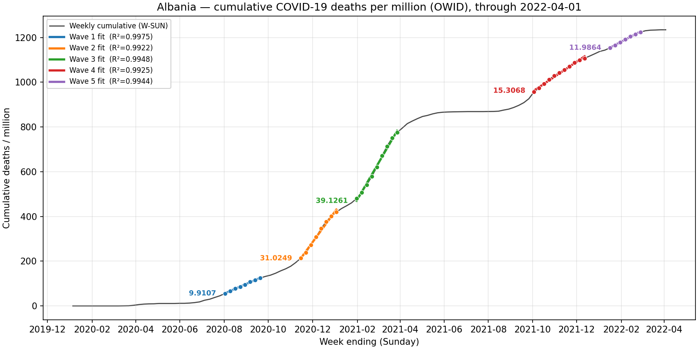
  - 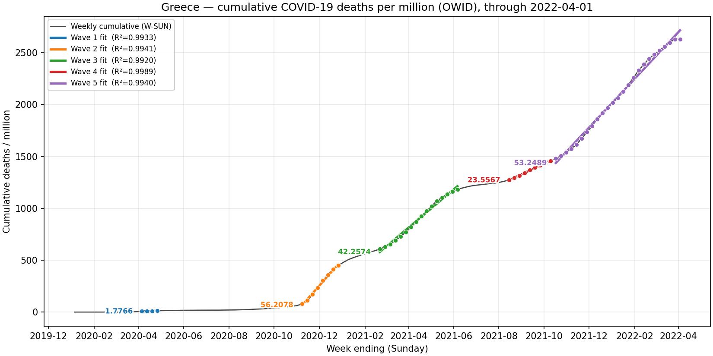
  - 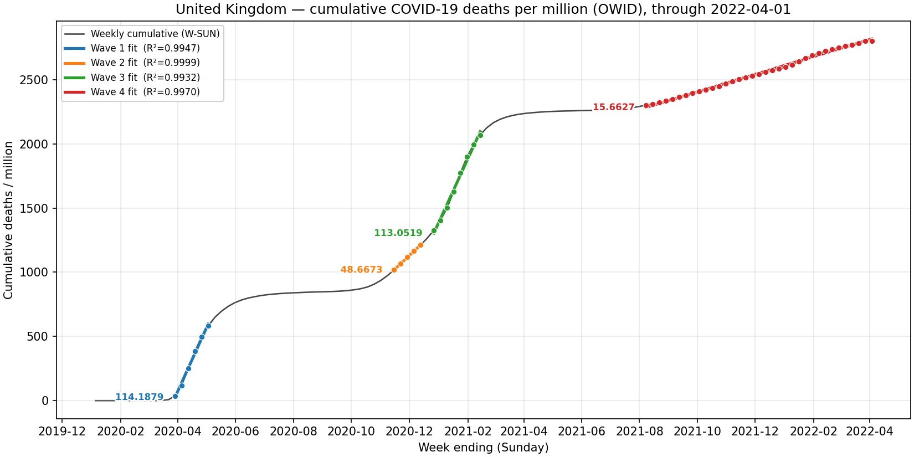
  - 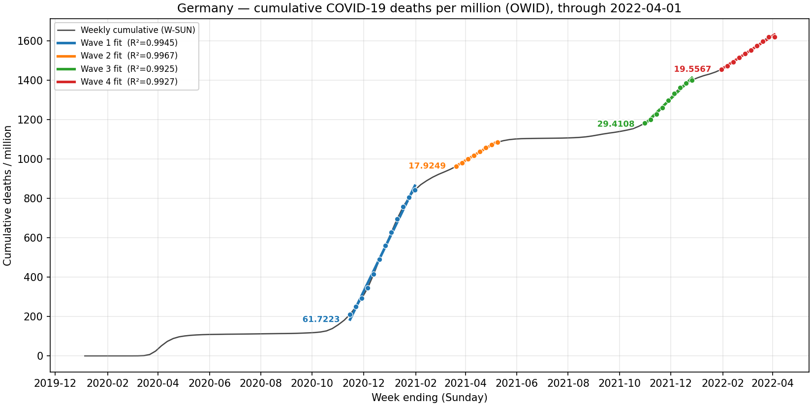
  - 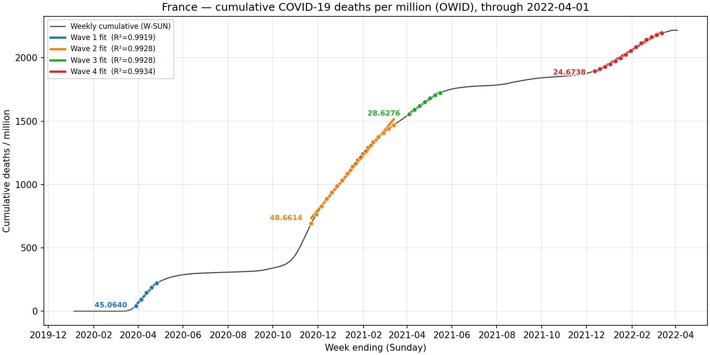
  - 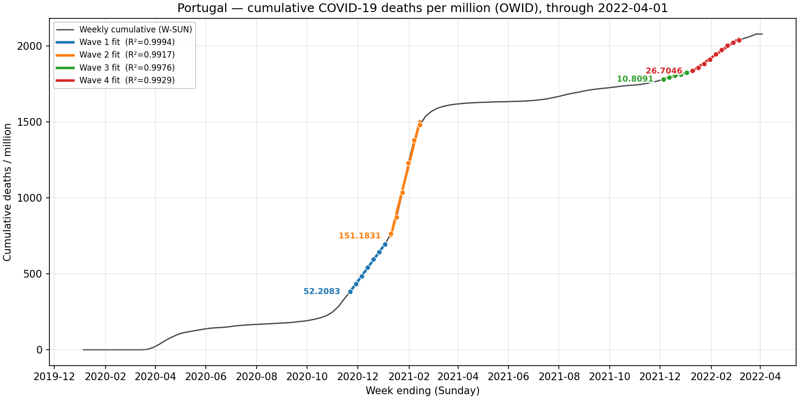
  - 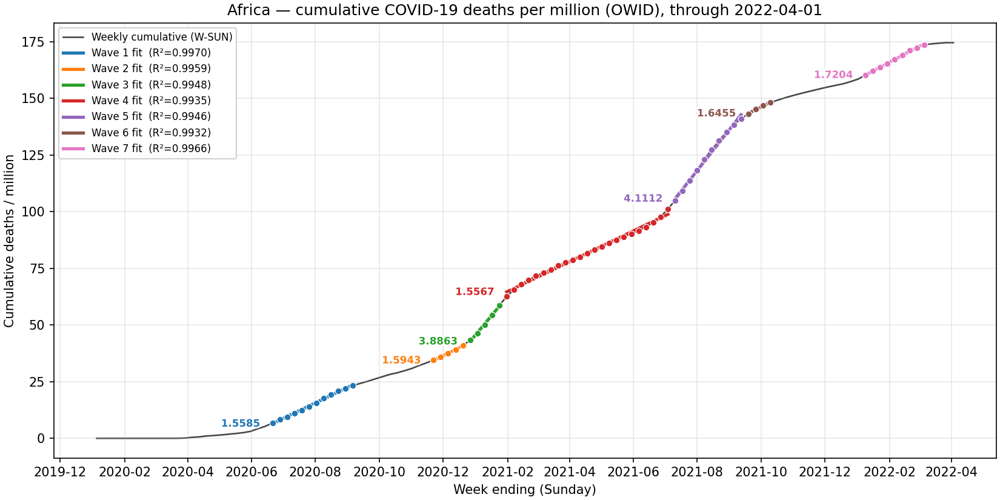
  - 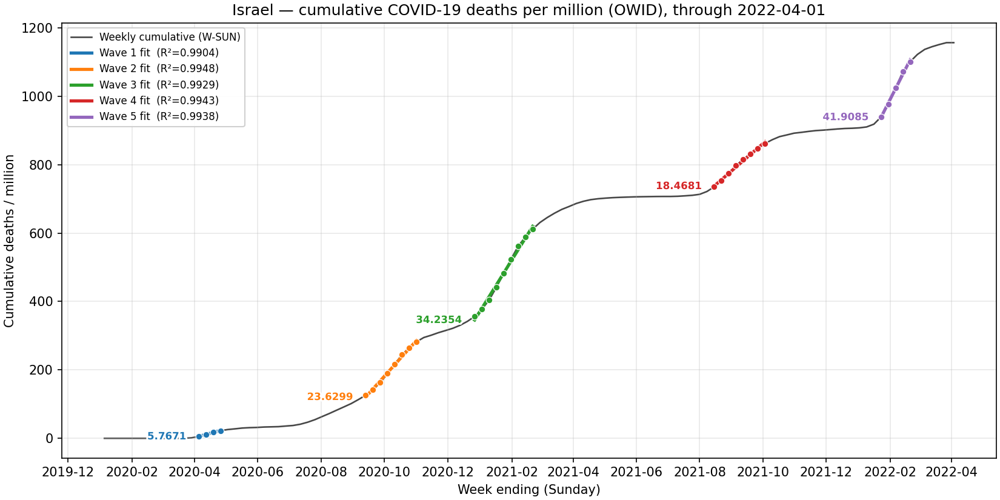
  - 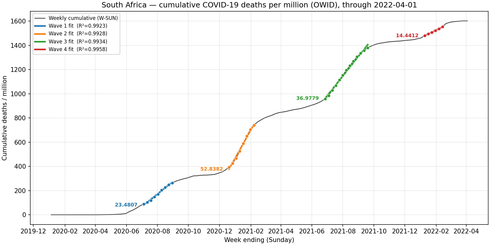
- All-location dot plot:
  - 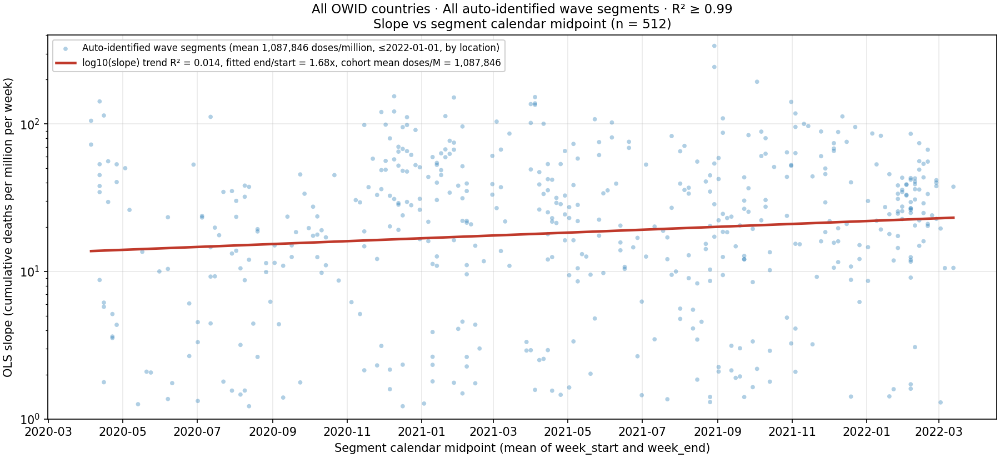
  - The dot plot shows 512 identified high-linearity wave segments with `R^2 >= 0.99`.
  - The y-axis is cumulative COVID-death slope in deaths per million per week on a log scale; the x-axis is segment calendar midpoint.
  - The plot does not show an obvious post-rollout collapse of wave slopes after vaccination became widespread.
  - Visual takeaway: you cannot tell from this plot when the COVID shots were rolled out.
  - Regression note: the plotted regression is `log10(slope)` vs segment midpoint; the fitted trend is weak but upward (`R^2 = 0.014`, fitted end/start = 1.68x).
  - This is one of the cleanest non-cherry-picked visuals because it uses all OWID countries and all auto-identified high-linearity wave segments, not selected country examples.
  - Underlying CSV: `debate/data/owid_slope/owid_all_locations_wave_slopes.csv`.
  - Quick quarter summary from the underlying CSV:
    - 2020Q4: n=65, median slope 30.48, p75 57.58, max 154.09 deaths/million/week.
    - 2021Q1: n=69, median 26.91, p75 54.48, max 151.18.
    - 2021Q2: n=74, median 22.73, p75 39.40, max 152.23.
    - 2021Q3: n=79, median 17.02, p75 34.83, max 338.46.
    - 2021Q4: n=62, median 28.45, p75 64.23, max 193.29.
    - 2022Q1: n=79, median 27.34, p75 38.97, max 86.23.
  - Interpretation: this is not causal proof, because country mix, variant timing, infection intensity, reporting, and age structure vary; but it is a useful falsification screen against the claim that large population-level VE death is obvious in the global slope record.
- Debate line:
  - "You cannot tell from the global COVID-death slope plot when the shots were rolled out. That is not what a large, durable, population-level death-prevention effect should look like."
  - "No cherry picking: all OWID countries, all auto-identified wave segments, `R^2 >= 0.99`; the fitted log-slope trend goes up, not down."
  - "From the slope shapes alone, you cannot reliably infer vaccine coverage. That is a serious visual challenge to claims that large population-level VE death should be obvious in cumulative COVID mortality."
  - "If the explanation is that wave intensity or other factors exactly offset the vaccine effect, show the country-by-country counterfactual model and validate it against the measured slopes."
- Major exhibit framing:
  - This may be one of the strongest visual points in the debate because it is not a selected-country example.
  - Summary phrase: "This is one of the best arguments that large net lives saved is not visible in the measurements."
  - If vaccine-induced protection and accumulating natural immunity both materially reduced population-level COVID death risk, the broad expectation would be downward pressure on later wave slopes.
  - Instead, across all high-fit OWID country wave segments, the fitted log-slope trend is slightly upward rather than downward.
  - This does not prove vaccine harm or prove exactly zero benefit, because variant severity, infection pressure, country mix, reporting, age structure, and timing changed.
  - But it is a serious problem for a confident large-net-benefit claim: if the benefit was large at population scale, it should be visible somewhere in a broad all-country slope screen.
  - If the benefit is not visible, the defender must quantify the counterfactual forces that allegedly hid it.
  - Debate line: "If there was large COVID-death benefit, where is it in the all-country slope record? Natural immunity and vaccination should both push later slopes down, yet the fitted trend goes up."
- Presentation tactic:
  - Before showing the plot, ask SW and/or the AI judge for the directional prediction.
  - Do not imply ignorance of the result; simply frame it as a model-prediction question.
  - Suggested question:
    - "As a model-prediction question: if vaccines were producing large durable population-level COVID-death protection, and natural immunity was accumulating, what directional trend should we expect in an all-country OWID wave-slope plot over time?"
  - More specific version:
    - "What should happen if we take all OWID countries, identify all high-linearity cumulative COVID-death wave segments, and plot each segment's slope against calendar midpoint? Under a large durable vaccine death-benefit model, especially with accumulating natural immunity, should the fitted trend go down, stay flat, or go up?"
  - If SW predicts "down," reveal the plot: all OWID countries, all auto-identified high-linearity segments, `R^2 >= 0.99`, n=512; fitted `log10(slope)` trend goes up, fitted end/start = 1.68x.
  - If SW predicts "flat" or "up," ask whether he is conceding that even large VE death would leave no visible downward fingerprint in the global slope record.
  - If SW refuses to make a prediction, note that a model that cannot make even a directional prediction before looking at the result is hard to use as evidence of large lives saved.

### OWID high-vax vs low-vax slope split

- Purpose:
  - Reduce the "all countries mixed together" critique by comparing countries with high versus low vaccination exposure.
  - Metric used by the script: OWID total doses per million as of 2022-01-01, among locations with at least one auto-identified wave segment.
  - Segment filter: auto-identified cumulative COVID-death wave segments with `R^2 >= 0.99`.
- Top 25 vs bottom 25:
  - Local figure: 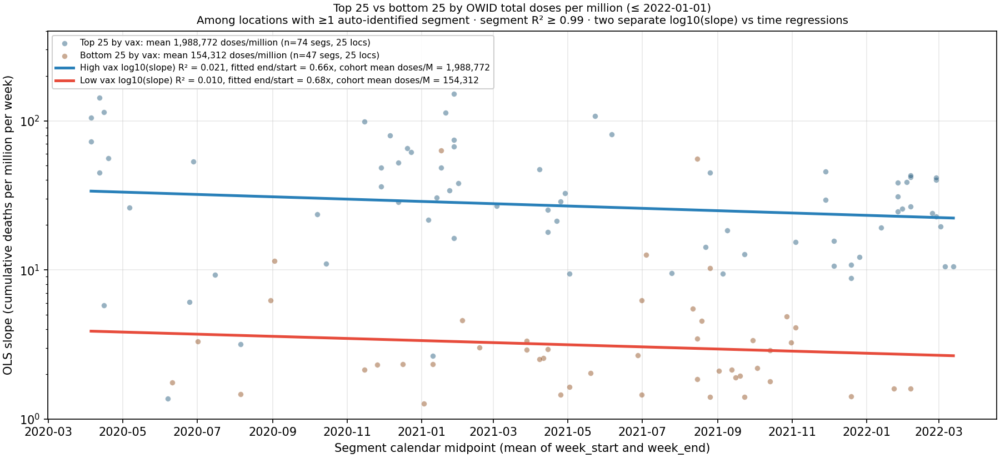
  - High-vax cohort mean: 1,988,772 doses per million.
  - Low-vax cohort mean: 154,312 doses per million.
  - Dose separation: about 12.9x.
  - High-vax fitted log-slope trend: `R^2 = 0.021`, fitted end/start = 0.66x.
  - Low-vax fitted log-slope trend: `R^2 = 0.010`, fitted end/start = 0.68x.
  - Interpretation: despite about a 13x dose exposure difference, the fitted trend over time is nearly the same. The absolute slope levels are not the same, so do not describe this as identical mortality levels; describe it as no obvious differential downward trend in the high-vax group.
- Top 70 vs bottom 70:
  - Local figure: 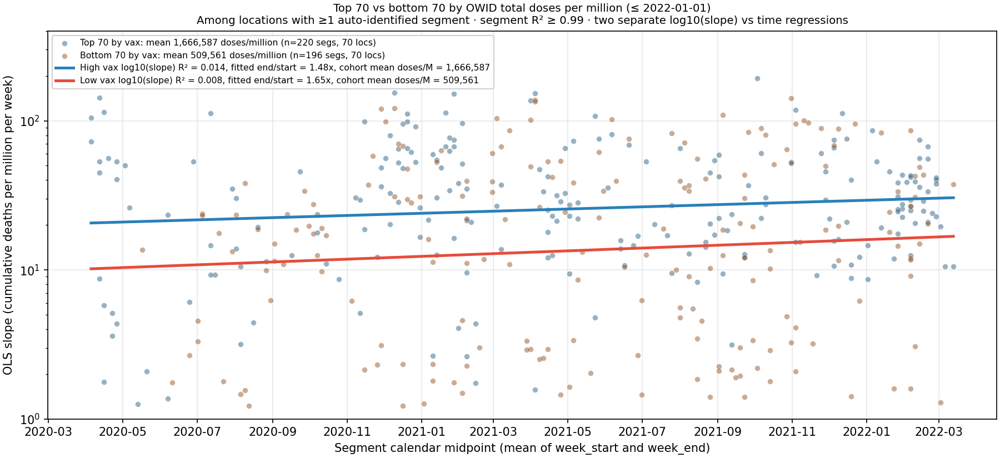
  - High-vax cohort mean: 1,666,587 doses per million.
  - Low-vax cohort mean: 509,561 doses per million.
  - Dose separation: about 3.27x.
  - High-vax fitted log-slope trend: `R^2 = 0.014`, fitted end/start = 1.48x.
  - Low-vax fitted log-slope trend: `R^2 = 0.008`, fitted end/start = 1.65x.
  - Interpretation: with a broader country set, both high- and low-vax groups slope upward over time, with no clear high-vax downward fingerprint.
- Why keep all three slope charts:
  - The all-country chart asks the broadest question: is there a visible downward rollout fingerprint across all high-linearity COVID-death wave segments? The answer is no; the fitted trend goes upward.
  - The top 25 / bottom 25 chart asks the high-contrast question: with about a 13x dose exposure difference, does the high-vax group show a much stronger downward trend? The fitted trends are nearly the same: 0.66x vs 0.68x.
  - The top 70 / bottom 70 chart asks the broader-sample question: if the 25-country split is too narrow, does a larger split reveal the expected high-vax advantage? It still does not; both groups slope upward with similar fitted end/start ratios: 1.48x vs 1.65x.
  - Taken together, these charts suggest that the apparent trend is sensitive to grouping choices and probably close to flat-to-upward, not a robust downward vaccine-benefit fingerprint.
- Debate line:
  - "Top 25 vs bottom 25 countries differ by roughly 13x in dose exposure, yet their fitted COVID-death wave-slope time trends are nearly the same. That is not what a large, durable, population-level death-prevention effect should look like."
  - "The 70-country split trades some exposure contrast for a larger sample, and the same basic point remains: there is still no clear high-vax downward fingerprint."

### South Korea: not just "no harm"; also a population-level benefit problem

- Why this matters:
  - SW used South Korea as part of the zero-COVID / low-COVID set to argue that vaccination rollout did not produce obvious excess mortality.
  - But South Korea is also highly relevant on the benefit side: after very high vaccination and boosting, South Korea still experienced a very large mortality/COVID wave in early 2022.
- Local figures:
  - 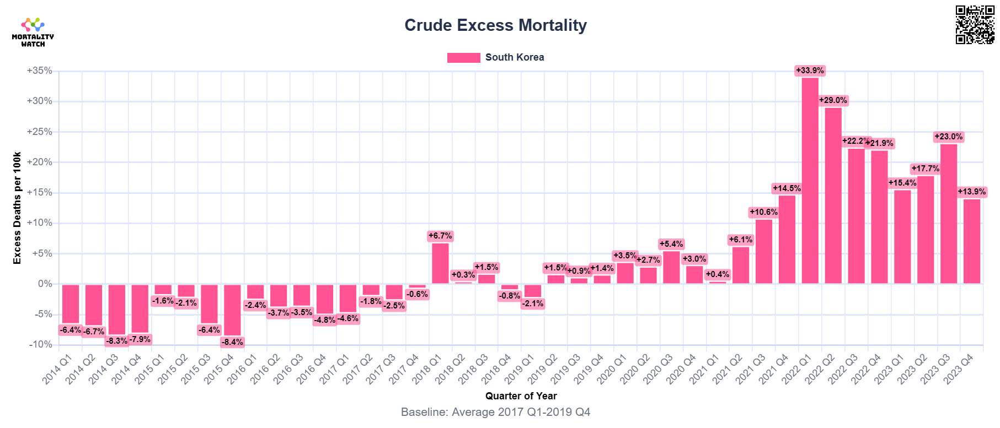
  - 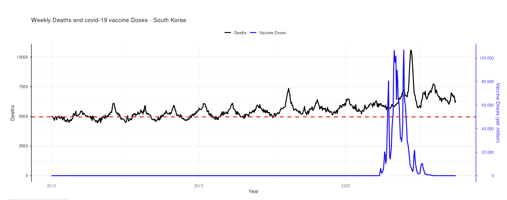
- OWID vaccination context:
  - South Korea was approximately 81.67% fully vaccinated by 2021-12-31, with boosters at about 35.68 per hundred.
  - By 2022-03-31, South Korea was approximately 85.24% fully vaccinated, with boosters at about 63.78 per hundred.
- Mortality Watch visual:
  - South Korea crude excess mortality was strongly positive in 2022, including about +33.9% in 2022 Q1 and +29.0% in 2022 Q2 in the saved chart.
  - This is difficult to use as a "vaccines caused no excess mortality" proof.
- Benefit-side interpretation:
  - The stronger use is not to claim the South Korea spike proves vaccine harm.
  - The stronger use is to say that South Korea is a major problem for the claim that vaccination produced a large, durable, population-level COVID-death benefit.
  - If a country is highly vaccinated and boosted, yet experiences one of its largest COVID/excess-mortality waves weeks/months after rollout, the measured population-level benefit is not obvious.
- Caveat:
  - This does not prove individual-level VE was zero.
  - South Korea's 2022 wave may reflect Omicron immune escape, enormous infection pressure, waning, age structure, reporting, policy changes, and prior low infection / low natural immunity.
  - But those are exactly the factors SW must quantify if he claims large lives saved despite the observed mortality spike.
- Debate line:
  - "South Korea cannot be used simply as a no-harm example. It is also a benefit-side problem: after very high vaccination and boosting, the country still had a massive mortality/COVID wave. If SW says vaccination saved large numbers of lives there, show the counterfactual quantitatively."
- Counterfactual peak stress test:
  - The weekly-deaths/vaccine-doses plot is useful because the black all-cause mortality line rises dramatically after the blue vaccine rollout spikes.
  - A clean way to use this is to ask what no-vaccine peak is implied by a high-VE model.
  - Do not use a simple "10x total mortality" claim unless assuming 100% coverage and applying the 10x only to the COVID-excess component.
  - Correct coverage-adjusted formula:
    - If coverage is `p` and VE against COVID death is `VE`, then observed COVID-excess deaths are approximately `(1 - p * VE)` of the no-vaccine COVID-excess counterfactual, assuming equal infection pressure and no vaccine harm.
    - Therefore, no-vaccine COVID-excess counterfactual is approximately `observed_excess / (1 - p * VE)`.
  - For South Korea:
    - If coverage was about 80% and VE death was 90%, the no-vaccine COVID-excess counterfactual would be about `1 / (1 - 0.80 * 0.90) = 3.57x` the observed COVID-excess component.
    - If coverage was about 85% and VE death was 90%, the no-vaccine COVID-excess counterfactual would be about `1 / (1 - 0.85 * 0.90) = 4.26x` the observed COVID-excess component.
    - If observed all-cause mortality at the peak was roughly double baseline, then the implied no-vaccine all-cause peak under the high-VE model would be several-fold baseline, not merely slightly higher.
  - Proposed exhibit:
    - Plot the observed South Korea weekly death peak against implied no-vaccine counterfactual peaks under 50%, 70%, and 90% VE assumptions at observed coverage.
    - Then compare those implied peaks with observed peaks in largely unvaccinated countries such as South Africa and Bulgaria.
  - Debate line:
    - "If South Korea was highly vaccinated and still had a roughly doubled all-cause mortality peak, what no-vaccine peak is implied by the claimed 90% VE death model? If the implied peak is far beyond what we see even in largely unvaccinated countries, the model is not credible without a quantitative explanation."

### Aarstad papers as Pillar 3 support

- Role in the argument:
  - Aarstad's work is best used as corroborating Pillar 3 evidence, not as the central proof.
  - The strongest use is to show that multiple independent ecological / population-level analyses find that excess mortality after rollout did not behave like a clean large-net-benefit story.
  - The limitation is that these are mostly ecological or reanalysis designs, so they remain vulnerable to ecological confounding, age structure, country-level health differences, COVID intensity, reporting quality, and vaccine uptake being correlated with many other variables.
- Aarstad & Kvitastein European analysis:
  - Paper/preprint: "Is There a Link between the 2021 COVID-19 Vaccination Uptake in Europe and 2022 Excess All-Cause Mortality?"
  - Reported finding: in 31 European countries, higher 2021 vaccination uptake was positively associated with higher monthly 2022 excess all-cause mortality; the preprint reports a one percentage point increase in 2021 vaccine uptake associated with a 0.105% monthly 2022 mortality increase.
  - A peer-reviewed article is linked from the preprint page: https://doi.org/10.21276/apjhs.2023.10.1.6
  - Preprint page: https://www.preprints.org/manuscript/202302.0350
- Aarstad update / long-term mortality work:
  - Aarstad later updates argue that vaccine effects may have changed over time, with possible temporary mortality reduction followed by higher later mortality, especially around boosters.
  - These are useful because they fit our warning that "vaccine benefit" cannot be treated as static, durable, and homogeneous.
  - But they should be cited as suggestive unless peer-review status and methods are checked carefully.
- Aarstad US county paper:
  - F1000Research 2026 paper: "Why COVID-19 vaccination cannot be ruled out as an explanation for all-cause excess mortality in the pandemic's aftermath: A population-level study of over 3,000 US counties with over 320 million people."
  - Status: F1000Research version 1, peer review awaiting peer review as of the page checked.
  - Reported finding: US county-level vaccine uptake at the end of 2021/2022 was significantly positively associated with 2022/2023 all-cause excess mortality after including lagged dependent variables.
  - Link: https://f1000research.com/articles/15-244/v1
- Aarstad young England / ONS reanalysis:
  - EXCLI Journal 2024 letter: "Deaths among young people in England increased significantly in 10 of 11 weeks after COVID-19 vaccination and doubled in three."
  - The letter critiques using later post-vaccination time windows as a reference period if longer-term post-vaccination risk is possible.
  - This is relevant to our broader point that self-controlled designs can be biased if the chosen control window is not a true no-risk period.
  - Link: https://www.excli.de/vol23/2024-7498/2024-7498.htm
- Heatwave rebuttal:
  - Aarstad's 2024 Climate article argues against heatwaves being a strong explanation for European 2022 summer excess mortality, pointing for example to high excess mortality in places less plausibly explained by heat.
  - This can be used as a rebuttal to one competing explanation for excess mortality, not as proof of vaccine causation.
  - Link: https://www.mdpi.com/2225-1154/12/5/69
- Debate line:
  - "Aarstad should not be used as a one-paper proof. Use it with Mostert, OWID slopes, US UCOD, Japan H(t), and Florida brand-matched NCACM as convergence: the aggregate mortality record does not look like a clean large-net-benefit intervention."

### Pillar placement: VAERS, FDA/Prasad memo, and Japan

- VAERS:
  - Best placement: Pillar 2, "harm likely nonzero or significant."
  - Rationale: VAERS is the official US vaccine adverse-event reporting system, and an unprecedented death / serious-adverse-event reporting pattern is a safety signal that requires competent public adjudication.
  - Limitation: VAERS is passive surveillance and cannot estimate incidence or causality by itself; it is signal evidence, not a stand-alone death-count estimate.
  - Debate line: "VAERS cannot estimate vaccine deaths by itself, but it is the official US safety-signal system. An unprecedented signal in the official system cannot be dismissed without a transparent adjudication."
  - Add to Pillar 2 evidence list:
    - COVID-19 vaccines produced an unprecedented volume of VAERS death reports relative to prior vaccine products and the prior history of the system.
    - This should be described as an official safety signal, not as a direct proof that all reported deaths were caused by vaccination.
    - The key institutional challenge is: what was the adjudication process, what fraction was medically reviewed, what causal categories were assigned, and why were the full results not transparently released?
    - If the response is "VAERS is unreliable," that does not solve the problem; VAERS is the system the US government chose for vaccine safety signal detection.
    - Debate line: "The official US safety-signal system produced an unprecedented death-report signal. If that signal is non-causal, show the adjudication, don't just dismiss the system."
  - Pillar 3 connection:
    - VAERS is not a net-mortality estimate, but it belongs in the Pillar 3 convergence picture.
    - At the same time aggregate mortality moved the wrong way, the official US vaccine safety system produced an unprecedented death-report signal.
    - This is not proof of net harm, but it is directionally inconsistent with an uncomplicated "large net lives saved and no meaningful harm" story.
- FDA/Prasad memo:
  - Best placement: Pillar 2, with implications for rebutting SW's institutional-detection argument.
  - Rationale: the memo undermines the claim that, if vaccines had caused deaths, agencies would necessarily have detected and publicly admitted it in real time.
  - It also shows that official actors can acknowledge vaccine-caused deaths and unresolved risk-benefit questions after the fact, rather than as timely public warnings.
  - Debate line: "The FDA/Prasad memo is not a full adult net-mortality estimate; it is evidence that institutional silence is not proof of no deaths."
- Japan:
  - Japan OWID excess mortality graph: best placement is Pillar 3, "net direction looked worse, not better."
  - Japan full-population H(t): can support both Pillar 2 and Pillar 3, because it is closer to individual/cohort data and less exposed to simple vaccinated-vs-unvaccinated HVE.
  - Japan Factors paper: primarily Pillar 3, with cautious Pillar 2 support where later-dose associations are discussed.
  - Debate line: "Japan is not one-paper proof of vaccine harm, but it is difficult to reconcile Japan's sharp post-rollout excess mortality with a simple large-net-benefit narrative unless the counterfactual is shown quantitatively."

### Judging strategy for Claude or another AI judge

- Recommended decision rule:
  - Use a preponderance-style threshold, not a beyond-reasonable-doubt threshold.
  - Suggested instruction: "Judge the debate by preponderance of evidence. If one side is more likely correct by at least 55%, name that side the winner. If neither side reaches 55%, conclude that the evidence is too uncertain and no side wins."
- Why not 95%:
  - A 95% threshold will likely force an "unknowable / no winner" result because the question is observationally confounded and neither side can prove the full counterfactual at that level.
  - The debate is about which side made the more likely case, not whether either side can establish near-certainty.
- Claude-specific notes:
  - Claude is likely to reward careful causal language, caveats, and direct engagement with the strongest opposing evidence.
  - Claude is likely to penalize overclaiming from VAERS, anecdotes, autopsy series, ecological charts, or country slopes.
  - Claude is also likely to penalize SW if he handwaves confounding, says "ecological fallacy" as a magic phrase, relies on observational VE studies without NCACM negative controls, or uses lives-saved models without validating them against observed population slopes.
- Best final framing:
  - "I am not claiming each signal is definitive alone. I am claiming SW's large-net-benefit case is not established because his strongest VE evidence does not survive HVE/NCACM concerns, his models are not validated against the measured slope record, and the aggregate ACM/safety record moved in the wrong direction. If he says all of that is coincidental or confounded, he needs to show the quantitative reconciliation."
- Practical implication:
  - The best path to winning is disciplined burden-shifting, not overclaiming.
  - The likely fallback if the judge is very cautious is "unknowable / not established," which is still far better than conceding the official large-net-benefit story.

### Current strongest arguments by pillar

- Pillar 1: lives saved was likely small or unproven.
  - Strongest current evidence:
    - OWID all-country slope screen: all high-linearity cumulative COVID-death wave segments (`R^2 >= 0.99`, n=512) show no obvious downward rollout fingerprint; fitted log-slope trend goes upward, not downward.
    - OWID top25/bottom25 split: countries differ by about 13x in dose exposure, yet fitted COVID-death wave-slope trends are nearly identical (0.66x vs 0.68x).
    - OWID top70/bottom70 split: broader sample with about 3.27x exposure contrast still does not show a high-vax downward fingerprint; both groups trend upward (1.48x vs 1.65x).
    - Czech CACM/NCACM checks: high COVID-signal weeks show apparent COVID/non-COVID ratios around ~2.1x to ~2.3x in older/all-age groups, not 10x to 30x, and even that ~2x is not necessarily causal.
    - South Korea: after high vaccination and boosting, South Korea still experienced a large 2022 mortality/COVID wave, creating a benefit-side counterfactual problem.
  - Burden on SW:
    - Show the large VE-death effect in transparent data after NCACM / negative-control checks.
    - Show a quantitative model explaining why high vaccination plus natural immunity did not create a visible downward slope fingerprint in all-country and high-vax vs low-vax slope screens.
  - Caveat:
    - These are population-level falsification screens, not direct individual-level VE estimates; wave intensity, variant mix, prior infection, reporting, and age structure remain possible explanations if quantified.
- Pillar 2: harm was likely nonzero or significant.
  - Strongest current evidence:
    - Florida Levi/Ladapo Pfizer-vs-Moderna: US mRNA active-comparator, brand-vs-brand, exact-matched NCACM signal; generic HVE is less responsive because both cohorts chose vaccination.
    - VAERS: the official US vaccine safety-signal system produced an unprecedented death / serious-adverse-event reporting signal; this is not a death-count estimate but requires transparent adjudication.
    - FDA/Prasad memo: undermines "agency silence means no deaths" and supports the claim that institutional detection/admission cannot be assumed.
    - Japan full-population H(t): possible post-rollout mortality deviations in a full cohort rather than a simple vaccinated-vs-unvaccinated comparison.
    - Autopsy/pathology, EMS/insurance/disability, and mechanistic material remain supporting signals, but should be used cautiously and not as stand-alone proof.
  - Burden on SW:
    - Produce a comparable or stronger US mRNA brand-comparison study showing no NCACM difference between strictly matched Pfizer and Moderna cohorts.
    - Explain why the official VAERS signal was non-causal with transparent adjudication rather than dismissing VAERS as unreliable.
  - Caveat:
    - Individual harm signals vary in strength; the argument is convergence and burden-shift, not that every signal independently proves net harm.
- Pillar 3: net direction looked worse, not better.
  - Strongest current evidence:
    - US mortality remained elevated after rollout; the US UCOD decomposition did not eliminate the elevation after removing obvious categories such as drug/alcohol/external causes.
    - Mostert: persistent excess mortality across many Western countries is a real empirical phenomenon that must be reconciled with large-net-benefit claims.
    - Aarstad: ecological / ONS-reanalysis work supports the broader observation that post-rollout ACM did not behave like a clean large-net-benefit intervention.
    - Japan excess mortality and Japan Factors paper: Japan's sharp post-rollout excess mortality is difficult to reconcile with a simple large-net-benefit narrative without a quantitative counterfactual.
    - OWID slope screens provide global falsification/context evidence even though the debate target is US net lives.
  - Burden on SW:
    - Provide a quantitative decomposition showing why US and comparator-country mortality moved the wrong way despite large claimed vaccine benefit and no meaningful harm.
    - Explain both the persistent US mortality elevation and the Florida active-comparator mRNA brand signal.
  - Caveat:
    - Pillar 3 is a more-likely-than-not net-direction argument, not proof that vaccines caused every excess death.
  - Current thesis:
    - "On balance, the real-world ACM / excess-mortality record is more consistent with little/no net benefit or net harm than with large net lives saved."

### Scope discipline: the debate is about the United States

- Debate question:
  - "In the US, did the mRNA COVID vaccines likely net save lives or cost lives through the end of 2022?"
- Important implication:
  - Worldwide and OWID country-slope evidence should be used as falsification/context evidence against large universal VE-death claims.
  - But the final net-impact argument must return to US evidence.
- US-centered points to foreground:
  - US mortality remained elevated after rollout.
  - The US UCOD analysis did not make the elevation disappear after removing obvious "unrelated" categories such as drug/alcohol/external causes; the residual elevation remained.
  - This matters because SW cannot use "COVID" as a free explanation without also accounting for the claimed COVID-death reduction from vaccination.
  - If vaccines strongly reduced US COVID mortality and had no meaningful harm, the US ACM / residual NCACM record should not require an invisible counterfactual to explain why mortality remained elevated.
  - Florida Levi/Ladapo is especially relevant because it is US data, mRNA-specific, and active-comparator brand-vs-brand rather than simple vaccinated-vs-unvaccinated.
- Debate line:
  - "The worldwide slope exhibit is not the target estimand; it is a falsification screen. The debate is US net lives through end-2022. For that, the key facts are that US mortality stayed elevated, removing obvious non-vaccine categories did not eliminate the elevation, and the Florida mRNA brand comparison gives a US active-comparator NCACM harm signal."
- US harm-side burden shift:
  - The Florida Levi/Ladapo study is especially important because it is not a generic vaccinated-vs-unvaccinated comparison.
  - It is a US mRNA active-comparator brand comparison: Pfizer vs Moderna.
  - If the products were equally safe, strictly matched Pfizer and Moderna recipients should have similar NCACM.
  - Levi/Ladapo reports a large NCACM difference between the brands.
  - If SW says the difference is residual confounding, he should produce a comparable or stronger brand-comparison study showing NCACM equality between strictly matched mRNA cohorts.
  - Generic vaccinated-vs-unvaccinated VE studies do not answer this brand-safety question.
  - Debate line: "If the products are equally safe, matched Pfizer and Moderna recipients should have similar NCACM. Levi/Ladapo says they do not. Where is SW's equally strict matched brand-comparison study showing the opposite?"
- Two concrete US burdens for SW:
  - Burden 1: explain persistent US mortality elevation.
    - If mRNA vaccines produced large net lives saved and no meaningful harm, why did US mortality remain elevated after rollout?
    - The US UCOD decomposition did not make the elevation disappear after removing obvious categories such as drug/alcohol/external causes.
    - SW needs a quantitative decomposition, not a list of possible causes.
  - Burden 2: answer the Florida active-comparator NCACM signal.
    - Levi/Ladapo is US, mRNA-specific, and brand-vs-brand among vaccinated people, so generic healthy-vaccinee explanations are much less responsive.
    - If SW claims residual confounding, he should produce a comparable or stronger Pfizer-vs-Moderna matched study showing no NCACM difference.
  - Debate line: "My US case is not just global ecological suspicion. It is persistent US mortality elevation plus a US mRNA brand-comparison harm signal. If SW says the vaccines net saved lives, he needs to reconcile both."
