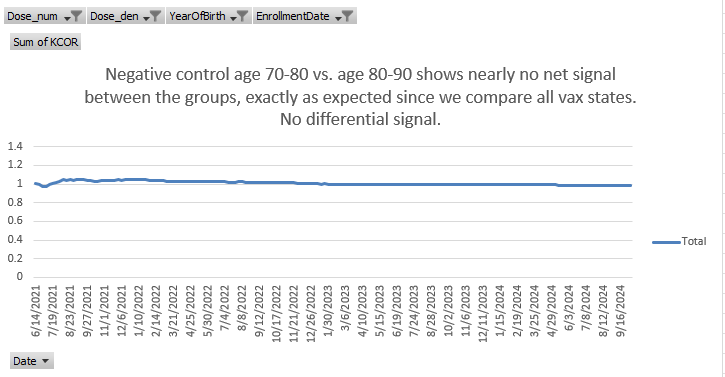
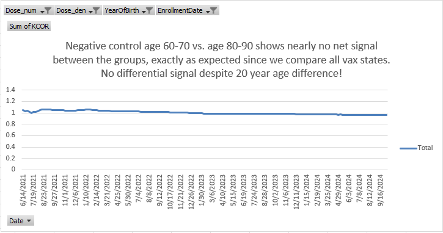

# KCOR: Depletion-Neutralized Cohort Comparison via Gamma-Frailty Normalization Under Selection-Induced Hazard Curvature

<!--
paper_v5.md (methods-only manuscript; updated to KCOR v6)

Goal: Submit a methods paper focused on the KCOR methodology + validation via negative/positive controls.
This version deliberately avoids presenting any applied Czech2 vaccine-effect results (to be a separate paper).

KCOR v6 update:
- Replace v4 “slope/curvature normalization + anchoring” with a gamma-frailty normalization in cumulative-hazard space.
- Math formatting follows documentation/style_guide/KCOR_Markdown_Math_Style_Guide.md:
  use `$...$` for inline math and double-dollar blocks for display math (delimiter alone on its line).
-->

## Manuscript metadata (for journal submission)

- **Article type**: Methods / Statistical method
- **Running title**: KCOR via gamma-frailty normalization
- **Authors**: [Author names and degrees to be added prior to submission]
- **Affiliations**: [Institutional affiliations to be added prior to submission]
- **Corresponding author**: [Contact information to be added prior to submission]
- **Word count**: [To be calculated prior to submission]
- **Keywords**: selection bias; healthy vaccinee effect; non-proportional hazards; frailty; gamma frailty; negative controls; causal inference

---

## Abstract

Retrospective cohort studies often estimate the mortality impact of medical interventions, but selection can create non-exchangeable cohorts that defeat standard comparisons. In particular, selective uptake can induce systematic differences in mortality curvature—differences in the time-evolution of cohort hazards driven by frailty heterogeneity and depletion of susceptibles—that violate the assumptions of standard epidemiologic tools such as Cox proportional hazards models, age-standardized mortality rates, and inverse-probability weighting. We introduce **KCOR (Kirsch Cumulative Outcomes Ratio)**, a method that neutralizes selection-induced curvature before cohort comparison by estimating and inverting a gamma-frailty mixture model in **cumulative-hazard space**. KCOR v6 fits cohort-specific selection parameters during epidemiologically quiet periods and transforms observed cumulative hazards to depletion-neutralized baseline cumulative hazards, which are then compared cumulatively via ratios. We describe the KCOR framework, its mathematical foundation, and its validation using prespecified negative and positive control tests designed to stress selection-induced curvature. KCOR enables interpretable cumulative cohort comparisons in settings where treated and untreated hazards are non-proportional because selection induces different depletion dynamics.

---

## 1. Introduction

### 1.1 Retrospective cohort comparisons under selection

Randomized controlled trials (RCTs) are the gold standard for causal inference, but are often infeasible, underpowered for rare outcomes, or unavailable for questions that arise after rollout. As a result, observational cohort comparisons are widely used to estimate intervention effects on outcomes such as all-cause mortality.

However, when intervention uptake is voluntary, prioritized, or otherwise selective, treated and untreated cohorts are frequently **non-exchangeable** at baseline and evolve differently over follow-up. This problem is not limited to any single intervention class; it arises whenever the same factors that influence treatment uptake also influence outcome risk.

### 1.2 Curvature (shape) is the hard part: non-proportional hazards from frailty depletion

Selection does not merely shift mortality **levels**; it can alter mortality **curvature**—the time-evolution of cohort hazards. Frailty heterogeneity and depletion of susceptibles naturally induce curvature even when individual-level hazards are simple functions of time. When selection concentrates high-frailty individuals into one cohort (or preferentially removes them from another), the resulting cohort-level hazard trajectories can be strongly non-proportional.

One convenient way to formalize "curvature" is in cumulative-hazard space: if the cumulative hazard $H(t)$ were perfectly linear in time, then its second derivative would be zero, whereas selection-induced depletion generally produces concavity in observed cumulative hazards during otherwise stable periods.

This violates core assumptions of many standard tools:

- **Cox PH**: assumes hazards differ by a time-invariant multiplicative factor (proportional hazards).
- **IPTW / matching**: can balance measured covariates yet fail to balance unmeasured frailty and the resulting depletion dynamics.
- **Age-standardization**: adjusts levels across age strata but does not remove cohort-specific time-evolving hazard shape.

KCOR is designed for this failure mode: **cohorts whose hazards are not proportional because selection induces different depletion dynamics (curvature).**

### 1.3 Evidence from the literature: residual confounding despite meticulous matching

Two large, rigorously designed observational analyses illustrate the core empirical motivation: even extremely careful matching and adjustment can leave large residual differences in non-COVID mortality, indicating confounding and selection that standard pipelines do not eliminate.

#### 1.3.1 Denmark (negative controls highlight confounding)

Obel et al. used Danish registry data to build 1:1 matched cohorts and applied negative control outcomes to assess confounding. Their plain-language summary includes the following:

> Meaning: The negative control methods indicate that observational studies of SARS-CoV-2 vaccine effectiveness may be prone to
> substantial confounding which may impact the observed associations. This bias may both lead to underestimation of vaccine
> effectiveness (increased risk of SARS-CoV2 infection among vaccinated individuals) and overestimation of the vaccine effectiveness (decreased risk of death after of SARS-CoV2 infection among vaccinated individuals). Our results highlight the need
> for randomized vaccine efficacy studies after the emergence of new SARS-CoV-2 variants and the rollout of multiple booster
> vaccines. [@obel2024]

This is a direct statement that observational designs—even with careful matching and covariate adjustment—can remain substantially confounded when selection and health-seeking behavior differ between cohorts.

#### 1.3.2 Qatar (time-varying HVE despite meticulous matching)

Chemaitelly et al. analyzed matched national cohorts and explicitly measured the **time-varying healthy vaccinee effect (HVE)** using non-COVID mortality as a control outcome. They report a pronounced early-period reduction in non-COVID mortality among vaccinated individuals despite meticulous matching, followed by reversal later in follow-up, consistent with dynamic selection and depletion processes. [@chemaitelly2025]

Together, these studies motivate a methods gap: we need estimators that explicitly address **time-evolving selection-induced curvature**, not only baseline covariate imbalance.

| Study | Design | Matching/adjustment | Key control finding | Implication for methods |
|---|---|---|---|---|
| Obel et al. (Denmark) [@obel2024] | Nationwide registry cohorts (60–90y) | 1:1 match on age/sex + covariate adjustment; negative control outcomes | Vaccinated had higher rates of multiple negative control outcomes, but substantially lower mortality after unrelated diagnoses | Strong evidence of confounding in observational VE estimates; “negative control methods indicate… substantial confounding” |
| Chemaitelly et al. (Qatar) [@chemaitelly2025] | Matched national cohorts (primary series and booster) | Exact 1:1 matching on demographics + coexisting conditions + prior infection; Cox models | Strong early reduction in non-COVID mortality (HVE), with time-varying reversal later | Even meticulous matching leaves time-varying residual differences consistent with selection/frailty depletion |

Table: Summary of two large matched observational studies demonstrating residual confounding / HVE despite meticulous matching. {#tbl:HVE_motivation}

### 1.4 Contribution of this work

This paper introduces **KCOR**, a method that transforms observed cohort hazards to remove selection-induced depletion dynamics prior to comparison, enabling interpretable cumulative cohort comparisons under selection-induced non-proportional hazards.

This manuscript is **methods-only**:

- We present the estimator, model assumptions, and uncertainty quantification.
- We validate the method using prespecified negative and positive controls designed to stress selection-induced curvature.
- We defer any applied real-world intervention conclusions to a separate, dedicated applied paper.

KCOR is proposed as a diagnostic and normalization estimator for selection-induced hazard curvature; causal interpretation requires additional assumptions beyond the scope of this methods paper.

---

## 2. Methods

| Symbol | Meaning |
|---|---|
| $d$ | cohort index (enrollment definition × age group × dose/exposure) |
| $t$ | event time since enrollment (discrete bins, e.g., weeks) |
| $h_d^{\mathrm{obs}}(t)$ | observed cohort hazard at time $t$ |
| $H_d^{\mathrm{obs}}(t)$ | observed cumulative hazard (after skip/stabilization) |
| $h_{0,d}(t)$ | depletion-neutralized baseline hazard for cohort $d$ |
| $H_{0,d}(t)$ | depletion-neutralized baseline cumulative hazard |
| $\theta_d$ | frailty variance (selection strength) for cohort $d$ |
| $k_d$ | baseline hazard level for cohort $d$ under default baseline shape |

Table: Notation used throughout the Methods section. {#tbl:notation}

### 2.1 Conceptual framework: level vs curvature under selection

Differences in mortality between cohorts can arise from:

- **Level effects**: multiplicative shifts in hazard that are constant over time.
- **Curvature effects**: differences in the time-evolution of cohort hazards induced by heterogeneity and selective depletion.

Selection bias commonly produces curvature differences through frailty mixing and depletion. KCOR’s strategy is to **estimate and remove the selection-induced depletion component**, then compare cohorts on a cumulative scale.

### 2.2 Cohort construction and estimand

KCOR is defined for **fixed cohorts** at enrollment:

- Cohorts are fixed at enrollment and defined by intervention status at a specified time.
- No censoring or cohort switching is permitted in the primary estimand.
- Analysis proceeds in **event time** $t$ (time since enrollment).

This fixed-cohort design corresponds to an intent-to-treat–like estimand under selection. It is chosen deliberately to avoid time-varying deferral bias, immortal time bias, and dynamic health-based sorting that arise when individuals change exposure status during follow-up. Dynamic “as-treated” formulations are treated as sensitivity analyses rather than primary estimands.

### 2.3 Hazard estimation and cumulative hazards (discrete time)

Let $t$ denote event time since enrollment (e.g., weeks), $D_d(t)$ deaths during interval $t$ in cohort $d$, and $N_d(t)$ the number at risk at the start of interval $t$. In discrete time, hazards are treated as piecewise-constant and can be computed from interval risk as

$$
h_d^{\mathrm{obs}}(t) = -\ln\left(1 - \frac{D_d(t)}{N_d(t)}\right).
$$
{#eq:hazard-discrete}

We work primarily in **cumulative-hazard space**, accumulating observed hazards after an optional stabilization skip (see §2.7):

$$
H_d^{\mathrm{obs}}(t) = \sum_{s \le t} h_d^{\mathrm{eff}}(s)\,\Delta t,
\qquad \Delta t = 1 \text{ (one time bin)}.
$$
{#eq:cumhazard-observed}

### 2.4 Selection model: gamma frailty and the cumulative-hazard identity

#### 2.4.1 Individual hazards with multiplicative frailty

Model individual hazards in cohort $d$ as multiplicative frailty on top of a baseline hazard:

$$
h_{i,d}(t) = z_{i,d}\,h_{0,d}(t),
\qquad
z_{i,d} \sim \mathrm{Gamma}(\mathrm{mean}=1,\ \mathrm{var}=\theta_d).
$$
{#eq:individual-hazard-frailty}

Gamma frailty is used not as a claim of biological truth, but as a mathematically minimal and widely used model for unobserved heterogeneity whose Laplace transform yields a closed-form relationship between observed and baseline cumulative hazards [@vaupel1979]. In KCOR, gamma frailty is therefore a **depletion-neutralizing approximation**: its adequacy is treated as empirically testable and is assessed using prespecified negative controls and sensitivity analyses rather than assumed dogmatically.

Frailty $z_{i,d}$ captures latent heterogeneity in baseline risk and drives selective depletion: higher-frailty individuals die earlier, changing the cohort composition over time and inducing curvature in $h_d^{\mathrm{obs}}(t)$ even when $h_{0,d}(t)$ is simple.

#### 2.4.2 Gamma-frailty identity (core mathematics)

Let the baseline cumulative hazard be

$$
H_{0,d}(t) = \int_0^t h_{0,d}(s)\,ds.
$$
{#eq:baseline-cumhazard}

Integrating over gamma frailty yields a closed-form relationship between the observed cohort cumulative hazard and the baseline cumulative hazard:

$$
H_d^{\mathrm{obs}}(t) = \frac{1}{\theta_d}\,\log\!\left(1+\theta_d H_{0,d}(t)\right).
$$
{#eq:gamma-frailty-identity}

This identity can be inverted exactly:

$$
H_{0,d}(t) = \frac{e^{\theta_d H_d^{\mathrm{obs}}(t)} - 1}{\theta_d}.
$$
{#eq:gamma-frailty-inversion}

This inversion is the **KCOR v6 normalization step**: it transforms the observed cumulative hazard into a depletion-neutralized baseline cumulative hazard for each cohort.

![Three-panel schematic illustrating the KCOR v6 normalization logic. Left: individual hazards differ only by multiplicative frailty $z$, with no treatment effect. Middle: aggregation over heterogeneous frailty induces cohort-level curvature in observed cumulative hazards $H^{\mathrm{obs}}(t)$ despite identical baseline hazards. Right: inversion of the gamma-frailty identity recovers aligned baseline cumulative hazards $H_0(t)$, demonstrating depletion-neutralization. This figure is schematic and intended for conceptual illustration; it does not represent empirical data.](figures/fig1_kcor_v6_schematic.png){#fig:kcor_v6_schematic}

#### 2.4.3 Baseline shape for fitting (default)

To identify $\theta_d$ from data, KCOR fits the gamma-frailty model during epidemiologically quiet periods. In the reference specification, the baseline time-shape is taken to be constant over the fit window:

$$
h_{0,d}(t) = k_d\,g(t),
\qquad
g(t)=1,
\qquad
H_{0,d}(t)=k_d t.
$$
{#eq:baseline-shape-default}

This choice minimizes degrees of freedom and forces curvature during quiet periods to be explained by selection (frailty) rather than by an explicit time-varying baseline.

### 2.5 Estimation during quiet periods (cumulative-hazard least squares)

KCOR estimates $(k_d,\theta_d)$ independently for each cohort $d$ using only time bins that fall inside a prespecified **quiet window** in calendar time (ISO week space). The quiet window is prespecified and applied consistently across cohorts within an analysis; robustness to alternate quiet-window bounds is assessed in sensitivity analyses. Quiet periods are identified diagnostically via stability of observed cumulative hazards and absence of external shocks, rather than by a fixed universal numeric threshold. Let $\mathcal{T}_d$ denote the set of event-time bins $t$ whose corresponding calendar week lies in the quiet window, with $t$ also satisfying $t \ge \mathrm{SKIP\_WEEKS}$.

Under the default baseline shape, the model-implied observed cumulative hazard is

$$
H_{d}^{\mathrm{model}}(t; k_d, \theta_d) = \frac{1}{\theta_d}\,\log\!\left(1+\theta_d k_d t\right).
$$
{#eq:hobs-model}

Identifiability of $(k_d,\theta_d)$ comes from curvature in cumulative-hazard space: the mapping $t \mapsto H_d^{\mathrm{obs}}(t)$ is nonlinear when $\theta_d>0$. When depletion is weak (or the quiet window is too short to show curvature), the model smoothly collapses to a linear cumulative hazard, since $H_{d}^{\mathrm{model}}(t; k_d, \theta_d) \to k_d t$ as $\theta_d \to 0$. Operationally, near-linear $H_d^{\mathrm{obs}}(t)$ naturally drives $\hat\theta_d \approx 0$; fit diagnostics such as $n_{\mathrm{obs}}$ and RMSE in $H$-space provide a practical check on whether the selection parameters are being identified from the quiet-window data. In practice, lack of identifiable curvature naturally manifests as $\hat\theta \to 0$, providing an internal diagnostic for non-identifiability over short or sparse follow-up.

Parameters are estimated by constrained nonlinear least squares:

$$
(\hat k_d,\hat \theta_d)
=
\arg\min_{k_d>0,\ \theta_d \ge 0}
\sum_{t \in \mathcal{T}_d}
\left[
H_d^{\mathrm{obs}}(t) - H_{d}^{\mathrm{model}}(t; k_d, \theta_d)
\right]^2.
$$
{#eq:nls-objective}

We fit in cumulative-hazard space rather than maximizing a likelihood because the primary inputs are discrete-time, cohort-aggregated hazards and the objective is stable estimation of selection-induced depletion curvature during quiet periods. Least squares on $H_d^{\mathrm{obs}}(t)$ is numerically robust under sparse events, emphasizes shape agreement over the fit window, and yields diagnostics (e.g., RMSE in $H$-space) that directly reflect the quality of the depletion fit. Likelihood-based fitting can be treated as a sensitivity analysis, but is not required for the normalization identity itself.

#### Reference implementation defaults (this repo)

The manuscript describes KCOR generically; for reproducibility, this repository’s KCOR v6 defaults are:

- **Quiet window**: ISO weeks `2022-24` through `2024-16` (inclusive).
- **Skip weeks**: a fixed prespecified skip, `SKIP_WEEKS = DYNAMIC_HVE_SKIP_WEEKS` (see code), applied by setting $h_d^{\mathrm{eff}}(t)=0$ for $t < \mathrm{SKIP\_WEEKS}$.
- **Observed hazard transform used to build $H_d^{\mathrm{obs}}$ from weekly mortality risk**: if $\mathrm{MR}_{d,t}=D_{d,t}/Y_{d,t}$ is the weekly mortality input,

$$
h_d^{\mathrm{obs}}(t) = -\log\!\left(\frac{1 - 1.5\,\mathrm{MR}_{d,t}}{1 - 0.5\,\mathrm{MR}_{d,t}}\right).
$$
{#eq:hazard-from-mr-improved}

- **Fit method**: nonlinear least squares in cumulative-hazard space (not MLE), with constraints $k_d>0$ and $\theta_d \ge 0$.
- **Cohort indexing (implementation)**: enrollment period (sheet) × YearOfBirth group × Dose, plus an all-ages cohort (YearOfBirth $=-2$).

### 2.6 Normalization (depletion-neutralized cumulative hazards)

After fitting, KCOR computes the depletion-neutralized baseline cumulative hazard for each cohort $d$ by applying the inversion to the full post-enrollment trajectory:

$$
\tilde H_{0,d}(t) = \frac{e^{\hat \theta_d H_d^{\mathrm{obs}}(t)} - 1}{\hat \theta_d}.
$$
{#eq:normalized-cumhazard}

An adjusted hazard may be recovered by differencing:

$$
\tilde h_{0,d}(t) \approx \tilde H_{0,d}(t) - \tilde H_{0,d}(t-1).
$$
{#eq:normalized-hazard-diff}

The key object for KCOR is $\tilde H_{0,d}(t)$; differenced hazards are optional diagnostics.

### 2.7 Stabilization (early weeks)

In many applications, the first few post-enrollment intervals can be unstable due to immediate post-enrollment artifacts (e.g., rapid deferral, short-term sorting, administrative effects). KCOR supports a prespecified stabilization rule by excluding early weeks from accumulation and from quiet-window fitting. The skip-weeks parameter is prespecified and evaluated via sensitivity analysis to exclude early enrollment instability rather than to tune estimates.

In discrete time, define an effective hazard for accumulation:

$$
h_d^{\mathrm{eff}}(t)=
\begin{cases}
0, & t < \mathrm{SKIP\_WEEKS} \\
h_d^{\mathrm{obs}}(t), & t \ge \mathrm{SKIP\_WEEKS}.
\end{cases}
$$
{#eq:effective-hazard-skip}

Then compute $H_d^{\mathrm{obs}}(t)$ from $h_d^{\mathrm{eff}}(t)$ as in §2.3.

### 2.8 KCOR estimator (v6)

For cohorts $A$ and $B$, KCOR compares depletion-neutralized cumulative hazards:

$$
\mathrm{KCOR}(t) = \frac{\tilde H_{0,A}(t)}{\tilde H_{0,B}(t)}.
$$
{#eq:kcor-estimator}

This is a cumulative comparison in hazard space after removing cohort-specific selection-induced depletion dynamics estimated during quiet periods.

### 2.9 Uncertainty quantification

KCOR can be equipped with uncertainty intervals via:

- **Analytic variance propagation** for cumulative hazards combined with delta-method approximations for the ratio, and/or
- **Monte Carlo resampling** to capture uncertainty from event realization and from estimation of $(k_d,\theta_d)$ and the resulting normalization.

Uncertainty intervals reflect stochastic event realization and model-fit uncertainty in the selection-parameter estimation. They do not assume sampling from a superpopulation and may be interpreted as uncertainty conditional on the observed risk sets and modeling assumptions.

### 2.10 Algorithm summary and reproducibility checklist

| Step | Operation | Output | Prespecify? | Diagnostics |
|---|---|---|---|---|
| 1 | Choose enrollment date and define fixed cohorts | Cohort labels | Yes | Verify cohort sizes/risk sets |
| 2 | Compute discrete-time hazards $h_d^{\mathrm{obs}}(t)$ | Hazard curves | Yes (binning/transform) | Check for zeros/sparsity |
| 3 | Apply stabilization skip and accumulate $H_d^{\mathrm{obs}}(t)$ | Observed cumulative hazards | Yes (skip rule) | Plot $H_d^{\mathrm{obs}}(t)$ |
| 4 | Select quiet-window bins in calendar ISO-week space | Fit points $\mathcal{T}_d$ | Yes | Overlay quiet window on hazard plots |
| 5 | Fit $(k_d,\theta_d)$ via cumulative-hazard least squares | $\hat k_d,\hat\theta_d$ | Yes | RMSE, residuals, fit stability |
| 6 | Normalize: invert gamma-frailty identity to $\tilde H_{0,d}(t)$ | Depletion-neutralized cumulative hazards | Yes | Compare pre/post shapes; sanity checks |
| 7 | Cumulate and ratio: compute $\mathrm{KCOR}(t)$ | KCOR$(t)$ curve | Yes (horizon) | Flat under negative controls |
| 8 | Uncertainty | CI / intervals | Yes | Coverage on positive controls |

Table: Step-by-step KCOR v6 algorithm (high-level), with recommended prespecification and diagnostics. {#tbl:KCOR_algorithm}

---

## 3. Validation and control tests

This section is the core validation claim of KCOR:

- **Negative controls (null under selection):** under a true null effect, KCOR remains approximately flat at 1 even when selection induces large curvature differences.
- **Positive controls (detect injected effects):** when known harm/benefit is injected into otherwise-null data, KCOR reliably detects it.

### 3.1 Negative controls: null under selection-induced curvature

#### 3.1.1 Fully synthetic negative control (recommended)

Design a simulation where:

- Individual hazards follow a baseline hazard $h_0(t)$ multiplied by frailty $z$.
- Two cohorts have different frailty variance $\theta$ (or different selection rules), creating different cohort-level curvature in $h_d^{\mathrm{obs}}(t)$.
- **No treatment effect is applied** (both cohorts share the same baseline hazard $h_0(t)$).

After estimating $(k_d,\theta_d)$ during quiet periods and applying gamma-frailty inversion, KCOR should remain approximately constant at 1 over follow-up.

##### In-model “gamma-frailty” stress test (highly convincing null)

One especially clear falsification test is an **in-model gamma-frailty null**: simulate data directly from the gamma-frailty model with the same $h_0(t)$ but different $\theta$ between cohorts. This induces strong, visibly different hazard curvature from depletion alone. Because the data-generating process matches the model, the fitted normalization is exact up to sampling noise, and KCOR should be flat at 1.

**Suggested construction (example):**

- Time unit: weeks.
- Baseline hazard shape: $g(t)=1$ during quiet periods; choose a baseline level $k$ in the chosen time units.
- Cohort A: $\theta_A > 0$ (stronger depletion).
- Cohort B: $\theta_B > 0$ (weaker depletion).

{#fig:neg_control_synthetic}

#### 3.1.2 Empirical “within-category” negative control (already implemented in repo)

The repository includes a pragmatic negative control construction that repurposes a real dataset by comparing “like with like” while inducing large composition differences (e.g., age band shifts). In this construction, age strata are remapped into pseudo-doses so that comparisons are, by construction, within the same underlying category; the expected differential effect is near zero, but the baseline hazards differ strongly.

These age-shift negative controls deliberately induce extreme baseline mortality differences (10–20 year age gaps) while preserving a true null effect by construction, since all vaccination states are compared symmetrically. The near-flat KCOR trajectories demonstrate that the estimator neutralizes selection-induced depletion curvature without introducing spurious time trends or cumulative drift.

Two snapshots illustrate that KCOR is near-flat even under 10–20 year age differences:

{#fig:neg_control_10yr}

{#fig:neg_control_20yr}

| Enrollment | Dose comparison | KCOR (pooled/ASMR) | 95% CI |
|---|---|---:|---|
| 2021_24 | 1 vs 0 | 1.0097 | [0.992, 1.027] |
| 2021_24 | 2 vs 0 | 1.0213 | [1.000, 1.043] |
| 2021_24 | 2 vs 1 | 1.0115 | [0.991, 1.033] |
| 2022_06 | 1 vs 0 | 0.9858 | [0.970, 1.002] |
| 2022_06 | 2 vs 0 | 1.0756 | [1.055, 1.097] |
| 2022_06 | 2 vs 1 | 1.0911 | [1.070, 1.112] |

Table: Example end-of-window KCOR values from the empirical negative control (pooled/ASMR summaries), demonstrating near-null behavior under large composition differences. (Source: `../../test/negative_control/out/KCOR_summary.log`) {#tbl:neg_control_summary}

<!--
NOTE: The empirical negative control is built from real-world data where non-proportional external hazards (e.g., epidemic waves) can create small deviations from an idealized null.
The key validation claim is that KCOR does not produce spurious *drift* under large composition differences; curves remain near-flat, and injected effects (positive controls) are detectable.
-->

### 3.2 Positive controls: detect injected harm/benefit

Positive controls are constructed by starting from a negative-control dataset and injecting a known effect into one cohort, for example by multiplying the *baseline* hazard by a constant factor $r$ over a prespecified interval:

$$
h_{0,\mathrm{treated}}(t) = r \cdot h_{0,\mathrm{control}}(t) \quad \text{for } t \in [t_1, t_2],
$$
{#eq:pos-control-injection}

with $r>1$ for harm and $0<r<1$ for benefit.

After gamma-frailty normalization (inversion), KCOR should deviate from 1 in the correct direction and with magnitude consistent with the injected effect (up to discretization and sampling noise).

{#fig:pos_control_injected}

| Scenario | Injection window | Hazard multiplier $r$ | Expected direction | Observed KCOR at week 80 |
|---|---|---:|---|---:|
| Benefit | week 20–80 | 0.8 | < 1 | 0.825 |
| Harm | week 20–80 | 1.2 | > 1 | 1.107 |

Table: Positive control results comparing injected hazard multipliers to detected KCOR deviations. Both scenarios show KCOR deviating from 1.0 in the expected direction, validating that the estimator can detect true effects. {#tbl:pos_control_summary}

### 3.3 Sensitivity analyses (robustness checks)

The primary analysis uses a prespecified quiet window applied uniformly across cohorts; sensitivity analyses explicitly vary quiet-window bounds and related prespecified choices to assess robustness.

KCOR results should be robust (up to numerical tolerance) to reasonable variations in:

- Quiet-window selection (calendar ISO-week bounds)
- Stabilization skip (early-bin handling)
- Time-binning resolution
- Age stratification and/or stratified analyses where appropriate
- Baseline shape choice $g(t)$ (default $g(t)=1$; alternatives can be assessed as sensitivity)

{#fig:sensitivity_overview}

---

## 4. Discussion

### 4.1 What KCOR estimates

KCOR is a **cumulative** comparison of depletion-neutralized cumulative hazards. It is designed for settings where selection induces non-proportional hazards such that conventional proportional-hazards estimators can be difficult to interpret.

Under the working assumptions that:

1. selection-induced depletion dynamics can be estimated during quiet periods using a gamma-frailty mixture model, and
2. the fitted selection parameters can be used to invert observed cumulative hazards into depletion-neutralized baseline cumulative hazards,

then the remaining differences between cohorts are interpretable, **conditional on the stated selection model and quiet-window validity**, as differences in baseline hazard level (on a cumulative scale), summarized by KCOR$(t)$.

### 4.2 Relationship to negative control methods

Negative control outcomes/tests are widely used to *detect* confounding. KCOR’s objective is different: it is an estimator intended to *neutralize a specific confounding structure*—selection-induced depletion dynamics—prior to comparison. Negative and positive controls are nevertheless central to validating the estimator’s behavior.

### 4.3 Practical guidance for use

Recommended reporting includes:

- Enrollment definition and justification
- Risk set definitions and event-time binning
- Quiet-window definition and justification
- Baseline-shape choice $g(t)$ and fit diagnostics
- Skip/stabilization rule and robustness to nearby values
- Predefined negative/positive controls used for validation
- Sensitivity analysis plan and results

---

## 5. Limitations

- **Model dependence**: Normalization relies on the adequacy of the gamma-frailty model and the baseline-shape assumption during the quiet window.
- **Sparse events**: When event counts are small, hazard estimation and parameter fitting can be unstable.
- **Contamination of quiet periods**: External shocks (e.g., epidemic waves) overlapping the quiet window can bias selection-parameter estimation.
- **Causal interpretation**: KCOR supports interpretable cohort comparison under stated assumptions, but it is not a substitute for randomization; causal claims require explicit causal assumptions and careful validation.

### 5.1 Failure modes and diagnostics (recommended)

KCOR is designed to neutralize selection-induced depletion curvature under its stated model and windowing assumptions. Reviewers and readers should expect the method to degrade when those assumptions are violated. Common failure modes include:

- **Mis-specified quiet window**: If the quiet window overlaps major external shocks (epidemic waves, policy changes, reporting artifacts), the fitted $(\hat k_d,\hat\theta_d)$ may absorb non-selection dynamics, biasing normalization.
- **External time-varying hazards masquerading as frailty depletion**: Strong secular trends, seasonality, or outcome-definition changes can introduce curvature that is not well captured by gamma-frailty depletion alone.
- **Extremely sparse cohorts**: When events are rare, $H_d^{\mathrm{obs}}(t)$ becomes noisy and $(k_d,\theta_d)$ can be weakly identified, often manifesting as unstable $\hat\theta_d$ or wide uncertainty.
- **Non-frailty-driven curvature**: Administrative censoring, cohort-definition drift, changes in risk-set construction, or differential loss can induce curvature unrelated to latent frailty.

Practical diagnostics to increase trustworthiness include:

- **Quiet-window overlays** on hazard/cumulative-hazard plots to confirm the fit window is epidemiologically stable.
- **Fit residuals in $H$-space** (RMSE, residual plots) and stability of $(\hat k_d,\hat\theta_d)$ under small perturbations of the quiet-window bounds.
- **Sensitivity analyses** over plausible quiet windows and skip-weeks values.
- **Prespecified negative controls**: KCOR curves should remain near-flat at 1 under control constructions designed to induce composition differences without true effects.

In practice, prespecified negative controls—such as the age-shift controls presented in §3.1.2—provide a direct empirical check that KCOR does not generate artifactual cumulative effects under strong selection-induced curvature.

---

## 6. Conclusion

KCOR provides a principled approach to retrospective cohort comparison under selection-induced hazard curvature by estimating and inverting a gamma-frailty mixture model to remove cohort-specific depletion dynamics prior to comparison. Validation via negative and positive controls supports that KCOR remains near-null under selection without effect and detects injected effects when present. Applied analyses on specific datasets are best reported separately from this methods manuscript.

---

## Declarations (journal requirements)

### Ethics approval and consent to participate

Not applicable. This is a methods-only manuscript using synthetic data generated for validation purposes and publicly available aggregated mortality statistics. No individual-level data requiring ethics approval were used in the primary analyses presented here.

### Consent for publication

Not applicable.

### Data availability

- Synthetic validation data (negative and positive control datasets) and generation scripts are available in the project repository under `test/negative_control/` and `test/positive_control/`.
- Sensitivity analysis outputs are available under `test/sensitivity/out/`.
- The reference implementation includes example datasets in KCOR_CMR format for reproducibility.

### Code availability

- The KCOR v6 reference implementation and complete validation suite are available in the project repository.
- Repository URL: [https://github.com/skirsch/KCOR](https://github.com/skirsch/KCOR)
- For archival reproducibility, a Zenodo DOI will be minted for the exact release corresponding to this manuscript prior to final publication.

### Competing interests

[To be declared by authors prior to submission.]

### Funding

[To be declared by authors prior to submission.]

### Authors' contributions

[To be specified prior to submission. Expected contributions include: conceptualization, methodology development, software implementation, validation, writing.]

### Acknowledgements

[To be added prior to submission.]

Supplementary appendices provide mathematical derivations and full control-test specifications.

---

## Supplementary material (appendix placeholders)

### Appendix A. Mathematical derivations

#### A.1 Frailty mixing induces hazard curvature

Consider a cohort where individual $i$ has hazard $h_i(t) = z_i \cdot h_0(t)$, with frailty $z_i$ drawn from a distribution with mean 1 and variance $\theta > 0$. Let $S_i(t) = \exp(-z_i H_0(t))$ be the individual survival function, where $H_0(t) = \int_0^t h_0(s)\,ds$.

The cohort survival function is the expectation over frailty:

$$
S^{\mathrm{cohort}}(t) = E_z[S_i(t)] = E_z[\exp(-z H_0(t))] = \mathcal{L}_z(H_0(t)),
$$

where $\mathcal{L}_z(\cdot)$ is the Laplace transform of the frailty distribution. The cohort hazard is then:

$$
h^{\mathrm{cohort}}(t) = -\frac{d}{dt}\log S^{\mathrm{cohort}}(t).
$$

Even when $h_0(t) = k$ is constant (so $H_0(t) = kt$), the cohort hazard $h^{\mathrm{cohort}}(t)$ is generally time-varying because high-frailty individuals die earlier, shifting the surviving population toward lower frailty over time. This is the mechanism by which frailty heterogeneity induces **curvature** in cohort-level hazards.

#### A.2 Gamma-frailty identity derivation

For gamma-distributed frailty $z \sim \mathrm{Gamma}(\alpha = 1/\theta, \beta = 1/\theta)$ with mean 1 and variance $\theta$, the Laplace transform is:

$$
\mathcal{L}_z(s) = \left(1 + \theta s\right)^{-1/\theta}.
$$

The cohort survival function becomes:

$$
S^{\mathrm{cohort}}(t) = \left(1 + \theta H_0(t)\right)^{-1/\theta}.
$$

The observed cumulative hazard is $H^{\mathrm{obs}}(t) = -\log S^{\mathrm{cohort}}(t)$, giving:

$$
H^{\mathrm{obs}}(t) = \frac{1}{\theta}\log\left(1 + \theta H_0(t)\right).
$$

This is the gamma-frailty identity (Equation {#eq:gamma-frailty-identity} in the main text).

#### A.3 Inversion formula

Solving for $H_0(t)$ from the gamma-frailty identity:

$$
\theta H^{\mathrm{obs}}(t) = \log\left(1 + \theta H_0(t)\right)
$$

$$
e^{\theta H^{\mathrm{obs}}(t)} = 1 + \theta H_0(t)
$$

$$
H_0(t) = \frac{e^{\theta H^{\mathrm{obs}}(t)} - 1}{\theta}.
$$

This inversion recovers the baseline cumulative hazard from the observed cumulative hazard, conditional on the frailty variance $\theta$.

#### A.4 Variance propagation (sketch)

For uncertainty quantification, variance in KCOR$(t) = \tilde{H}_{0,A}(t) / \tilde{H}_{0,B}(t)$ can be approximated via the delta method. If $\mathrm{Var}(\tilde{H}_{0,d})$ is available (e.g., from bootstrap or analytic propagation through the inversion), then:

$$
\mathrm{Var}(\mathrm{KCOR}) \approx \mathrm{KCOR}^2 \left[ \frac{\mathrm{Var}(\tilde{H}_{0,A})}{\tilde{H}_{0,A}^2} + \frac{\mathrm{Var}(\tilde{H}_{0,B})}{\tilde{H}_{0,B}^2} - 2\frac{\mathrm{Cov}(\tilde{H}_{0,A}, \tilde{H}_{0,B})}{\tilde{H}_{0,A}\tilde{H}_{0,B}} \right].
$$

In practice, Monte Carlo resampling provides a more robust approach that captures uncertainty from both event realization and parameter estimation.

### Appendix B. Control-test specifications

#### B.1 Negative control: synthetic gamma-frailty null

The synthetic negative control (Figure @fig:neg_control_synthetic) is generated using:

- **Data source**: `example/Frail_cohort_mix.xlsx` (pathological frailty mixture)
- **Generation script**: `code/generate_pathological_neg_control_figs.py`
- **Cohort A weights**: Equal weights across 5 frailty groups (0.2 each)
- **Cohort B weights**: Shifted weights [0.30, 0.20, 0.20, 0.20, 0.10]
- **Frailty values**: [1, 2, 4, 6, 10] (relative frailty multipliers)
- **Base weekly probability**: 0.01
- **Weekly log-slope**: 0.0 (constant baseline during quiet periods)
- **Skip weeks**: 2
- **Normalization weeks**: 4
- **Time horizon**: 250 weeks

Both cohorts share identical per-frailty-group death probabilities; only the mixture weights differ. This induces different cohort-level curvature under the null.

#### B.2 Negative control: empirical age-shift construction

The empirical negative control (Figures @fig:neg_control_10yr and @fig:neg_control_20yr) is generated using:

- **Data source**: Real aggregated mortality data in KCOR_CMR format
- **Generation script**: `test/negative_control/code/generate_negative_control.py`
- **Construction**: Age strata remapped to pseudo-doses within same vaccination category
- **Age mapping**:
  - Dose 0 → YoB {1930, 1935}
  - Dose 1 → YoB {1940, 1945}
  - Dose 2 → YoB {1950, 1955}
- **Output YoB**: Fixed at 1950 (unvax cohort) or 1940 (vax cohort)
- **Sheets processed**: 2021_24, 2022_06

This construction ensures that dose comparisons are within the same underlying vaccination category, preserving a true null while inducing 10–20 year age differences.

#### B.3 Positive control: injected effect

The positive control (Figure @fig:pos_control_injected and Table @tbl:pos_control_summary) is generated using:

- **Generation script**: `test/positive_control/code/generate_positive_control.py`
- **Initial cohort size**: 100,000 per cohort
- **Baseline hazard**: 0.002 per week
- **Frailty variance**: $\theta_0 = 0.5$ (control), $\theta_1 = 1.0$ (treatment)
- **Injection window**: weeks 20–80
- **Hazard multipliers**:
  - Harm scenario: $r = 1.2$
  - Benefit scenario: $r = 0.8$
- **Random seed**: 42
- **Enrollment date**: 2021-06-14 (ISO week 2021_24)

The injection multiplies the treatment cohort's baseline hazard by factor $r$ during the injection window, while leaving the control cohort unchanged.

#### B.4 Sensitivity analysis parameters

The sensitivity analysis (Figure @fig:sensitivity_overview) varies:

- **Baseline weeks**: [2, 3, 4, 5, 6, 7, 8]
- **Quiet-start offsets**: [-12, -8, -4, 0, +4, +8, +12] weeks from 2022-24
- **Quiet-window end**: Fixed at 2024-16
- **Dose pairs**: 1 vs 0, 2 vs 0, 2 vs 1
- **Cohorts**: 2021_24

Output grids show KCOR values for each parameter combination.

### Appendix C. Additional figures and diagnostics

#### C.1 Fit diagnostics

For each cohort $d$, the gamma-frailty fit produces diagnostic outputs including:

- **RMSE in $H$-space**: Root mean squared error between observed and model-predicted cumulative hazards over the quiet window. Values < 0.01 indicate excellent fit; values > 0.05 may warrant investigation.
- **Fitted parameters**: $\hat{k}_d$ (baseline hazard level) and $\hat{\theta}_d$ (frailty variance). Very small $\hat{\theta}_d$ (< 0.01) indicates minimal detected depletion; very large values (> 5) may indicate model stress.
- **Number of fit points**: $n_{\mathrm{obs}}$ observations in quiet window. Larger $n_{\mathrm{obs}}$ provides more stable estimates.

Example diagnostic output from the reference implementation:

```
KCOR6_FIT,EnrollmentDate=2021_24,YoB=1950,Dose=0,
  k_hat=4.29e-03,theta_hat=8.02e-01,
  RMSE_Hobs=3.37e-03,n_obs=97,success=1
```

#### C.2 Residual analysis

Fit residuals $r_t = H_d^{\mathrm{obs}}(t) - H_d^{\mathrm{model}}(t; \hat{k}_d, \hat{\theta}_d)$ should be examined for:

- **Systematic patterns**: Residuals should be approximately random around zero. Systematic curvature in residuals suggests model inadequacy.
- **Outliers**: Individual weeks with large residuals may indicate data quality issues or external shocks.
- **Autocorrelation**: Strong autocorrelation in residuals suggests the model is missing time-varying structure.

#### C.3 Parameter stability checks

Robustness of $(\hat{k}_d, \hat{\theta}_d)$ should be assessed by:

- **Quiet-window perturbation**: Shift the quiet-window start/end by ±4 weeks and re-fit. Stable parameters should vary by < 10%.
- **Skip-weeks sensitivity**: Vary SKIP_WEEKS from 0 to 8 and verify KCOR trajectories remain qualitatively similar.
- **Baseline-shape alternatives**: Compare default $g(t) = 1$ to mild linear trends and verify normalization is not sensitive to this choice.

The sensitivity analysis (§3.3 and Figure @fig:sensitivity_overview) provides a systematic assessment of parameter stability.

#### C.4 Quiet-window overlay plots

Recommended diagnostic: overlay the prespecified quiet window on hazard and cumulative-hazard time series plots. The fit window should:

- Avoid major epidemic waves or external mortality shocks
- Contain sufficient event counts for stable estimation
- Span a time range where baseline mortality is approximately stationary

Visual inspection of quiet-window placement relative to mortality dynamics is an essential diagnostic step.

---

## References

