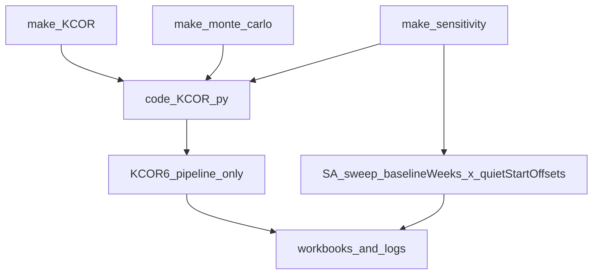

# KCOR6-only MC+SA unify (no flag)

## Objective
- Make **KCOR v6 (gamma-frailty)** the **only** pipeline used by:
  - `make KCOR`
  - `make monte_carlo`
  - `make sensitivity`
  - `make test`
- Remove the **`KCOR6_ENABLE` toggle entirely** and delete the legacy **tau × norm-weeks** SA sweep.
- Keep **Monte Carlo outputs stable** (same workbook layout + `KCOR_MC_summary.log` summary tables), but ensure MC runs **KCOR6 fit + normalization** per iteration.

## What we found in the current repo
- `code/KCOR.py` currently *parses* `KCOR6_ENABLE` and **forces KCOR6 off in SA mode**:

```3604:3646:code/KCOR.py
    # KCOR 6.0 enable switch (default ON; can be disabled via KCOR6_ENABLE=0).
    # SA mode is intentionally kept slope-based for now (grid sweep fixtures depend on it).
    _kcor6_env_raw = str(os.environ.get("KCOR6_ENABLE", "")).strip()
    if _kcor6_env_raw == "":
        kcor6_enable_requested = True
    else:
        kcor6_enable_requested = _kcor6_env_raw.lower() in ("1", "true", "yes")
    kcor6_enabled_effective = bool(kcor6_enable_requested) and (not _is_sa_mode())

    # ...
    dual_print(f"  KCOR6_ENABLE          = {kcor6_enabled_effective}  [env KCOR6_ENABLE={'<unset>' if _kcor6_env_raw == '' else _kcor6_env_raw}; disabled in SA mode]")
    dual_print(f"  KCOR6_QUIET_WINDOW    = {KCOR6_QUIET_START_ISO}..{KCOR6_QUIET_END_ISO}")

    # Slope normalization config is only relevant when KCOR6 is disabled (or in MC mode).
    if (not kcor6_enabled_effective) or MONTE_CARLO_MODE:
        dual_print(f"  SLOPE6_METHOD        = QuantReg (tau={SLOPE6_QUANTILE_TAU})  [Slope6: Time-centered linear quantile regression normalization for b >= 0]")
        # ...
    else:
        dual_print("  SLOPE_NORMALIZATION   = disabled (KCOR6)")
```

- `code/KCOR.py` has an MC-only branch that still computes **Slope6** and **skips KCOR6 fits**:

```4077:4362:code/KCOR.py
        # -------------------------------------------------------------------
        # KCOR 6.0 (gamma-frailty) fits in quiet window (logging only; not applied yet)
        # ...
        # NOTE: SA mode early-returns before this loop; MC mode is explicitly skipped here.
        if not MONTE_CARLO_MODE:
            # ... compute KCOR6_FIT and populate kcor6_params_map ...
            pass

        # ...
        # Monte Carlo mode: simplified processing path (skip SA mode and dynamic slopes)
        if MONTE_CARLO_MODE:
            # ... slope6 normalization path ...
            continue
```

- SA mode is currently an **early-return legacy sweep** (`SA_TAU_VALUES` × `SA_NORM_WEEKS`) and writes `KCOR_SA.xlsx`.

## Target behavior
### Monte Carlo
- For each iteration:
  - compute **KCOR6 fits** in the quiet window
  - apply **KCOR6 normalization** (gamma-frailty inversion) and compute KCOR time series
  - keep output workbook behavior: **one sheet per iteration** + existing MC summary printed to `KCOR_MC_summary.log`

### Sensitivity
- Remove tau sweep completely.
- Sweep only:
  - **Baseline weeks**: `SA_BASELINE_WEEKS` (default `2,3,4,5,6,7,8`)
  - **Quiet-window start offsets (weeks)** relative to `2022-24`: `SA_QUIET_START_OFFSETS` (default `-12,-8,-4,0,4,8,12`)
- Quiet-window end remains **fixed** at `2024-16`.
- For each (baseline_weeks, offset) and each requested (cohort, dose-pair), write the **YoB=-2 KCOR at the cohort’s reporting date** into a grid workbook `KCOR_SA.xlsx`.

## Implementation plan

### 1) Remove `KCOR6_ENABLE` and make KCOR6 unconditional
Update [`code/KCOR.py`](code/KCOR.py):
- Delete all parsing/logging of `KCOR6_ENABLE`.
- Replace `kcor6_enabled_effective` with an unconditional constant (or remove the variable entirely) and ensure:
  - KCOR6 fits always run (including MC)
  - KCOR6 normalization always runs
  - no slope “config dump” is printed
- Update the “About” sheet / methodology text to describe the KCOR6 method (it currently documents slope normalization).

### 2) Unify MC execution path onto the KCOR6 pipeline
Update [`code/KCOR.py`](code/KCOR.py):
- Remove the MC-only slope6 “simplified processing” branch (`if MONTE_CARLO_MODE: ... continue`).
- Ensure **KCOR6 fit+normalization happens inside the normal sheet loop** for MC runs.
- Standardize the key used for:
  - dose-pair lookup: still use the `2022_06` dose-pair set
  - KCOR6 parameter lookup: use the same “effective enrollment label” consistently (e.g., `effective_enroll = "2022_06" if MONTE_CARLO_MODE else sh`) so theta lookup matches normalization.
- Keep MC outputs stable:
  - still write one sheet per iteration
  - still create the MC summary via `create_mc_summary()`
- Logging acceptance check:
  - `KCOR_MC_summary.log` contains `KCOR6_FIT,` lines
  - no `SLOPE6_FIT_WINDOW`, `[Slope6]`, `SLOPE8_`, etc. in MC logs

### 3) Replace SA with KCOR6-only sweep: baseline weeks × quiet-start offsets
Update [`code/KCOR.py`](code/KCOR.py):
- Replace the current SA early-return (`tau_values` × `norm_weeks_values`) with a new SA driver that:
  - parses `SA_BASELINE_WEEKS` (int list/range)
  - parses `SA_QUIET_START_OFFSETS` (int list/range; can be negative)
  - for each combination:
    - set `KCOR_NORMALIZATION_WEEKS` and `KCOR_NORMALIZATION_WEEKS_EFFECTIVE`
    - compute `quiet_start_iso = KCOR6_QUIET_START_ISO + offset_weeks` using `datetime.fromisocalendar(...)+timedelta(weeks=...)`
    - compute `quiet_start_int = iso_to_int(quiet_start_year, quiet_start_week)` and use it for the quiet-mask
    - run **all-ages-only** KCOR6 processing per cohort (aggregate across sexes+ages to YoB=-2) to keep runtime sane
    - compute KCOR time series for requested dose pairs and extract value at the cohort reporting date (closest available)
- Update `create_sa_grid_output()` to output:
  - rows: baseline weeks
  - columns: quiet-start offsets (e.g., `offset_-12w`, `offset_0w`, `offset_12w`)
  - one sheet per `(cohort, dose_num, dose_den)`

### 4) Makefiles + CLI interface
Update the Makefiles to reflect the new SA knobs and removal of tau-based sweep:
- [`test/sensitivity/Makefile`](test/sensitivity/Makefile)
  - replace `SA_TAU_VALUES` / `SA_NORM_WEEKS` with `SA_BASELINE_WEEKS` / `SA_QUIET_START_OFFSETS`
  - pass those env vars into `code/KCOR.py`
- [`Makefile`](Makefile)
  - update the `help` examples under “Sensitivity quick-test examples”
- [`code/Makefile`](code/Makefile)
  - update the “minimal sensitivity plumbing target” comments + env echo lines so it doesn’t advertise tau sweep

### 5) Validation / acceptance
After implementation:
- **Quick MC smoke**:
  - `make monte_carlo DATASET=Czech MC_ITERATIONS=5`
  - grep `data/Czech/KCOR_MC_summary.log` for `KCOR6_FIT,`
  - grep to ensure absence of slope tags
- **Quick SA smoke**:
  - `make sensitivity DATASET=Czech SA_COHORTS=2022_06 SA_DOSE_PAIRS=1,0 SA_BASELINE_WEEKS=4 SA_QUIET_START_OFFSETS=0`
  - confirm `test/sensitivity/out/KCOR_SA.xlsx` produced and contains a sheet `2022_06_1_vs_0`
- **Full test**:
  - `make test DATASET=Czech`



## Notes / scope boundaries
- We’ll **stop using** slope normalization everywhere, but we won’t do a risky “delete all slope code” cleanup in this pass (can be a follow-up once outputs are stable).
- The repo currently contains historical log files that mention `KCOR6_ENABLE`; we won’t rewrite them.


