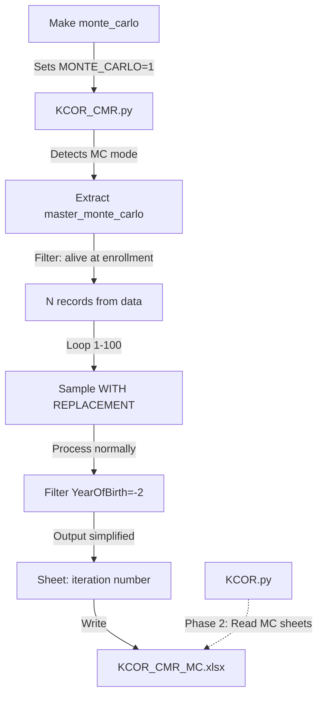

# Monte Carlo Mode Implementation

## Overview

Add Monte Carlo sampling mode to KCOR pipeline that generates 100 iterations of bootstrap samples from the master population. Each iteration processes a random sample (with replacement) and outputs simplified results to separate Excel sheets.

## Architecture



## Implementation Steps

### 1. Makefile Changes (`code/Makefile`)

- Add `monte_carlo` target that:
  - Sets `MONTE_CARLO=1` environment variable
  - Sets `MC_ITERATIONS` (default 100, configurable)
  - Calls `KCOR_CMR.py` with MC output path: `KCOR_CMR_MC.xlsx`
  - Optionally calls `KCOR.py` in MC mode (Phase 2)

### 2. KCOR_CMR.py Modifications (`code/KCOR_CMR.py`)

#### 2.1 Mode Detection

- Check `os.environ.get('MONTE_CARLO')` at script start
- If MC mode:
  - Override `enrollment_dates` to `['2022-06']` only
  - Override output path to `KCOR_CMR_MC.xlsx` (or from argv)
  - Set `MC_ITERATIONS` from env (default 100)

#### 2.2 Master Population Extraction

- After loading data and filtering to 2022-06 enrollment:
  - Extract `master_monte_carlo`: records where `DateOfDeath.isna() OR DateOfDeath >= enrollment_date`
  - This represents people alive at start of enrollment week
  - Store full record set (all columns needed for processing)
  - Use actual count from data (will vary by dataset - not hardcoded)
  - Print master population count for verification: `print(f"Master Monte Carlo population: {len(master_monte_carlo):,} records")`

#### 2.3 Monte Carlo Loop

- Wrap the existing enrollment processing loop:
  ```python
  master_count = len(master_monte_carlo)
  print(f"Master Monte Carlo population: {master_count:,} records")
  
  for iteration in range(1, MC_ITERATIONS + 1):
      print(f"\nMonte Carlo iteration {iteration}/{MC_ITERATIONS}")
      # Sample WITH REPLACEMENT from master_monte_carlo
      # Sample size = actual master population size (not hardcoded)
      sampled_records = master_monte_carlo.sample(n=master_count, replace=True, random_state=iteration)
      
      # Process sampled_records normally (existing logic)
      # BUT: filter output to YearOfBirth == -2 (all ages) only
      # AND: simplify output columns to: ISOweekDied, Dose, DateDied, Dead, Alive
      
      # Write to sheet named str(iteration)
  ```


#### 2.4 Output Simplification

- In MC mode, after normal processing:
  - Filter `out` DataFrame to `YearOfBirth == -2` only
  - Select only columns: `['ISOweekDied', 'Dose', 'DateDied', 'Dead', 'Alive']`
  - Write each iteration to separate sheet (sheet name = iteration number as string)

#### 2.5 Key Processing Details

- Use same enrollment date parsing: `2022-06` → `2022-06-1` format
- Use same dose group assignment logic
- Use same week-by-week processing
- Sample happens BEFORE processing (each iteration gets fresh random sample)
- Random seed = iteration number for reproducibility
- Master population count is determined dynamically from the data (not hardcoded)

### 3. File Structure

- Regular mode: `KCOR_CMR.xlsx` (unchanged)
- Monte Carlo mode: `KCOR_CMR_MC.xlsx` (new file)
  - Sheets: "1", "2", "3", ..., "100"
  - Each sheet: columns `ISOweekDied`, `Dose`, `DateDied`, `Dead`, `Alive`
  - All rows have `YearOfBirth=-2` (all ages aggregated)

### 4. Configuration

- Environment variables:
  - `MONTE_CARLO=1`: Enable MC mode
  - `MC_ITERATIONS=N`: Number of iterations (default: 100)
- Makefile variables:
  - `MC_ITERATIONS`: Can override default (e.g., `make monte_carlo MC_ITERATIONS=50`)

## Files to Modify

1. **`code/Makefile`**

   - Add `monte_carlo` target
   - Define `MC_OUTPUT = ../data/$(DATASET)/KCOR_CMR_MC.xlsx`
   - Set environment variables before calling scripts

2. **`code/KCOR_CMR.py`**

   - Add MC mode detection at top
   - Extract master_monte_carlo after enrollment date filtering
   - Wrap processing loop in MC iteration loop
   - Add output filtering and simplification for MC mode
   - Modify sheet writing logic for MC mode

## Testing Considerations

- Verify master_monte_carlo extraction correctly identifies alive-at-enrollment records
- Verify sampling with replacement produces expected variability
- Verify output columns match specification
- Verify all 100 sheets are created correctly
- Test with smaller iteration count first (e.g., `MC_ITERATIONS=5`)
- Verify master population count is printed and matches expected number of alive records

## Notes

- Phase 2 (KCOR.py reading MC sheets) is deferred for now
- Random seed uses iteration number for reproducibility
- All existing processing logic reused; only sampling and output filtering added
- MC mode is mutually exclusive with regular mode (controlled by Makefile target)
- Master population count is determined from actual data, not hardcoded (e.g., 4.6M was just an example)

