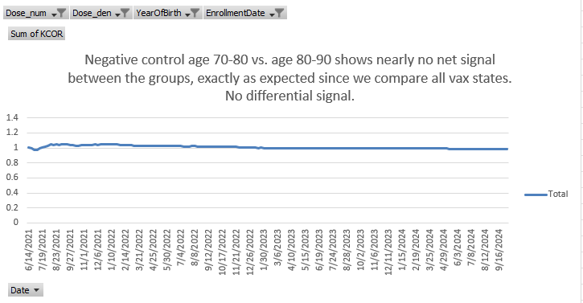

# Negative control tests

This directory is for doing negative control tests.

The code directory contains the program to generate the negative control test file.

Then we call KCOR.py to analyze it, setting the input and output files correctly.

The input should be the file generated by the generate_negative_control.py program which per the Makefile outputs to data/KCOR_synthetic_test.xlsx

There is an out directory with the output of the KCOR analysis. If all goes well, it will be flatter for the unvaccinated controls.

### How the negative control data is generated

For the negative control test dataset, we fake it by comparing the unvaccinated with unvaccinated, but different ages. So dose 0 is older age group and dose 2 is the youngest age group.

we do the same comparing vaccinated with vaccinated, but different ages. 

and then again, using the entire death data, regardless of vaccination status.

So essentially, we turn ages into doses and we're always comparing people in the same cohort.

We read the data/Czech/KCOR_CMR.xlsx file, and we create corresponding control sheets by using 10 year younger age groups for the doses.

so for each sheet, we just cover dose 0, 1, and 2:

- dose 0= unvaxxed born in 1930,1935
- dose 1= unvaxxed born in 1940,1945
- dose 2= unvaxxed born in 1950,1955

and we make everyone born in 1950 (the choice was arbitrary; we just need a birthdate)

Then we do the same method for the vaccinated, but treat them as all born in 1940. But do the same thing where the:
- dose 0 = vaxxed with 2 doses born in 1930,1935
- dose 1= vaxxed with 2 doses born in 1940,1945
- dose 2= vaxxed with 2 doses in 1950,1955

Then we do the same for all people, regardless of vaccination status... treat them all as if born in 1960. Same dose mapping as we did before, treating the different age groups as having different doses at enrollment.

so basically, we are comparing cohorts of those in the same category, which should result in a very low signal for the unvaccinated, and a higher signal for the vaccinated, but nowhere near as high as unvax--> vax comparison.

So we have a code, data, out directory and a Makefile at the root. The makefile makes the test file as described above and puts it in data. It then calls KCOR to process it, having it put the output file in the out directory.

Note: we ignore sex from the CMR file for now. These tests are for all sexes including other.

### Results snapshots

These graphs show even with 10 and 20 year age differences between the cohorts, KCOR is able to accurately normalize the mortality and find neglible differences. Only when there is a real signal will there be a difference. Do you know of any other epidemiology tool that will find no signal in these groups which have dramatically different composition? The methods I'm aware of require you to do 1:1 matching.

The negative control test is made from multiple enrollment dates (specified in the Makefile).

The makefile should specify the age range for each dose.

The three years we simulate the output for (1940, 1950, 1960) is hardwired into the code.

